# OpenDoor Midsummer Meetup: <br> Extending eZ Platform v2 and <br> What's New in eZ Platform v2.2

<center><small>Meetup at <a href="http://ez.no">eZ Systems</a> Cologne 2018/06/21</small></center>

--

- Extending eZ Platform v2
	- Extending UI Navigation
	- Working with eZ Repository Forms
	- Extending the Dashboard
	- Flex Workflow Notification
- What's New in eZ Platform v2.2

---

# Extending UI Navigation

--

## Menus

<small>
- Menus in eZ Platform are based on the KnpMenuBundle and are easily extensible. For a general idea on how to use MenuBuilder there is doc at https://symfony.com/doc/master/bundles/KnpMenuBundle/index.html.

- We can easily extend the current menus using suscribers/listeners.

- There are some menu builders in `EzSystems\EzPlatformAdminUi\Menu` that will create some base menu items and then dispatch an event to allow us to add more stuff to it.

- You can find the list of events to hook in https://doc.ezplatform.com/en/2.1/guide/extending_ez_platform_ui/#menus

- The only thing you need is to create listener and register it to add stuff in menus.

</small>

--

## Some Examples

- Enterprise Edition
	- ezstudio-form-builder/lib/Core/Menu/ConfigureMenuListener.php
	- studio-ui-bundle/Menu/ConfigureMenuListener.php

- Open source
	- netgen/tagsbundle/bundle/PlatformAdminUI/EventListener/MainMenuBuilderListener.php
	- https://doc.ezplatform.com/en/2.1/guide/extending_ez_platform_ui/#menus

--

## Add a menu item in navigationbar : Menu EventListener Class

```
/** @param \EzSystems\EzPlatformAdminUi\Menu\Event\ConfigureMenuEvent $event */
public function onMenuConfigure(ConfigureMenuEvent $event)
{
		$menu = $event->getMenu();
		$contentMenu = $menu->getChild(MainMenuBuilder::ITEM_CONTENT);
		$contentMenu->addChild(
				self::CUSTOM__MENU__ITEM,
				[
						'route' => 'ezsystems.custompage.menu',
						'extras' => [
								'translation_domain' => 'menu',
						],
				]
		);
}
```

--

## Add a menu item in navigationbar: register

```
#EzSystems/CustomizeAdminUIBundle/Resources/config/services.yml

services:
    _defaults:
        autowire: true
        autoconfigure: true
        public: false

    EzSystems\CustomizeAdminUIBundle\EventListener\ConfigureMenuListener:
        public: true
        tags:
          - { name: kernel.event_listener, event: ezplatform_admin_ui.menu_configure.main_menu, method: onMenuConfigure }
```

- `kernel.event_listener` is the service tag responsible to listen to different events/hooks in Symfony and which will here listen to the `ezplatform_admin_ui.menu_configure.main_menu` event which refers to the eZ `MAIN_MENU` (see: `EzSystems\EzPlatformAdminUi\Menu\Event\ConfigureMenuEvent.php`) and inject the event in the `onMenuConfigure` method.


--

## Add a menu item in navigationbar: controller

- Nothing special here, basic symfony stuff

```
ezsystems.custompage.menu:
    path: /custom/page
    defaults:
        _controller: 'EzSystemsCustomizeAdminUIBundle:CustomPage:menu'
```

--

# Check Access Permission


```
//use eZ\Publish\API\Repository\PermissionResolver;

if (!$this->permissionResolver->hasAccess('custom_module', 'custom_fuction')) {
		return;
}
```

```
use Symfony\Component\Security\Core\Authorization\AuthorizationCheckerInterface;
use eZ\Publish\Core\MVC\Symfony\Security\Authorization\Attribute;

if (!$this->authorizationChecker->isGranted(
	new Attribute('custom_module', 'custom_fuction'))) {
    return;
}
```

- Deprecated since 6.6, to be removed !
```
if ($this->repository->hasAccess('custom_module', 'custom_module') === false) {
    return;
}
```

---

# Working with Repository Forms

--

## Creating a custom form

- Most of the admin is made with the Symfony form component
- Lots of data class / form type and a form factory are provided in the admin-ui-bundle
- You can extend the already present ones or easily create a custom one

--

## 1. The FormFactrory

- Your form factory must implements the FormFactoryInterface from `Symfony\Component\Form\FormFactoryInterface`

- Our factory will create a form using the
```
createNamed(
  string|int $name,
  string $type = 'Symfony\\Component\\Form\\Extension\\Core\\Type\\FormType',
  mixed $data = null,
  array $options = array()
  )
```

 method from the FormFactoryInterface.

- Note that a form factory is already available in `EzSystems\EzPlatformAdminUi\Form\Factory\FormFactory`, it handles a lot of different form.

--

## 2. The FormData

- The form is often tied to an object and the fields of the form get and store their data on the properties of that object.
- There are lots of form data in the admin-ui-bundle see `EzSystems\EzPlatformAdminUi\Form\Data` but for the example we will create our own

--

## 3. The FormType


- The FormType class needs to extend `Symfony\Component\Form\AbstractType`.
- Lots of other form field type are already defined in admin-ui-bundle see `EzSystems\EzPlatformAdminUi\Form\Type`

--

## Register your factory

- in services.yml

```
EzSystems\CustomizeAdminUIBundle\lib\Form\Factory\FormFactory: ~
```

---

# Extending the dashboard

--

#### Extending the dashboard: Understanding dashboard logic

<small>
- eZ Admin UI has a Twig extension allowing to render any renderable twig component defined as a service containing a custom tag `group`. This is done by the Twig function `ezplatform_admin_ui_component_group`

  - (see `EzSystems\EzPlatformAdminUiBundle\Templating\Twig\ComponentExtension.php`).

- This Twig function is called in the dashboard template `dashboard.html.twig` to render every `dashboard-blocks`

</small>
```
{{ ezplatform_admin_ui_component_group('dashboard-blocks') }}
```

<small>

- Of course each dashboard block has it's own template that you can customize.

</small>

--

- For the tabs in the block, the same logic applies: there is a twig extension with a twig function `ez_platform_tabs` in `EzSystems\EzPlatformAdminUiBundle\Templating\Twig\TabExtension.php`. This function will be called in block templates to render every tab defined as a service with the group given as parameter.

```
{{ ez_platform_tabs('dashboard-custom_block', []) }}
```

--

```
services:
    ezplatform.adminui.dashboard.custom:
        parent: EzSystems\EzPlatformAdminUi\Component\TwigComponent
        arguments:
            $template: 'EzSystemsCustomizeAdminUIBundle:dashboard/block:custom_block.html.twig'
        tags:
            - { name: ezplatform.admin_ui.component, group: 'dashboard-blocks' }

    EzSystems\CustomizeAdminUIBundle\Tab\Dashboard\CustomTab:
        parent: EzSystems\EzPlatformAdminUi\Tab\AbstractTab
        public: false
        tags:
            - { name: ezplatform.tab, group: dashboard-custom_block }
        arguments:
            $contentTypeIdentifier: ['product','article']

```

---

# Notification System

--

There are two type of Notification in the backend:

- `notificationIndicatorView`
  - Notification in the page bottom (Info, Error, Success, Warning)

- `notificationsPopupView`
  - Notification in the User Menu (Example: send for review in EE)

--

**notificationIndicatorView**

- Using Symfony `Flash Messages` which are messages stored in the session that vanish automatically as soon as you retrieve them. They are mostly used to display notifications to users.

- eZ Platform is using a custom `NotificationHandlerInterface` which could be simply called using:

```
//Example from: EzSystems\EzPlatformAdminUiBundle\Controller\ContentController
//use EzSystems\EzPlatformAdminUi\Notification\NotificationHandlerInterface;

$this->notificationHandler->success(
    $this->translator->trans(
        /** @Desc("New Version Draft for '%name%' created.") */
        'content.create_draft.success',
        ['%name%' => $contentInfo->name],
        'content'
    ));
```

--

**notificationsPopupView** Enterprise

- Using a signal Dispatcher to emit a Notification Signal using a specific type

```
use eZ\Publish\Core\SignalSlot\SignalDispatcher;
use EzSystems\Notification\Core\SignalSlot\Signal\NotificationSignal;

$data = [
    'custom_notification' => 'CustomNotification',
    'contributor' => 'Max Musetrmann',
    'message' => 'Review Content: contentID: LocationID:...',
    'link' => '/admin/content/location/55'
		];

$this->signalDispatcher->emit(new NotificationSignal([
    'ownerId' => 14,
    'type' => 'FlexWorkflow:CustomContentReview',
    'data' => $data,
]));

```

--

## Custom FlexWorkflow:CustomContentReview

<small>

- eZ Platform is coming with a `FlexWorkflow:Review` Type responsible for the send for review functionality in the Enterprise Edition.
- The Repository offers the possibility to use a custom FlexWorkflow Type using a custom Renderer class.
- The Renderer class helps:
  - To define a custom redirect URL for your custom notification in the popup view
  - Custom Template for your entry if needed
- The Renderer class should be registered with the tag name `ezstudio.notification.renderer`. It will be added automatically using the `NotificationRendererPass` CompilerPass defined in the `NotificationBundle`
- The custom `FlexWorkflow` Type should have an alias, in this case `CustomContentReview`

</small>

--

#### More Information

[Registry Definition - notification.renderer.registry](https://github.com/ezsystems/ezstudio-notifications/blob/master/bundle/Resources/config/services.yml#L71)

[FlexWorkflow:Review - Renderer Service](https://github.com/ezsystems/flex-workflow/blob/master/bundle/Resources/config/services.yml#L106)

Add the Renderer service definition to the service container

[NotificationRendererPass - notification.renderer.registry](https://github.com/ezsystems/ezstudio-notifications/blob/master/bundle/DependencyInjection/Compiler/NotificationRendererPass.php)

[NotificationController - renderNotifications() and markNotificationAsRead() ](https://github.com/ezsystems/ezstudio-notifications/blob/master/bundle/DependencyInjection/Compiler/NotificationRendererPass.php)
- renderNotifications
  - To add the Template (aka: hasRenderer)
- markNotificationAsRead()
  - To generate the redirect URL (aka: generateUrl() )

--

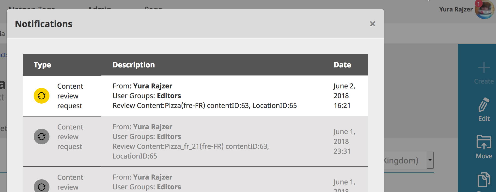

- More information in `eznotification` database table

---

# eZ Platform v2.2 Features

**Release date**: June 29, 2018

**Release type**: Fast Track

--

- Symfony 3.4.11
- Improvements and bug fixes since v2.1.0

--


- Bookmarks
    - Are Personal (manage, create or delete)
    - Available from content view, user menu, left sidebar and in UDW (faster embed content)

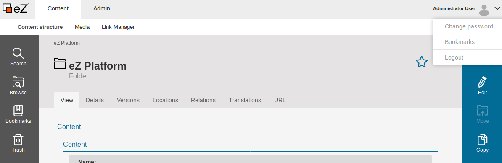


--

- CopySubrtree

<center>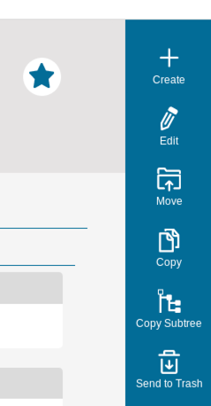</center>

--

- ContentType view new design and edit button is now added

<center>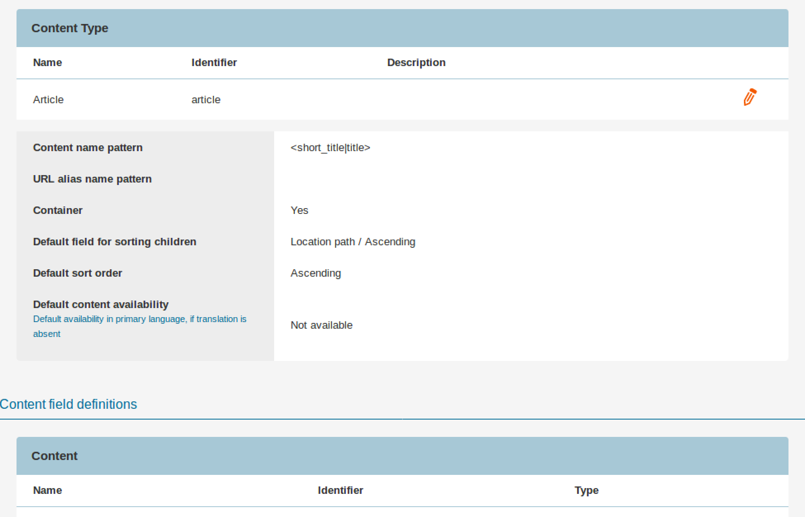</center>

--

- ContentType edit new design(accordion list)
- Adding new FieldType is using Fix Toolbar when you scroll down

<center>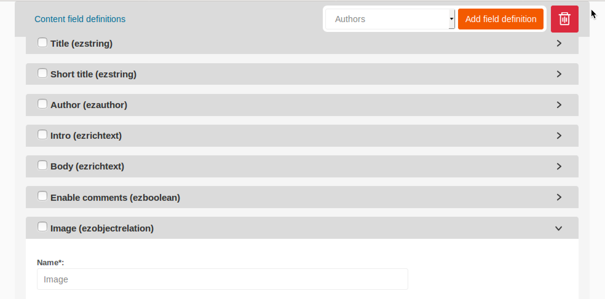</center>

--

- Adding new policy redirect you now to the edit form. In Previous version you'll been redirected to the „/role/list“ first and then you can edit it

<center>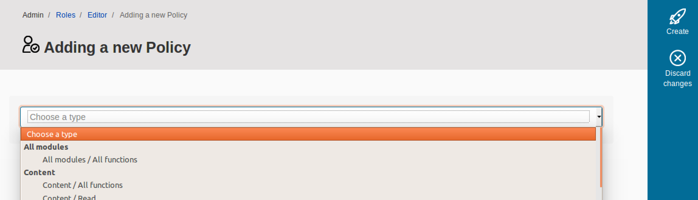</center>

--

- delete single item from the trash is now possible

<center>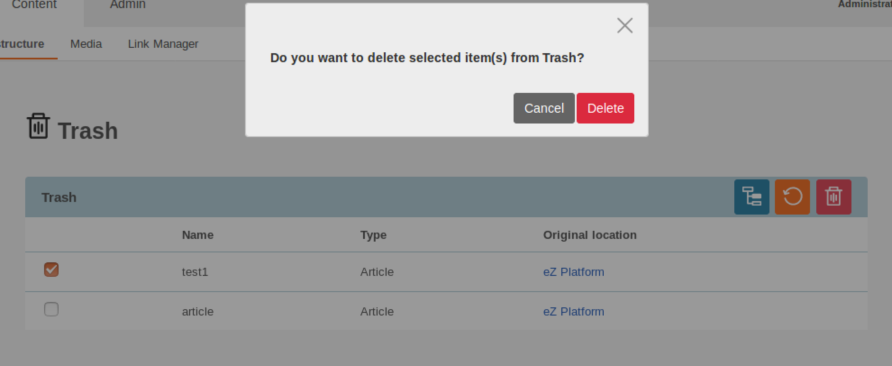</center>

--

- Previewing user and user group permissions (new Tab)

<center>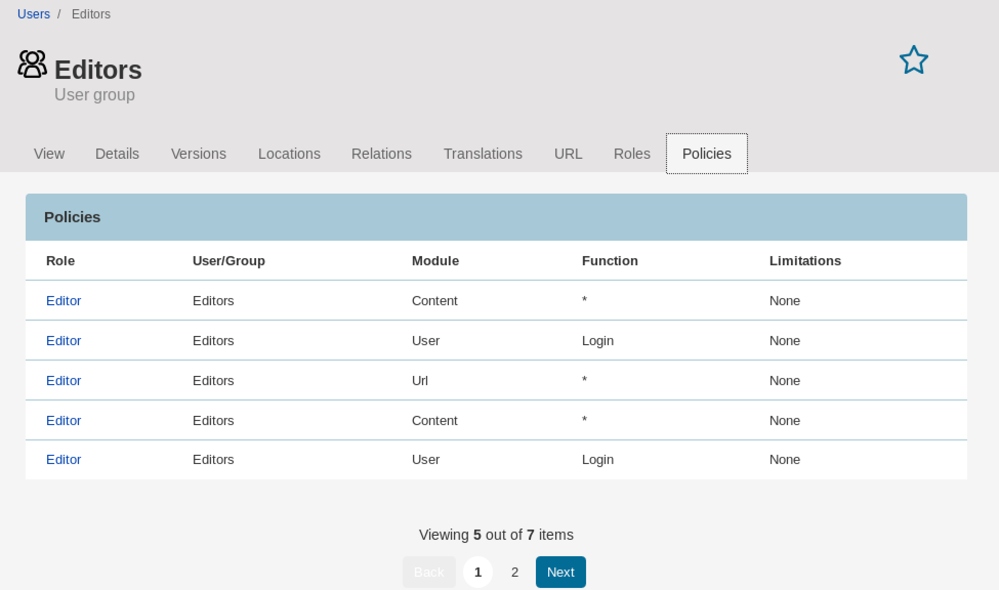</center>

--

- image Place Holder

Placeholder generator enables you to download or use generated image placeholder for any missing image. It might be used when you are working on an existing database and you are not able to download uploaded images to your local development environment because of their large size

In eZ Platform there are two implementations of PlaceholderProvider interface:
- GenericProvider
- RemoteProvider

--

```
ezpublish:
image_placeholder:
	default:
		provider: generic
		options:
				fontpath:   '%kernel.root_dir%/Resources/roboto/Roboto-Bold.ttf'
				background: '#EEEEEE'
				foreground: '#FF0000'
				text: "IMAGE %%width%%x%%height%%"
```

<center>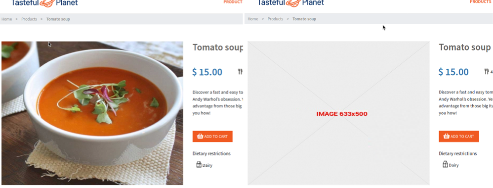</center>

--

- URL Generation Pattern

You can now select the pattern that will be used to generate URL patterns.

```
ezpublish:
    url_alias:
        slug_converter:
            transformation: example_group
            separator: underscore
            transformation_groups:
                example_group:
                    commands:
                        - 'space_normalize'
                        - 'hyphen_normalize'
                        - 'apostrophe_normalize'
                        - 'doublequote_normalize'
                        - 'your_custom_command'
                    cleanup_method: url_cleanup
```

--

There are three types of separator available: `dash`, `underscore` and `space`

<center>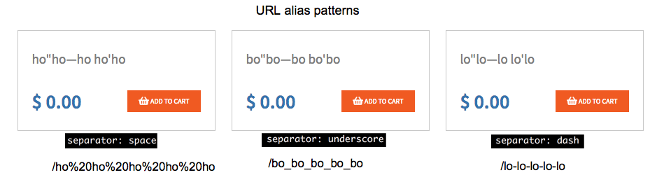</center>

--

- UTF8 to UTF8MB4

In order to support 4-byte characters 


>To cover this change when upgrading, follow the instructions in the [update guide](updating_ez_platform.md#4-update-database)

--

## Page Builder

- A new name for a major upgrade (RIP LandingPage Manager)
- Built for speed
- Better usability and comfort for editors
- Create content “on the fly” when adding a block to a page
- Better managing versions, translations and draft conflicts
- Use the `Page` FieldType with any other ContentType
	- Allow different field definitions for pages on different sites
- Extending using the power and simplicity of Symfony Forms and TWIG template.
- React based (YUI is completely removed)

--

- Creating new Block requires few field types
- Page block design
	- Twig and yml configuration (similar to add custom types)
	- Two new configuration fields: CSS Class and Style

<center>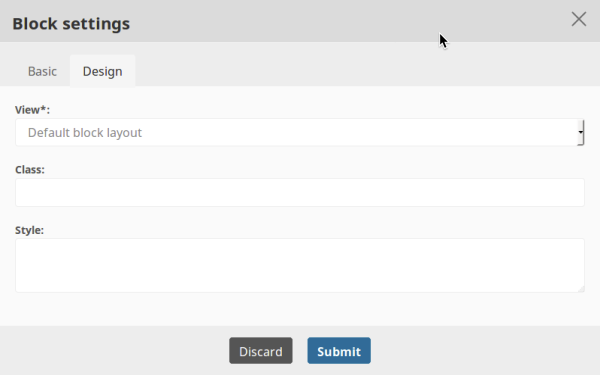</center>

--


- Full list of new features

https://ez.no/Blog/A-Quick-Look-Into-the-New-Page-Builder-of-eZ-Platform

https://github.com/ezsystems/developer-documentation/pull/303

---

### Thank you

|                   |                                                                             |
|-------------------|:----------------------------------------------------------------------------|
| We                |**http://ez.no**                                                             |
| Installation      |**https://ezplatform.com<br> https://github.com/ezsystems**                  |
| Documentation     |**http://doc.ezplatform.com**                   |
| Contact us        |**https://ezcommunity.slack.com<br> https://discuss.ezplatform.com**   |
