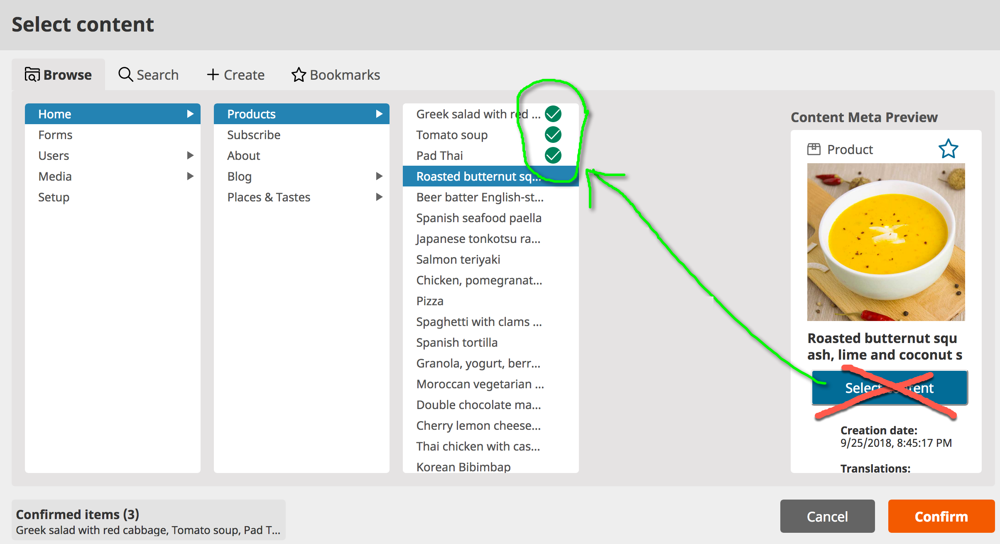
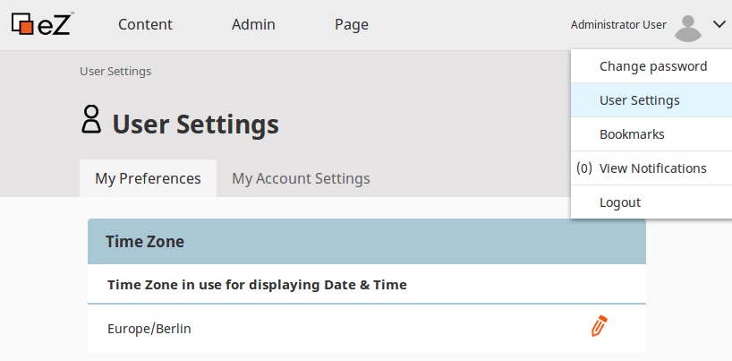
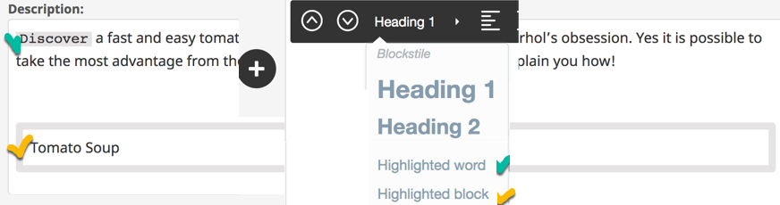
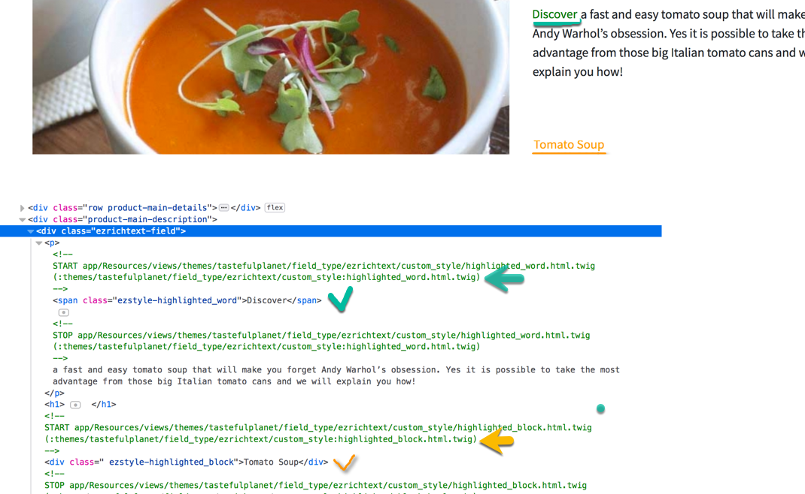
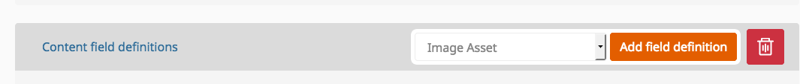
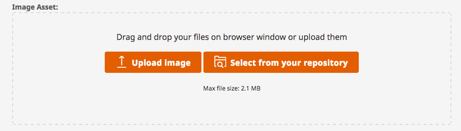
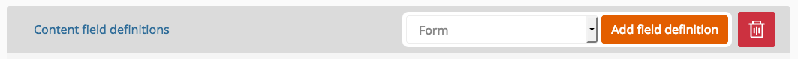
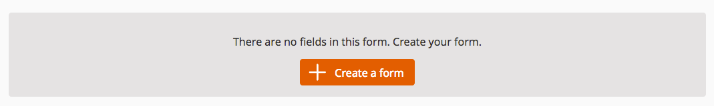
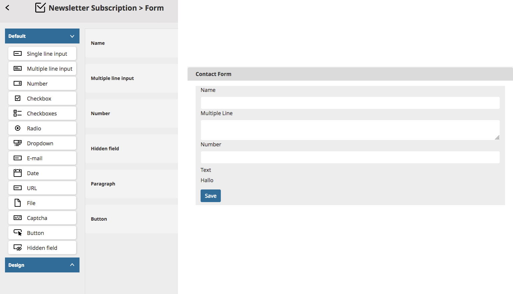

# What's New in eZ Platform v2.3

<center><small>Meetup at <a href="http://ez.no">eZ Systems</a> Cologne 2018/09/25</small></center>

---

# eZ Platform v2.3 Features

**Release date**: Sept 28, 2018

**Release type**: Fast Track

--

- Symfony 3.4.15
	- https://semver.mwl.be/#?package=symfony%2Fsymfony&version=%5E3.4&minimum-stability=stable
- Improvements and bug fixes since v2.2.0
	- https://github.com/ezsystems/ezplatform-ee/releases

--

## content relation(s) selection from UDW




--

## User preferences




--

## User preferences

- You can now use `User/preferences` policy
```
parameters:
    ezpublish.api.role.policy_map:
		user:
				#...
				preferences: ~
```

- New UserPreferenceService

```
ezpublish-kernel/eZ/Publish/API/Repository/UserPreferenceService.php

```

- Signal/EventListner: `UserPreferenceService\UserPreferenceSetSignal`

- No database update is required. `ezpreferences` is a Legacy table

--

## Online Editor Custom Styles

 


--

 

--

## Online Editor Custom Styles: Configuration


```
ezpublish:
    system:
        admin_group:
            fieldtypes:
                ezrichtext:
                    custom_styles: [highlighted_block, highlighted_word]

    ezrichtext:
        custom_styles:
            highlighted_word:
                template: '@ezdesign/field_type/ezrichtext/custom_style/highlighted_word.html.twig'
                inline: true
            highlighted_block:
                template: '@ezdesign/field_type/ezrichtext/custom_style/highlighted_block.html.twig'
                inline: false
```

[More information](https://github.com/alongosz/developer-documentation/blob/a8f472b956e36bd5df6d38ffdf02d193d435d5e6/docs/guide/extending_online_editor.md)

--

## RichText XML

```
<?xml version="1.0" encoding="UTF-8"?>
...
<ezstyleinline name="highlighted_word">Discover</ezstyleinline>

<ezstyle name="highlighted_block">Tomato Soup</ezstyle>
```

--


## Field Image asset - FieldType




- FieldType support either upload or simple relation
- Reuse uploaded images across the system.
- Updating the image itself will update all content relation inverse
- Deleting image from the image asset field will not affect the original image

--

## Field Image asset - configuration

```
ezpublish:
    system:
       default:
            fieldtypes:
                ezimageasset:
                    content_type_identifier: photo
                    content_field_identifier: image
                    name_field_identifier: title
                    parent_location_id: 106
```

--

## Field Image asset - Rendering

```
Field {#8601 ▼
  #id: 3136
  #fieldDefIdentifier: "image_asset"
  #value: Value {#8609 ▼
    +destinationContentId: 124
    +alternativeText: null
  }
  #languageCode: "eng-GB"
  #fieldTypeIdentifier: "ezimageasset"
}
```

- Using eZ twig helpers

```
{{ ez_render_field(content, 'image_asset') }}
```

--

## Field Image asset - Rendering

- Rendering customization is possible by configuring view type `asset_image`

```
ezpublish:
    system:
       default:           
            content_view:
                asset_image:
                    default:
                        template: '::custom_image_asset_template.html.twig'
                        match: []
```

[More Information](https://github.com/ezsystems/developer-documentation/pull/411/files)

--

## Form Builder - FieldType




- Add the form FieldType in any ContentType
- Or embed a form in the content (In the online Editor or as relation(s) )
- Content and Landing page capability
- Translation support
- Submissions are available in a new tab and ready for download (CSV)

[Check form requirement when upgrading to 2.3](https://github.com/ezsystems/developer-documentation/pull/412/files)

--

## Form Builder - FieldType



--

## Extending Form Builder

- You can extend the Form Builder by adding new form fields or modifying existing ones
- Form fields are defined in YAML configuration
- New types of fields require a mapper which implements `\EzSystems\EzPlatformFormBuilder\FieldType\Field\FieldMapperInterface`
	- Some example in: `ezplatform-form-builder/src/lib/FieldType/Field/Mapper/*`

--

- The mapper must be registered as a service:
	- Some example in `ezplatform-form-builder/src/bundle/Resources/config/services/field_mappers.yml`

```
services:
    # ...
    AppBundle\FormBuilder\Field\Mapper\CountryFieldMapper:
        arguments:
            $fieldIdentifier: 'country'
            $formType: 'Symfony\Component\Form\Extension\Core\Type\CountryType'
        tags:
            - { name: ezplatform.form_builder.field_mapper }
```

[More Information](https://github.com/ezsystems/developer-documentation/pull/410/files)


--

## Page Builder

- Block Scheduler: Add content and schedule it for later publishing
	- Option (tab) available for all blocks
- Timeline, Calendar and Event viewer:
	- they give control to editors by providing information on what events are scheduled
	- Available in view and edit mode
- Content Scheduler Block
	- Similar to the collection block **+**  scheduling every content

--

# Demo


--

## Access to Content on Location object

- From PHP
```
$location->getContent()
```

- From Twig

```
{{ location.content }}

{{ location.content.getFieldValue('title') }}

```

- Proxy Objects & lazy-loading
	- Trigger loading of Content when first used

--

## Regenerating URL aliases

- You can use the `ezplatform:urls:regenerate-aliases` command to regenerate all URL aliases.
After the command is applied, old aliases will redirect to the new ones.

Use it when:

- you change URL alias configuration and want to regenerate old aliases
- you encounter database corruption
- you have content that for whatever reason does not have a URL alias

--

- Command

```
bin/console ezplatform:urls:regenerate-aliases
```

- Use an `--iteration-count` parameter to define how many Locations should be processed at once, to avoid too much memory use.


! Backup your database


--

## UI Translation

[Available Translations](https://github.com/ezsystems/ezplatform-i18n/tree/master/translations)

- Install Translation:

```
composer require  ezplatform-i18n/ezplatform-i18n-de_de
```

- https://crowdin.com/project/ezplatform

- Or more easier from here:
	- https://translation.ezplatform.com/admin
	- [How to contribute to translation](https://discuss.ezplatform.com/t/how-to-help-to-translate-ez-platform-v2/425)


--

- Read about the features

https://ez.no/Blog

[PR doc for ezplatform 2.3](https://github.com/ezsystems/developer-documentation/blob/9d200cd115f74078a345fc514590666f0eea5a85/docs/releases/ez_platform_v2.3.md) and next week officially in http://doc.ezplatform.com


---

### Thank you

|                   |                                                                             |
|-------------------|:----------------------------------------------------------------------------|
| We                |**http://ez.no**                                                             |
| Installation      |**https://ezplatform.com<br> https://github.com/ezsystems**                  |
| Documentation     |**http://doc.ezplatform.com**                   |
| Contact us        |**https://ezcommunity.slack.com<br> https://discuss.ezplatform.com**   |
