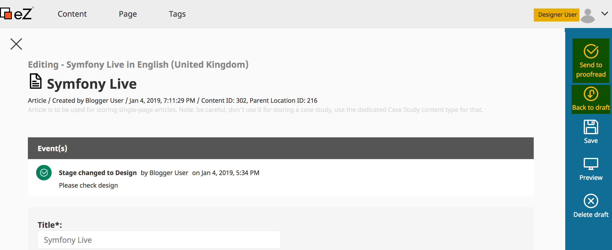

# What's New in eZ Platform v2.4

<center><small><a href="http://ez.no">eZ Systems</a></small></center>


---

# eZ Platform v2.4 Features

**Release date**: Dec 21, 2019

**Release type**: Fast Track

--


- Symfony 3.4.20
- Improvements and bug fixes since v2.3.0
	- https://github.com/ezsystems/ezplatform-ee/releases

--

# Editorial workflow

--

## Key Benefits

- User Interface Integration
- Role and policies-based access control
- User or Groups Notification
- Multisite ability

--

## Editorial workflow

<center></center>

--

## Configuration

<center></center>

--

## UI configuration integration

<center></center>

--

## Role and Policies

<center></center>

--

## Content edit

--

<center></center>

--

<center></center>

--

<center></center>

--

<center></center>

--

## Notifications

<center></center>

--

## Tech. Details

--

## Wokflow Meta Data

<center></center>

--

## Workflow Storage

<center></center>

--

## Navigation

- Menus in eZ Platform are based on the `KnpMenuBundle` and are easily extensible using EventSubscriber

```
$root = $event->getMenu(); //Right Sidebar
```

- Loading supported workflows using the Symfony `SupportStrategyInterface` to identify the Content/Subject workflow

```
/** @var \Symfony\Component\Workflow\SupportStrategy\SupportStrategyInterface */
    private $supportStrategy;
//...		
$this->supportStrategy->supports($workflow, $subject)
```

--

- Loading the actually Content/Subject marking

	```php
	$workflow->getMarking($subject); // Symfony\Component\Workflow\Workflow
	```

- Get next enabled Content/Subject Transitions to extend the Menu

	```php
	$workflow->getEnabledTransitions($subject); // Symfony\Component\Workflow\Workflow
	```

	- doCan($subject, Marking $marking, Transition $transition)
	- guardTransition($subject, Marking $marking, Transition $transition)
	```php
		$event = new GuardEvent($subject, $marking, $transition, $this->name);
		$this->dispatcher->dispatch('workflow.guard', $event);
		//...
  ```

--

- Check permission using the `GuardEvent` combined with eZ Platform user policies

```php
public static function getSubscribedEvents(): array
{
    return [
		'workflow.guard' => ['onTransition', 0],
		];
}
//...
if (
    $this->permissionResolver->canUser('workflow', 'change_stage', $subject, [$workflowTransition])
    && $this->permissionResolver->canUser('content', 'edit', $subject)
) {
	return;
}
$event->setBlocked(true);

```

- Add next transitions to Menu

```php
 $menuItems[] = $this->menuFactory->createItem($transition->getName(), $options)
```

--

## Workflow Siteaccess aware object

- The `WorkflowConfigurationProvider` class generates the workflow object using the `getWorkflows()` method
```php
$configurations = $this->configResolver->getParameter('workflows');
```
- Accessing the (group)Siteaccess workflow configuration
- Building workflow definition (Places, InitialPlace, Transitions)
- Building the Workflow Object

```php
$workflow = new Workflow(
		$definitionBuilder->build(),
		new WorkflowMarkingStore($workflowIdentifier, $this->workflowHandler),
		$this->eventDispatcher,
		$workflowIdentifier
);

$workflows[$workflowIdentifier] = $workflow;
```

--

<center></center>

--

# UI Improvement

--

## Form menu item

<center></center>

--

## Delete Notification

<center></center>

--

## Search Panel

<center></center>

--

## RichText Improvements

<center></center>

--

- Allowing editors to write rich text directly into a custom tag
- Each custom tag has an `ezcontent`  property that contains the tag's main content

<center></center>

--

- Rendering rich text inside custom tag

```
<div class="...">
	{{ content|raw }}
</div>
```

--

## Unformatted text

- Everything that is inside an unformated block will be rendered in the same way (character by character)
	- Program source code, HTML code, XML content, JS , etc
- It helps migration from ezxml ( legacy ) using `<literal>` tag which would basically put the containing text inside a `<pre>` tag
- Saving content using docbook's `<programlisting>` tag for the backend format, and html's `<pre>` tag for the view

--

<center></center>

--

## View templates

- Each Content item can be rendered differently, using different templates, depending on the type of view it is displayed in
	- Full
	- line
	- embed
	- `embed-inline`: <span class="orange_text">NEW!</span>

- Only the above four have built-in controllers in the system.
- Custom view types can be created

--

## full

- Used when the Content item is displayed by itself, as a full page

<center></center>

--

## line

- Used when it is displayed as an item in the list, for example a listing of contents of a folder

<center></center>

--

## embed

- used when one Content item is embedded in another, as a block

<center></center>

--

## embed-inline

- Used when a Content item is embedded `inline` in another block

<center></center>


--

## ContentType Translation

- Support for multilingual UI
- Only label can be translated
- Translation depends on default browser language

<center></center>

--

## ContentType User Policies

<center></center>

--

## Bulk  move/delete content items

<center></center>

--

- Pagination limit `ezplatform_default_settings.yml`

```
parameters:
		ezsettings.default.subitems_module.limit: 10
```

--

## User menu "Drafts"

<center></center>

--

- Pagination limit `ezplatform_default_settings.yml`

```
parameters:
    ezsettings.default.pagination.content_draft_limit: 10
```

- The Controller: `ContentDraftController`

```php
//@return \EzSystems\EzPlatformAdminUi\UI\Dataset\ContentDraftsDataset
$contentDraftsDataset = $this->datasetFactory->contentDrafts();
$contentDraftsDataset->load();
```

- The `ContentDraftsDataset` load() method is loading:

```php
$contentDrafts = $this->contentService->loadContentDrafts($user);
```

- Which returns unsorted list of VersionInfo. `$contentDraftsDataset->load()` Sort later results by modification date, descending.

--

## User FieldType Password restriction

<center></center>

--

## Password definition

- When creating or updating ContentType using the Public API

```php

$accountFieldCreate->isTranslatable = false;
$accountFieldCreate->isRequired = true;
//...
$accountFieldCreate->validatorConfiguration = array(
		'PasswordValueValidator' => array(
				'requireAtLeastOneUpperCaseCharacter' => 1, //true
				'requireAtLeastOneLowerCaseCharacter' => 1, //true
				'requireAtLeastOneNumericCharacter' => 1, //true
				'requireAtLeastOneNonAlphanumericCharacter' => 1, //true
				'minLength' => 8,
		),
);
```

--

<center></center>

<p class="fragment" data-fragment-index="0">*2+3=3 ?*</p>


--

## Bitwise Operators

- bitwise | operator: [toStorageFieldDefinition()](https://github.com/ezsystems/ezpublish-kernel/blob/ca35b890be6dc61e242a180d2fc9d33b9a8bfa1e/eZ/Publish/Core/Persistence/Legacy/Content/FieldValue/Converter/UserConverter.php)


```
dataInt1 = 0; //loop start
dataInt1: 0, selected: 1
( 1 = 0001) = ( 0 = 0000) | ( 1 = 0001)

dataInt1: 1, selected: 8
( 9 = 1001) = ( 1 = 0001) | ( 8 = 1000)
```

- dataInt1 = 9

--

## Bitwise Operators

- bitwise & operator: [toFieldDefinition()](https://github.com/ezsystems/ezpublish-kernel/blob/ca35b890be6dc61e242a180d2fc9d33b9a8bfa1e/eZ/Publish/Core/Persistence/Legacy/Content/FieldValue/Converter/UserConverter.php)

```
$rules = [
    1 => 'requireAtLeastOneUpperCaseCharacter',
    2 => 'requireAtLeastOneLowerCaseCharacter',
    4 => 'requireAtLeastOneNumericCharacter',
    8 => 'requireAtLeastOneNonAlphanumericCharacter',
];
dataInt1 = 9 ;
```

```
dataInt1: 9, rule: 1
( 1 = 0001) = ( 9 = 1001) & ( 1 = 0001)	//	(bool) 1 = true
dataInt1: 9, rule: 2
( 0 = 0000) = ( 9 = 1001) & ( 2 = 0010)	//	(bool) 0 = false
dataInt1: 9, rule: 4
( 0 = 0000) = ( 9 = 1001) & ( 4 = 0100)	//	(bool) 0 = false
dataInt1: 9, rule: 8
( 8 = 1000) = ( 9 = 1001) & ( 8 = 1000)	//	(bool) 8 = true

```

```
return []
[ requireAtLeastOneUpperCaseCharacter => 1, requireAtLeastOneLowerCaseCharacter => , ...]
```

--

## Pagebuilder

<center></center>

--

## Layout, Zones, Blocks and Attributes Storage

<center></center>

--

<center></center>

--


## Read about the features

- https://ez.no/Blog/Winter-Release-eZ-Platform-v2.4

- https://ez.no/Blog/The-Week-in-Review-eZ-Platform-2.4-Season-Greetings-and-More

- [Release note ezplatform 2.4](https://doc.ezplatform.com/en/latest/releases/ez_platform_v2.4/)

- https://ez.no/Blog/Experimental-package-for-GraphQL-support


---

### Thank you

|                   |                                                                             |
|-------------------|:----------------------------------------------------------------------------|
| We                |**http://ez.no**                                                             |
| Installation      |**https://ezplatform.com<br> https://github.com/ezsystems**                  |
| Documentation     |**http://doc.ezplatform.com**                   |
| Product Roadmap   |**[Product Roadmap](https://portal.productboard.com/vsjzmdg4emeihrpkxcfz6nrz)**                   |
| Tech. Contact     |**[Slack](https://ez-community-on-slack.herokuapp.com/)<br> https://discuss.ezplatform.com**   |
