# eZ Roadshow 2019

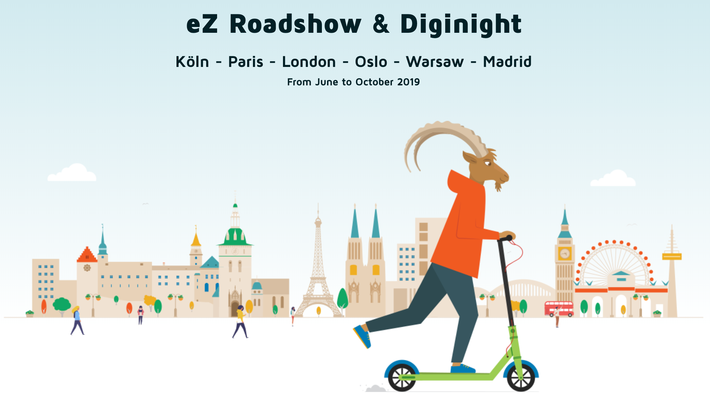

---

# eZ Platform v2.4 Features- Recap

--

# Content workflows as state machines

--

## Key Benefits:

- User Interface Integration
- Role and policies-based access control
- User or Groups Notification
- Multisite ability
- Extendable using event listeners delivered with Symfony Workflow Component

--

## Simple Editorial workflow

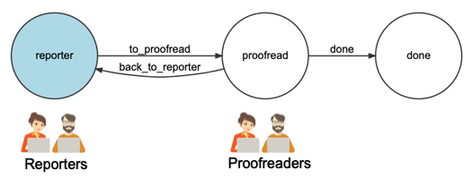

--

## Advanced Editorial workflow

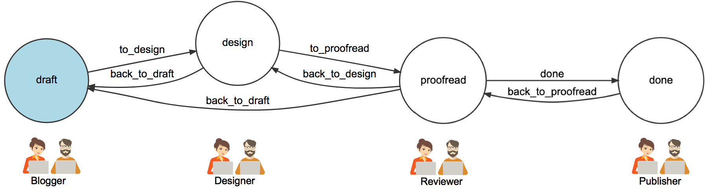

--

## Configuration

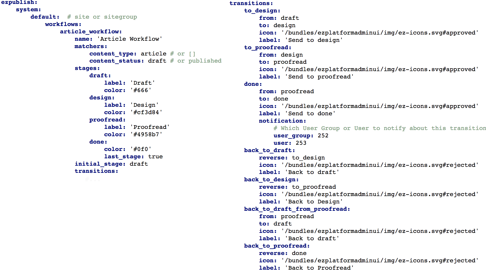

--

## UI integration

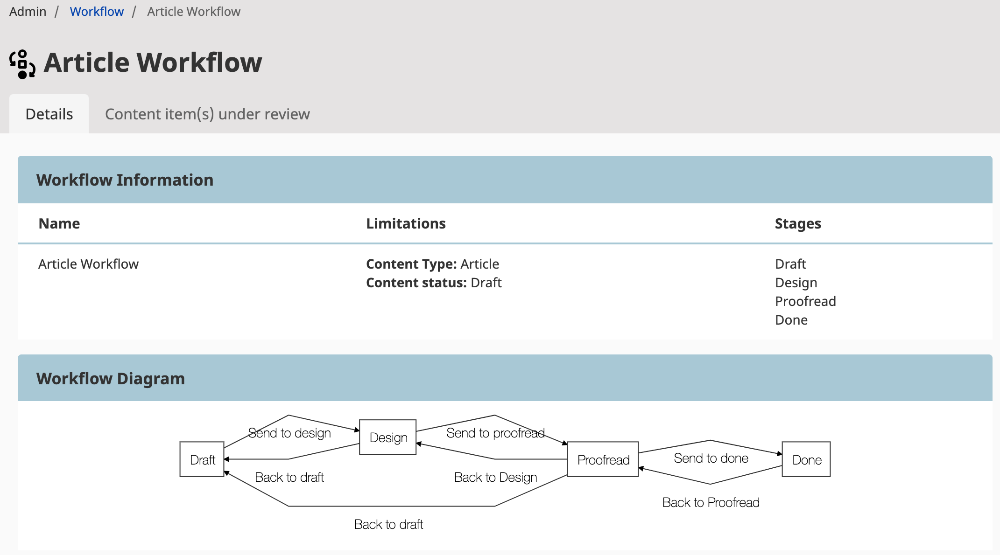

--

## Editors content tree access

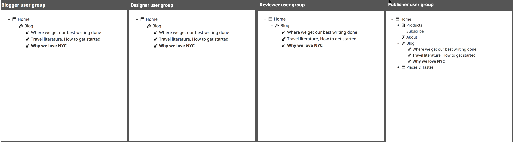

--

## User groups

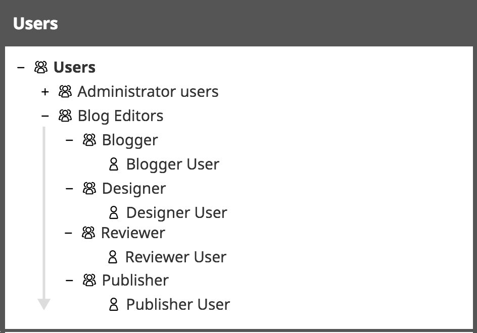

--

## Role and Policies

--

## <span class="orange_text">Blogger</span>

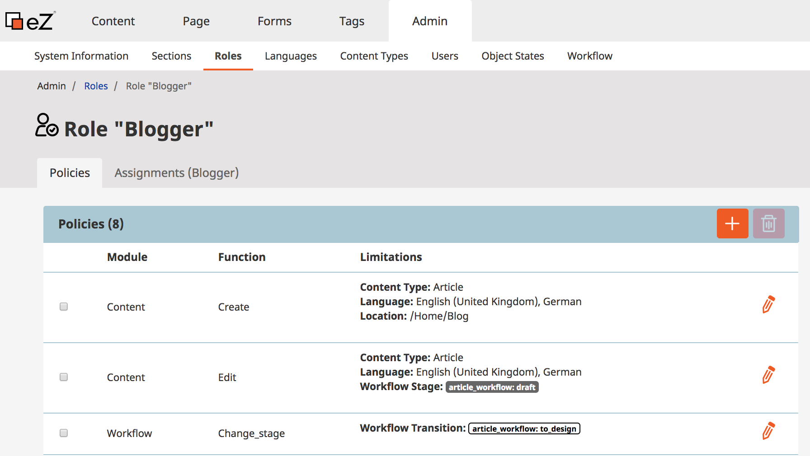

--

## <span class="orange_text">Designer</span>

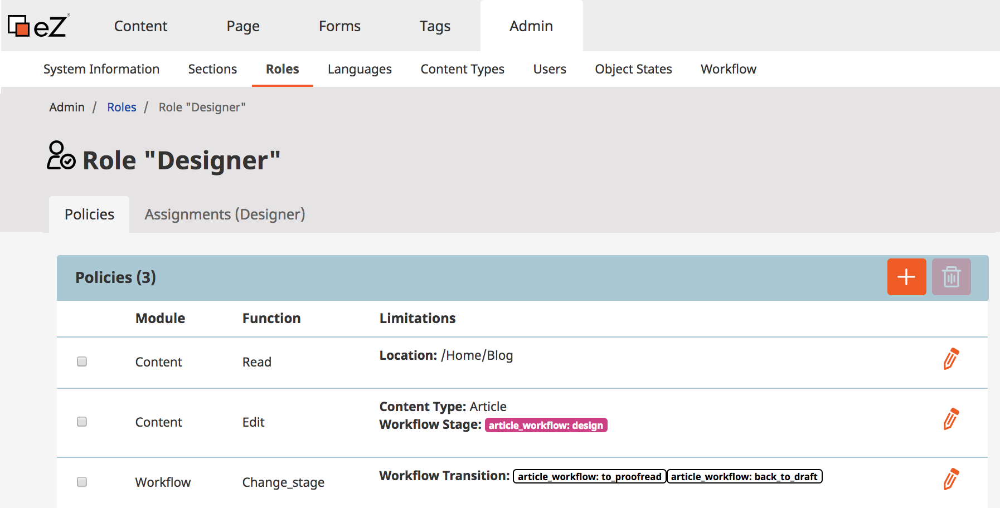

--

## <span class="orange_text">Reviewer</span>

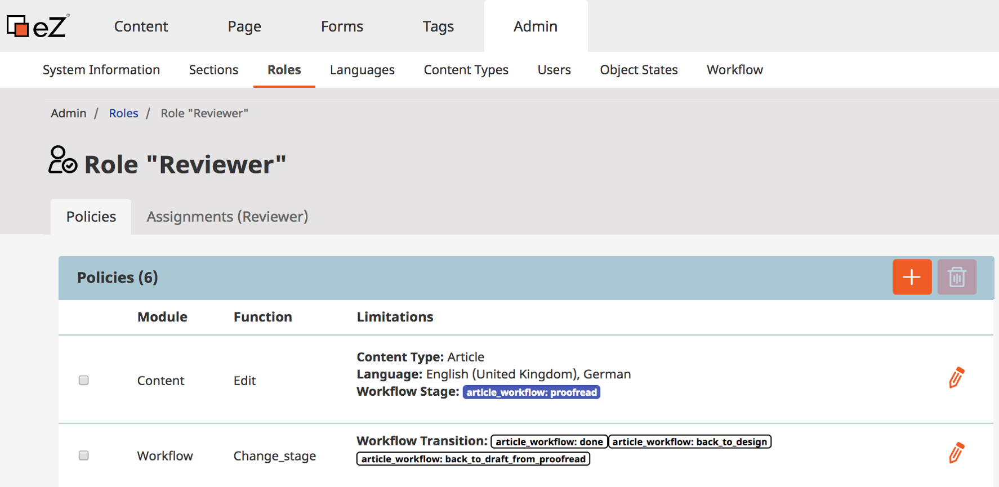

--

## <span class="orange_text">Publisher</span>

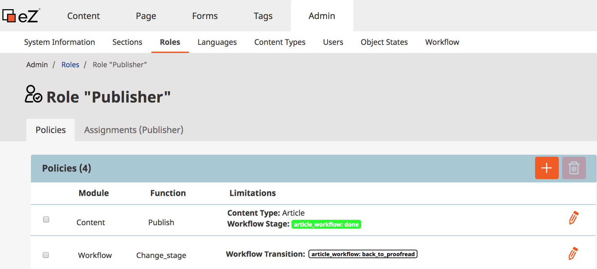

--

## Content edit

--

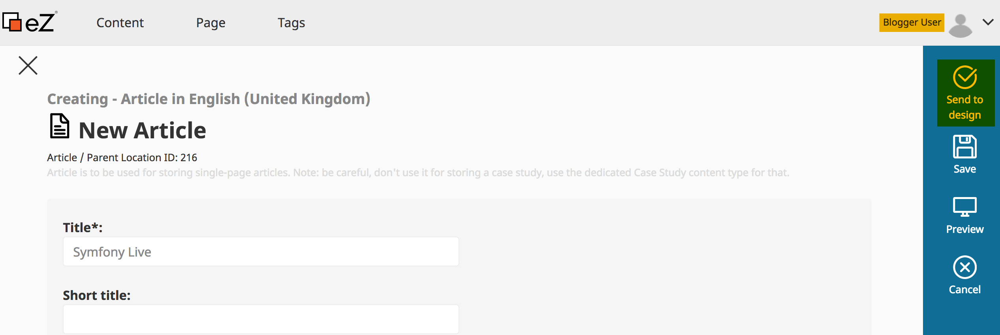

--

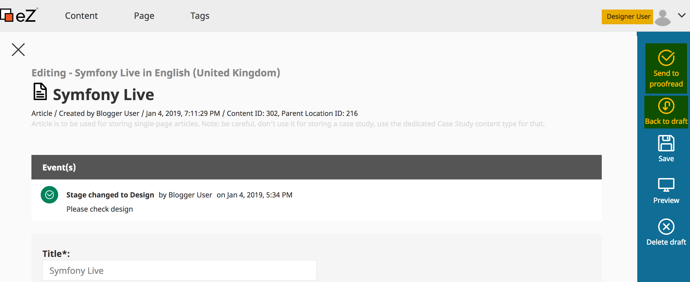

--

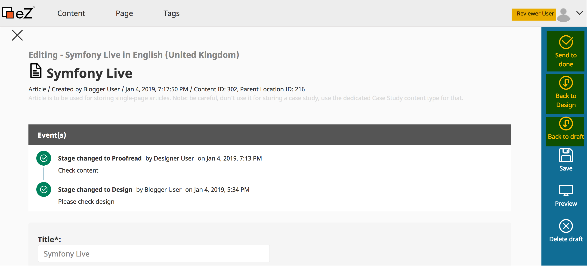

--

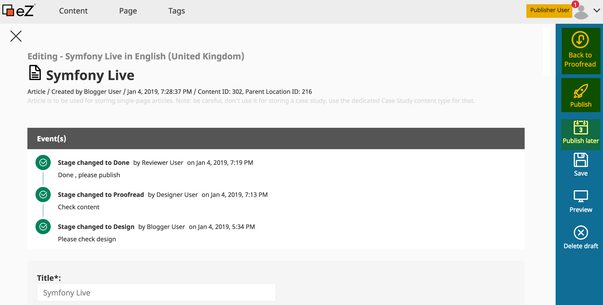

--

## Notifications

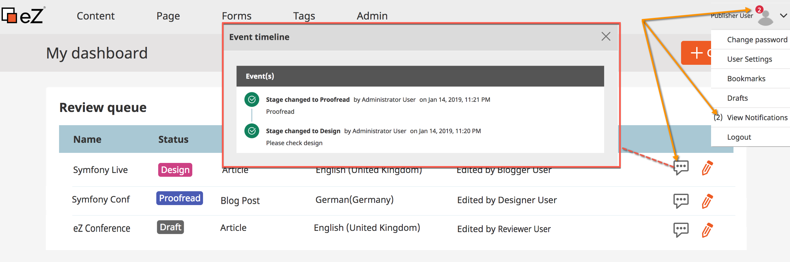


--

## Using Events

When a state transition is initiated, the events are dispatched in the following order:

- workflow.guard
- workflow.leave
- workflow.transition
- workflow.enter
- workflow.entered
- workflow.completed
- workflow.announce


&#9758; [Symfony Events doc](https://symfony.com/doc/current/workflow.html#using-events)

--

Each step has three events that are fired in order:

- An event for every workflow (global)
- An event for the workflow concerned
- An event for the workflow concerned with the specific transition or place name

--

## Listen to Events

- Block content publishing
	- using `workflow.guard`: Validate whether the transition is allowed at all

```
public static function getSubscribedEvents()
{
    return [
        'workflow.<workfolw_name>.guard' => ['guardReview'],
    ];
}
public function guardReview(GuardEvent $event)
{
        $subject = $event->getSubject();
        if( $subject instanceof Content && count($subject->getFieldValue('relations')->destinationContentIds) < 2 ) {
                $event->setBlocked('true');
                $this->notificationHandler->error(
                        'You should add at least two relations to this content'
                );
        }
}
```

Note: image size too large, image meta data(copyright, camera:sony/ should be canon ;). Relation to other product with empty stock(warning), number of relations is not satisfied, ...  

--

- Automatically publishing when the last stage/place is reached: done
	- using `workflow.entered`: The subject has entered in the places and the marking is updated (making it a good place to flush data in Doctrine).

```
public static function getSubscribedEvents()
{
    return [
        'workflow.<workfolw_name>.entered.done' => ['publishOnDone'],
    ];
}
public function publishOnDone(Event $event)
{
    $subject = $event->getSubject();
    $this->repository->sudo(function () use ($subject) {
            $this->contentService->publishVersion( $subject->versionInfo );
            $this->notificationHandler->success(
                'Content successfully published'
            );
        });
}
```

--


## Full Release updates

&#9758; [eZ Platform v2.4 Release](https://doc.ezplatform.com/en/latest/releases/ez_platform_v2.4/)

&#9758; [2.4 Features](https://arfaram.github.io/slides/ezplatform_v2.4)

---

# eZ Platform v2.5

--


**Release date**: March 29, 2019

**Release type**: LTS

--


- Symfony 3.4.23
- Improvements and bug fixes since v2.4.0
	- https://github.com/ezsystems/ezplatform-ee/releases

---

# What's New in eZ Platform v2.5

---

# Content Tree

--

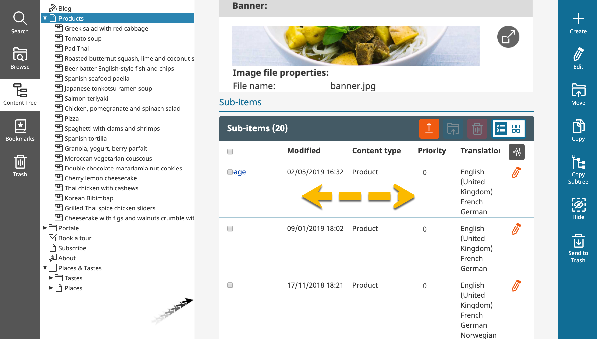

--

```yml
ezpublish:
    system:
        # any SiteAccess or SiteAccess group
        admin_group:
            content_tree_module:
                # defines how many children will be shown after expanding parent
                load_more_limit: 15
                # users won't be able to load more children than that
                children_load_max_limit: 200
                # maximum depth of expanded tree
                tree_max_depth: 10
                # Content Types to display in Content Tree, value of '*' allows all CTs to be displayed
                allowed_content_types: '*'
                # Content Tree won't display these Content Types, can be used only when 'allowed_content_types' is set to '*'
                ignored_content_types:
                   - post
                   - article
                # ID of Location to use as tree root. If omitted - content.tree_root.location_id setting is used.
                tree_root_location_id: 2
                # list of Location IDs for which Content Tree's root Location will be changed
                contextual_tree_root_location_ids:
                   - 2 # Home (Content structure)
                   - 5 # Users
                   - 43 # Media
```

--

```yml
contextual_tree_root_location_ids:
   - 54 # Product
```

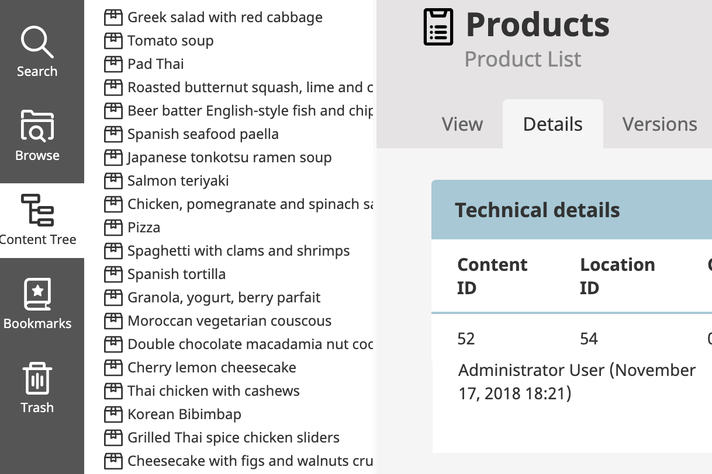


--

## REST API: Load location subitems

```
Request:
GET /api/ezp/v2/location/tree/load-subitems/<LocationId>/<limit>/<offset>
Accept: application/vnd.ez.api.ContentTreeRoot+xml
```
```
Response:
{
    "ContentTreeNode": {
        "_media-type": "application/vnd.ez.api.ContentTreeNode+json",
        "locationId": 207,
        "contentId": 236,
        "name": "Places & Tastes",
        "contentTypeIdentifier": "landing_page",
        "isContainer": true,
        "isInvisible": false,
        "displayLimit": 30,
        "totalChildrenCount": 2,
        "children": [
            {
                "_media-type": "application/vnd.ez.api.ContentTreeNode+json",
                "locationId": 208,
                "contentId": 206,
                "name": "Tastes",
                "contentTypeIdentifier": "folder",
                "isContainer": true,
                "isInvisible": false,
                "displayLimit": 30,
                "totalChildrenCount": 7,
                "children": []
            },
            {
                "_media-type": "application/vnd.ez.api.ContentTreeNode+json",
                "locationId": 220,
                "contentId": 218,
                "name": "Places",
                "contentTypeIdentifier": "place_list",
                "isContainer": true,
                "isInvisible": false,
                "displayLimit": 30,
                "totalChildrenCount": 6,
                "children": []
            }
        ]
    }
}
```

--

## REST API: Load Subtree (e.g /2/207/220)

Request header:
```
POST /api/ezp/v2/location/tree/load-subtree
Accept: application/vnd.ez.api.ContentTreeRoot+json
Content-Type: application/vnd.ez.api.ContentTreeLoadSubtreeRequest+json
X-CSRF-Token: {{csrf_token}}
```
Request body:
```
{
  "LoadSubtreeRequest": {
    "_media-type": "application/vnd.ez.api.ContentTreeLoadSubtreeRequest",
    "nodes": [
      {
        "_media-type": "application/vnd.ez.api.ContentTreeLoadSubtreeRequestNode",
        "locationId": 2,
        "limit": 30,
        "offset": 0,
        "children": [
          {
            "_media-type": "application/vnd.ez.api.ContentTreeLoadSubtreeRequestNode",
            "locationId": 207,
            "limit": 30,
            "offset": 0,
            "children": [
              {
                "_media-type": "application/vnd.ez.api.ContentTreeLoadSubtreeRequestNode",
                "locationId": 220,
                "limit": 2,
                "offset": 0,
                "children": []
              }
            ]
          }
        ]
      }
    ]
  }
}
```

--

Response body:

```
{
    "ContentTreeRoot": {
        "_media-type": "application/vnd.ez.api.ContentTreeRoot+json",
        "ContentTreeNodeList": [
            {
                "_media-type": "application/vnd.ez.api.ContentTreeNode+json",
                "locationId": 2,
                "contentId": 235,
                "name": "Home",
                "contentTypeIdentifier": "landing_page",
                "isContainer": true,
                "isInvisible": false,
                "displayLimit": 30,
                "totalChildrenCount": 7,
                "children": [
                    {
                        "_media-type": "application/vnd.ez.api.ContentTreeNode+json",
                        "locationId": 306,
                        "contentId": 318,
                        "name": "Blog",
                        "contentTypeIdentifier": "blog",
                        "isContainer": true,
                        "isInvisible": false,
                        "displayLimit": 30,
                        "totalChildrenCount": 0,
                        "children": []
                    },
                    {
                        "_media-type": "application/vnd.ez.api.ContentTreeNode+json",
                        "locationId": 54,
                        "contentId": 52,
                        "name": "Products",
                        "contentTypeIdentifier": "product_list",
                        "isContainer": true,
                        "isInvisible": false,
                        "displayLimit": 30,
                        "totalChildrenCount": 20,
                        "children": []
                    },
                    {
                        "_media-type": "application/vnd.ez.api.ContentTreeNode+json",
                        "locationId": 345,
                        "contentId": 356,
                        "name": "Portale",
                        "contentTypeIdentifier": "folder",
                        "isContainer": true,
                        "isInvisible": false,
                        "displayLimit": 30,
                        "totalChildrenCount": 3,
                        "children": []
                    },
                    {
                        "_media-type": "application/vnd.ez.api.ContentTreeNode+json",
                        "locationId": 240,
                        "contentId": 238,
                        "name": "Book a tour",
                        "contentTypeIdentifier": "form",
                        "isContainer": false,
                        "isInvisible": false,
                        "displayLimit": 30,
                        "totalChildrenCount": 0,
                        "children": []
                    },
                    {
                        "_media-type": "application/vnd.ez.api.ContentTreeNode+json",
                        "locationId": 228,
                        "contentId": 226,
                        "name": "Subscribe",
                        "contentTypeIdentifier": "subscribe",
                        "isContainer": false,
                        "isInvisible": false,
                        "displayLimit": 30,
                        "totalChildrenCount": 0,
                        "children": []
                    },
                    {
                        "_media-type": "application/vnd.ez.api.ContentTreeNode+json",
                        "locationId": 227,
                        "contentId": 225,
                        "name": "About",
                        "contentTypeIdentifier": "about",
                        "isContainer": false,
                        "isInvisible": false,
                        "displayLimit": 30,
                        "totalChildrenCount": 0,
                        "children": []
                    },
                    {
                        "_media-type": "application/vnd.ez.api.ContentTreeNode+json",
                        "locationId": 207,
                        "contentId": 236,
                        "name": "Places & Tastes",
                        "contentTypeIdentifier": "landing_page",
                        "isContainer": true,
                        "isInvisible": false,
                        "displayLimit": 30,
                        "totalChildrenCount": 2,
                        "children": [
                            {
                                "_media-type": "application/vnd.ez.api.ContentTreeNode+json",
                                "locationId": 208,
                                "contentId": 206,
                                "name": "Tastes",
                                "contentTypeIdentifier": "folder",
                                "isContainer": true,
                                "isInvisible": false,
                                "displayLimit": 30,
                                "totalChildrenCount": 7,
                                "children": []
                            },
                            {
                                "_media-type": "application/vnd.ez.api.ContentTreeNode+json",
                                "locationId": 220,
                                "contentId": 218,
                                "name": "Places",
                                "contentTypeIdentifier": "place_list",
                                "isContainer": true,
                                "isInvisible": false,
                                "displayLimit": 2,
                                "totalChildrenCount": 6,
                                "children": [
                                    {
                                        "_media-type": "application/vnd.ez.api.ContentTreeNode+json",
                                        "locationId": 221,
                                        "contentId": 219,
                                        "name": "Valencia, Spain",
                                        "contentTypeIdentifier": "place",
                                        "isContainer": false,
                                        "isInvisible": false,
                                        "displayLimit": 30,
                                        "totalChildrenCount": 0,
                                        "children": []
                                    },
                                    {
                                        "_media-type": "application/vnd.ez.api.ContentTreeNode+json",
                                        "locationId": 222,
                                        "contentId": 220,
                                        "name": "Kochin, India",
                                        "contentTypeIdentifier": "place",
                                        "isContainer": false,
                                        "isInvisible": false,
                                        "displayLimit": 30,
                                        "totalChildrenCount": 0,
                                        "children": []
                                    }
                                ]
                            }
                        ]
                    }
                ]
            }
        ]
    }
}
```

---
