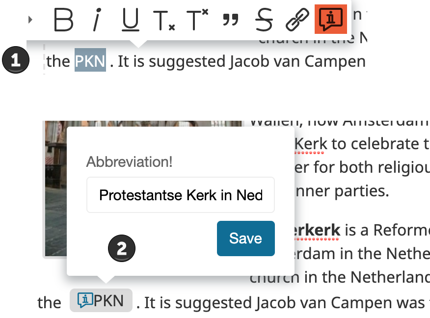

# eZ Roadshow 2019


---

# eZ Platform v2.4 Features- Recap

--

# Content workflows as state machines

--

## Key Benefits:

- User Interface Integration
- Role and policies-based access control
- User or Groups Notification
- Multisite ability
- Extendable using event listeners delivered with Symfony Workflow Component

--

## Simple Editorial workflow


--

## Advanced Editorial workflow


--

## Configuration


--

## UI integration


--

## Editors content tree access


--

## User groups


--

## Role and Policies

--

## <span class="orange_text">Blogger</span>


--

## <span class="orange_text">Designer</span>


--

## <span class="orange_text">Reviewer</span>


--

## <span class="orange_text">Publisher</span>


--

## Content edit

--


--


--


--


--

## Notifications


--

## Using Events

When a state transition is initiated, the events are dispatched in the following order:

- workflow.guard
- workflow.leave
- workflow.transition
- workflow.enter
- workflow.entered
- workflow.completed
- workflow.announce


&#9758; [Symfony Events doc](https://symfony.com/doc/current/workflow.html#using-events)

--

Each step has three events that are fired in order:

- An event for every workflow (global)
- An event for the workflow concerned
- An event for the workflow concerned with the specific transition or place name

--

## Listen to Events

- Block content publishing
	- using `workflow.guard`: Validate whether the transition is allowed at all

```
public static function getSubscribedEvents()
{
    return [
        'workflow.<workfolw_name>.guard' => ['guardReview'],
    ];
}
public function guardReview(GuardEvent $event)
{
        $subject = $event->getSubject();
        if( $subject instanceof Content && count($subject->getFieldValue('relations')->destinationContentIds) < 2 ) {
                $event->setBlocked('true');
                $this->notificationHandler->error(
                        'You should add at least two relations to this content'
                );
        }
}
```

Note: image size too large, image meta data(copyright, camera:sony/ should be canon ;). Relation to other product with empty stock(warning), number of relations is not satisfied, ...  

--

- Automatically publishing when the last stage/place is reached: done
	- using `workflow.entered`: The subject has entered in the places and the marking is updated (making it a good place to flush data in Doctrine).

```
public static function getSubscribedEvents()
{
    return [
        'workflow.<workfolw_name>.entered.done' => ['publishOnDone'],
    ];
}
public function publishOnDone(Event $event)
{
    $subject = $event->getSubject();
    $this->repository->sudo(function () use ($subject) {
            $this->contentService->publishVersion( $subject->versionInfo );
            $this->notificationHandler->success(
                'Content successfully published'
            );
        });
}
```

--


## Full Release updates

&#9758; [eZ Platform v2.4 Release](https://doc.ezplatform.com/en/latest/releases/ez_platform_v2.4/)

&#9758; [2.4 Features](https://arfaram.github.io/slides/ezplatform_v2.4)

---

# eZ Platform v2.5

--


**Release date**: March 29, 2019

**Release type**: LTS

--


- Symfony 3.4.23
- Improvements and bug fixes since v2.4.0
	- https://github.com/ezsystems/ezplatform-ee/releases

---

# What's New in eZ Platform v2.5

---

# Content Tree

--


--

```yml
ezpublish:
    system:
        # any SiteAccess or SiteAccess group
        admin_group:
            content_tree_module:
                # defines how many children will be shown after expanding parent
                load_more_limit: 15
                # users won't be able to load more children than that
                children_load_max_limit: 200
                # maximum depth of expanded tree
                tree_max_depth: 10
                # Content Types to display in Content Tree, value of '*' allows all CTs to be displayed
                allowed_content_types: '*'
                # Content Tree won't display these Content Types, can be used only when 'allowed_content_types' is set to '*'
                ignored_content_types:
                   - post
                   - article
                # ID of Location to use as tree root. If omitted - content.tree_root.location_id setting is used.
                tree_root_location_id: 2
                # list of Location IDs for which Content Tree's root Location will be changed
                contextual_tree_root_location_ids:
                   - 2 # Home (Content structure)
                   - 5 # Users
                   - 43 # Media
```

--

```yml
contextual_tree_root_location_ids:
   - 54 # Product
```


--

## REST API: Load location subitems

```
Request:
GET /api/ezp/v2/location/tree/load-subitems/<LocationId>/<limit>/<offset>
Accept: application/vnd.ez.api.ContentTreeRoot+xml
```
```
Response:
{
    "ContentTreeNode": {
        "_media-type": "application/vnd.ez.api.ContentTreeNode+json",
        "locationId": 207,
        "contentId": 236,
        "name": "Places & Tastes",
        "contentTypeIdentifier": "landing_page",
        "isContainer": true,
        "isInvisible": false,
        "displayLimit": 30,
        "totalChildrenCount": 2,
        "children": [
            {
                "_media-type": "application/vnd.ez.api.ContentTreeNode+json",
                "locationId": 208,
                "contentId": 206,
                "name": "Tastes",
                "contentTypeIdentifier": "folder",
                "isContainer": true,
                "isInvisible": false,
                "displayLimit": 30,
                "totalChildrenCount": 7,
                "children": []
            },
            {
                "_media-type": "application/vnd.ez.api.ContentTreeNode+json",
                "locationId": 220,
                "contentId": 218,
                "name": "Places",
                "contentTypeIdentifier": "place_list",
                "isContainer": true,
                "isInvisible": false,
                "displayLimit": 30,
                "totalChildrenCount": 6,
                "children": []
            }
        ]
    }
}
```

--

## REST API: Load Subtree (e.g /2/207/220)

Request header:
```
POST /api/ezp/v2/location/tree/load-subtree
Accept: application/vnd.ez.api.ContentTreeRoot+json
Content-Type: application/vnd.ez.api.ContentTreeLoadSubtreeRequest+json
X-CSRF-Token: {{csrf_token}}
```
Request body:
```
{
  "LoadSubtreeRequest": {
    "_media-type": "application/vnd.ez.api.ContentTreeLoadSubtreeRequest",
    "nodes": [
      {
        "_media-type": "application/vnd.ez.api.ContentTreeLoadSubtreeRequestNode",
        "locationId": 2,
        "limit": 30,
        "offset": 0,
        "children": [
          {
            "_media-type": "application/vnd.ez.api.ContentTreeLoadSubtreeRequestNode",
            "locationId": 207,
            "limit": 30,
            "offset": 0,
            "children": [
              {
                "_media-type": "application/vnd.ez.api.ContentTreeLoadSubtreeRequestNode",
                "locationId": 220,
                "limit": 2,
                "offset": 0,
                "children": []
              }
            ]
          }
        ]
      }
    ]
  }
}
```

--

Response body:

```
{
    "ContentTreeRoot": {
        "_media-type": "application/vnd.ez.api.ContentTreeRoot+json",
        "ContentTreeNodeList": [
            {
                "_media-type": "application/vnd.ez.api.ContentTreeNode+json",
                "locationId": 2,
                "contentId": 235,
                "name": "Home",
                "contentTypeIdentifier": "landing_page",
                "isContainer": true,
                "isInvisible": false,
                "displayLimit": 30,
                "totalChildrenCount": 7,
                "children": [
                    {
                        "_media-type": "application/vnd.ez.api.ContentTreeNode+json",
                        "locationId": 306,
                        "contentId": 318,
                        "name": "Blog",
                        "contentTypeIdentifier": "blog",
                        "isContainer": true,
                        "isInvisible": false,
                        "displayLimit": 30,
                        "totalChildrenCount": 0,
                        "children": []
                    },
                    {
                        "_media-type": "application/vnd.ez.api.ContentTreeNode+json",
                        "locationId": 54,
                        "contentId": 52,
                        "name": "Products",
                        "contentTypeIdentifier": "product_list",
                        "isContainer": true,
                        "isInvisible": false,
                        "displayLimit": 30,
                        "totalChildrenCount": 20,
                        "children": []
                    },
                    {
                        "_media-type": "application/vnd.ez.api.ContentTreeNode+json",
                        "locationId": 345,
                        "contentId": 356,
                        "name": "Portale",
                        "contentTypeIdentifier": "folder",
                        "isContainer": true,
                        "isInvisible": false,
                        "displayLimit": 30,
                        "totalChildrenCount": 3,
                        "children": []
                    },
                    {
                        "_media-type": "application/vnd.ez.api.ContentTreeNode+json",
                        "locationId": 240,
                        "contentId": 238,
                        "name": "Book a tour",
                        "contentTypeIdentifier": "form",
                        "isContainer": false,
                        "isInvisible": false,
                        "displayLimit": 30,
                        "totalChildrenCount": 0,
                        "children": []
                    },
                    {
                        "_media-type": "application/vnd.ez.api.ContentTreeNode+json",
                        "locationId": 228,
                        "contentId": 226,
                        "name": "Subscribe",
                        "contentTypeIdentifier": "subscribe",
                        "isContainer": false,
                        "isInvisible": false,
                        "displayLimit": 30,
                        "totalChildrenCount": 0,
                        "children": []
                    },
                    {
                        "_media-type": "application/vnd.ez.api.ContentTreeNode+json",
                        "locationId": 227,
                        "contentId": 225,
                        "name": "About",
                        "contentTypeIdentifier": "about",
                        "isContainer": false,
                        "isInvisible": false,
                        "displayLimit": 30,
                        "totalChildrenCount": 0,
                        "children": []
                    },
                    {
                        "_media-type": "application/vnd.ez.api.ContentTreeNode+json",
                        "locationId": 207,
                        "contentId": 236,
                        "name": "Places & Tastes",
                        "contentTypeIdentifier": "landing_page",
                        "isContainer": true,
                        "isInvisible": false,
                        "displayLimit": 30,
                        "totalChildrenCount": 2,
                        "children": [
                            {
                                "_media-type": "application/vnd.ez.api.ContentTreeNode+json",
                                "locationId": 208,
                                "contentId": 206,
                                "name": "Tastes",
                                "contentTypeIdentifier": "folder",
                                "isContainer": true,
                                "isInvisible": false,
                                "displayLimit": 30,
                                "totalChildrenCount": 7,
                                "children": []
                            },
                            {
                                "_media-type": "application/vnd.ez.api.ContentTreeNode+json",
                                "locationId": 220,
                                "contentId": 218,
                                "name": "Places",
                                "contentTypeIdentifier": "place_list",
                                "isContainer": true,
                                "isInvisible": false,
                                "displayLimit": 2,
                                "totalChildrenCount": 6,
                                "children": [
                                    {
                                        "_media-type": "application/vnd.ez.api.ContentTreeNode+json",
                                        "locationId": 221,
                                        "contentId": 219,
                                        "name": "Valencia, Spain",
                                        "contentTypeIdentifier": "place",
                                        "isContainer": false,
                                        "isInvisible": false,
                                        "displayLimit": 30,
                                        "totalChildrenCount": 0,
                                        "children": []
                                    },
                                    {
                                        "_media-type": "application/vnd.ez.api.ContentTreeNode+json",
                                        "locationId": 222,
                                        "contentId": 220,
                                        "name": "Kochin, India",
                                        "contentTypeIdentifier": "place",
                                        "isContainer": false,
                                        "isInvisible": false,
                                        "displayLimit": 30,
                                        "totalChildrenCount": 0,
                                        "children": []
                                    }
                                ]
                            }
                        ]
                    }
                ]
            }
        ]
    }
}
```

---

# Webpack Encore

--

- eZ Platform uses Webpack Encore(more modern way) for asset management.
- Requirement: **node.js** and **yarn**

&#9940; Assetic is still in use, but it will be deprecated in a future version.

**Dump assets**

```
php bin/console assetic:dump -e prod
yarn install
yarn encore prod
```

```
yarn encore dev
yarn encore dev --config-name ezplatform
yarn encore dev --config-name <customConfigName>
yarn encore dev --config-name <customConfigName> --watch
```

--

**1. Structuring a bundle**

```        
`-- CustomBundle
    `-- Resources
        |-- encore
        |   `-- ez.config.js
        |   `-- ez.webpack.custom.config.js
        |   `-- ez.config.manager.js
        `-- public
            |-- css
            |-- scss
            `-- js

```

--

&#9745; `ez.config.js`: import assets from a bundle

```
const path = require('path');

module.exports = (Encore) => {
    Encore
        .addEntry('<entry-name-css>', [
            path.resolve(__dirname, '../public/scss/style.scss'),
            path.resolve(__dirname, '../public/css/style.css'),
        ])
				.addEntry('<entry-name-js>', [
            path.resolve(__dirname, '../public/js/script.js')
        ]);
};

```

pagelayout.html.twig

```
{{ encore_entry_link_tags('entry-name-css') }}
{{ encore_entry_script_tags('entry-name-js') }}
```

--

&#9745; `ez.webpack.custom.config.js` : To add new configuration under your own namespace and with its own dependencies

```
const Encore = require('@symfony/webpack-encore');

Encore.setOutputPath('<custom-path>')
		.setPublicPath('<custom-path>')
		.autoProvidejQuery()
		.enableSassLoader()
		// ...
		.addEntry('<entry-name>', ['<JS-path>']);

const customConfig = Encore.getWebpackConfig();

customConfig.name = 'customConfigName';

// Config or array of configs: [customConfig1, customConfig2];
module.exports = customConfig;
```
pagelayout.html.twig

```
{{ encore_entry_link_tags('<entry-name>', null, 'customConfigName') }}
{{ encore_entry_script_tags('<entry-name>', null, 'customConfigName') }}
```

--

compile assets

```
yarn encore dev --config-name <customConfigName>
```

or use package.json:
```
"scripts": {
    "dev-server": "encore dev-server",
    "dev": "encore dev",
    "configname": "encore dev --config-name customConfigName",
    "watch": "encore dev --watch",
    "build": "encore production"
  }

```

and then
```
yarn configname
npm run configname
```

--

&#9745; `ez.config.manager.js` : To edit existing configuration entries

```
const path = require('path');

module.exports = (eZConfig, eZConfigManager) => {
    eZConfigManager.add({
        eZConfig,
        entryName: 'ezplatform-admin-ui-security-base-css',
        newItems:[path.resolve(__dirname, '../public/scss/demo.admin.scss')],
    });
};
```

--

**2. Configuration from main project file**

Everything in Encore is configured via a `webpack.config.js`  file at the root of your project. It already holds the basic config you need:

```
Encore.addEntry('demo', [
    path.resolve(__dirname, './web/assets/scss/demo.scss'),
    path.resolve(__dirname, './web/assets/js/blocks/placesMapLoader.js'),
    path.resolve(__dirname, './web/assets/js/main.js'),
]);
```

---

# Various improvements

--

## Notification bars timeout


--


```
#ezplatform-admin-ui/src/bundle/Resources/config/ezplatform_default_settings.yml

ezsettings.default.notifications.error.timeout: 0
ezsettings.default.notifications.warning.timeout: 0
ezsettings.default.notifications.success.timeout: 5000
ezsettings.default.notifications.info.timeout: 0
```

```
ezpublish:
    system:
        admin:
            notifications:
                info:
                    timeout: 3000
```

```
//use EzSystems\EzPlatformAdminUi\Notification\NotificationHandlerInterface;
//use Symfony\Component\Translation\TranslatorInterface;

$this->notificationHandler->info(
    $this->translator->trans(
        'contenttype.update.success',
        ['%identifier%' => $data->getContentType()->identifier],
        'dashboard'
    )
);
```

--

## System Information - Bundle Version


```
composer show | grep -e kernel -e user
composer show | egrep 'kernel|user'
composer show -i
composer show -i -t
composer show -- ezsystems/ezplatform-user
less composer.lock | grep kernel !  😱 😬
```


--


--

## Icons for Content Types

`ezplatform-admin-ui`/src/bundle/Resources/config/default_parameters.yml

&#xE3C9; **Standard Icons**
```
ezsettings.default.content_type.article:
	thumbnail: '/bundles/ezplatformadminui/img/ez-icons.svg#article'
ezsettings.default.content_type.blog_post:
	thumbnail: '/bundles/ezplatformadminui/img/ez-icons.svg#blog_post'
ezsettings.default.content_type.user:
	thumbnail: '/bundles/ezplatformadminui/img/ez-icons.svg#user'
```

&#xE3C9; **default icon**
```
ezsettings.default.content_type.default-config:
	thumbnail: '/bundles/ezplatformadminui/img/ez-icons.svg#file'
```

--

&#xE3C9; **custom default icon**

```
ezpublish:
    system:
       default:
           content_type:
              default-config:
                 thumbnail: '/assets/images/mydefaulticon.svg'
```

&#xE3C9; **custom contentType icon**

```
ezpublish:
    system:
       admin_group:
           content_type:
              article:
                 thumbnail: '/assets/images/customicon.svg'
```

&#9998; All icons should be in SVG format so they can display properly in Back Office.

--

&#xE3C9; Custom icons in Twig templates

```
<svg class="ez-icon ez-icon-{{ contentType.identifier }}">
    <use xlink:href="{{ ez_content_type_icon(contentType.identifier) }}"></use>
</svg>
```


--

# RichText enhancements

--

## Inline custom tags

- Insert the “custom tag” within a line of rich text
- Embed different type of content in a paragraph without breaking the flow of the sentence.

**Configuration**

```
ezpublish:
    system:
        admin_group:
            fieldtypes:
                ezrichtext:
                    custom_tags: [abbreviation]

ezrichtext:
    custom_tags:
        abbreviation:
            template: '@ezdesign/fields/ezrichtext/custom_tags/abbreviation.html.twig'
            icon: '/bundles/ezplatformadminui/img/ez-icons.svg#about'
            is_inline: true
            attributes:
                style:
                    type: 'string'
```

--

**Edit**


--

**Storage**


--

**Rendering**


--

## Anchor link


--

## Floating Toolbar


<video class="center scale60" controls>
    <source data-src="videos/floating_toolbar.mov" type="video/mp4" />
</video>

---

# miscellaneous Features

but useful !

--

- Filtering sub-items menu (Extensibility - Detail to follow)
- Collapse sections (fields preview) in the content view
- Assign a content item and its sub-items to a certain section from the content view
	- (<span class="orange_text">New</span>) `AssignSectionToSubtreeSignal` : returns locationId and sectionId
- Define a new main language for the content and then be able to delete unnecessary languages under the translation tab
- Object state table includes fewer fields and make it easier to read
- Password requirements: 10 characters long, and must include upper and lower case letters, and digits. Existing passwords are not changed.
- Dashboard a label that indicates the eZ version and license type that is being used

---

# Database Updates

--

- [dbupdate-7.4.0-to-7.5.0.sql](https://github.com/ezsystems/ezpublish-kernel/tree/master/data/update)

```
...

CREATE TABLE `ezcontentclass_attribute_ml`

ALTER TABLE ezcontentobject_trash add  trashed int(11) NOT NULL DEFAULT '0';

ALTER TABLE `ezcontentobject` ADD COLUMN `is_hidden` tinyint(1) NOT NULL DEFAULT '0';

```

--

#### ezcontentclass_attribute_ml for ContentType MultilingualData

[As an Administrator I want to translate ezselection Field Definition options](https://github.com/ezsystems/ezpublish-kernel/pull/2532)

```
contentclass_attribute_id: 313
                  version: 0
              language_id: 2
                     name: Salutation
              description: NULL
                data_text: <?xml version="1.0" encoding="utf-8"?>
<ezselection><options><option id="0" name="Mr"/><option id="1" name="Mrs."/></options></ezselection>

                data_json: NULL
*************************** 40. row ***************************
contentclass_attribute_id: 313
                  version: 0
              language_id: 8
                     name: Anrede
              description: NULL
                data_text: <?xml version="1.0" encoding="utf-8"?>
<ezselection><options><option id="0" name="Herr"/><option id="1" name="Frau"/></options></ezselection>
				data_json: NULL
```

&#9758; More infos in `SelectionConverter.php`

--

Using the Public API to set `ezselection` fieldSettings.

```
$selectionFieldCreate =
$contentTypeService->newFieldDefinitionCreateStruct('selection', 'ezselection');
$selectionFieldCreate->isRequired = true;
//...
$selectionFieldUpdate->fieldSettings = [
		'multilingualOptions' => [
				'eng-US' => [
						0 => 'Seattle',
						1 => 'San Francisco',
				],
				'ger-DE' => [
						0 => 'Berlin',
						1 => 'Cologne',
						2 => 'Bonn',
				],
				'eng-GB' => [
						0 => 'London',
						1 => 'Liverpool',
				],
		],
);
```

Also used everytime you translate FieldType name:

```
'name' => [
    'eng-US' => 'description',
    'ger-DE' => 'Überschrift',
],
```

--

#### ezcontentobject_trash : trashed column

- `TrashItem->trashed` timestamp covers when a Content item was placed in Trash
	- API: `TrashService`:  used within `trash()` and `loadTrashItem()` methods

--

#### ezcontentobject: is_hidden column

- `is_hidden`: Hiding and revealing **Content** by making all the Locations appear hidden/visible.
	- (Legacy)**Visibility/Location** `ezcontentobject_tree` : `is_hidden` & `is_invisible` columns
	- (<span class="orange_text">New</span>)**Hidden/Content** `ezcontentobject`: `is_hidden` column, (`ezcontentobject_tree.is_invisible` = 1 if content is hidden)
		- API: `ContentService`: `hideContent()` and `revealContent()` methods
		- `HideContentSignal` and `RevealContentSignal` : `contentId` Property

--

## Content vs Location hide


---

# Using PostgreSQL

--

- The introduction of [support for PostgreSQL](https://doc.ezplatform.com/en/latest/guide/databases/#using-postgresql) includes a change in the way database schema is generated.

- It is now created based on [YAML configuration](https://github.com/ezsystems/ezpublish-kernel/blob/master/eZ/Bundle/EzPublishCoreBundle/Resources/config/storage/legacy/schema.yaml), using the new [DoctrineSchemaBundle](https://github.com/ezsystems/doctrine-dbal-schema).

Requirements:

&#9745; `pdo_pgsql` PHP extension

&#9745; `ezsystems/doctrine-dbal-schema` Bundle provides cross-DBMS schema import

&#9745; `ez_doctrine_schema` settings in config.yml

--

## Doctrine Schema Bundle

- **SchemaBuilder**
	- Is an extensibility point to be used by Symfony-based projects.
	- Provided by APIs defined on the `SchemaBuilder` interface
	- Is event-driven
- **Schema Exporter**
	- Provided by APIs defined on the `SchemaExporter` interface
	- Exports given `\Doctrine\DBAL\Schema` object to the custom Yaml format.

- `CoreInstaller`: New variant of CleanInstaller, which uses SchemaBuilder.
- You can extend the `DbBasedInstaller`(only for eZPlatform Installtion) to import data `runQueriesFromFile()`

---
