# eZ Global Partner Conference 2020 <br> January 23-24</h1>


<center>
<h3 style="padding-top:30px;"class="orange_text">Annual Update training<br/> Track A</h3>
</center>

<ul class="ez-slide-meta light-list">
		<li>Ramzi Arfaoui</li>
		<li>Solutions Architect</li>
		<li><a href="mailto:ramzi.arfaoui@ez.no">ramzi.arfaoui@ez.no</a></li>
		<li>Github:<a href="https://github.com/arfaram">@arfaram</a></li>
</ul>

---

# eZ Platform v2.x - Recap

--

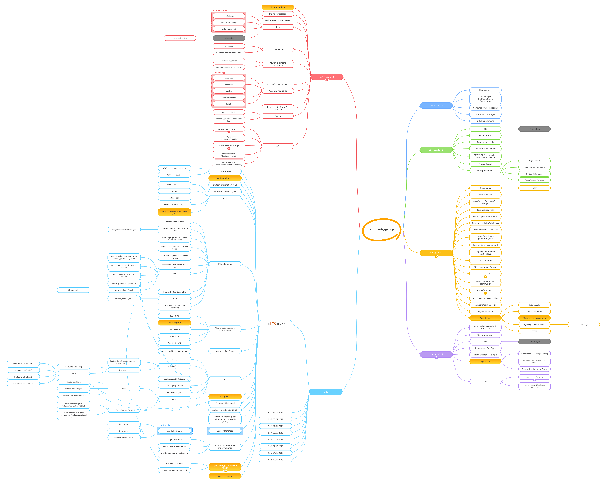

--

<center>
<h3> http://bit.ly/2v6gxMa </h3>
</center>

---

# eZ Platform v2.5

--

**Release date**: March 29, 2019

**Release type**: LTS

- Symfony 3.4.23
- Improvements and bug fixes since v2.4.0
	- https://github.com/ezsystems/ezplatform-ee/releases
- 2.5.8 (Symfony 3.4.36)

---

# What's New in eZ Platform v2.5

---

# Editorial Workflow

### UI Improvement

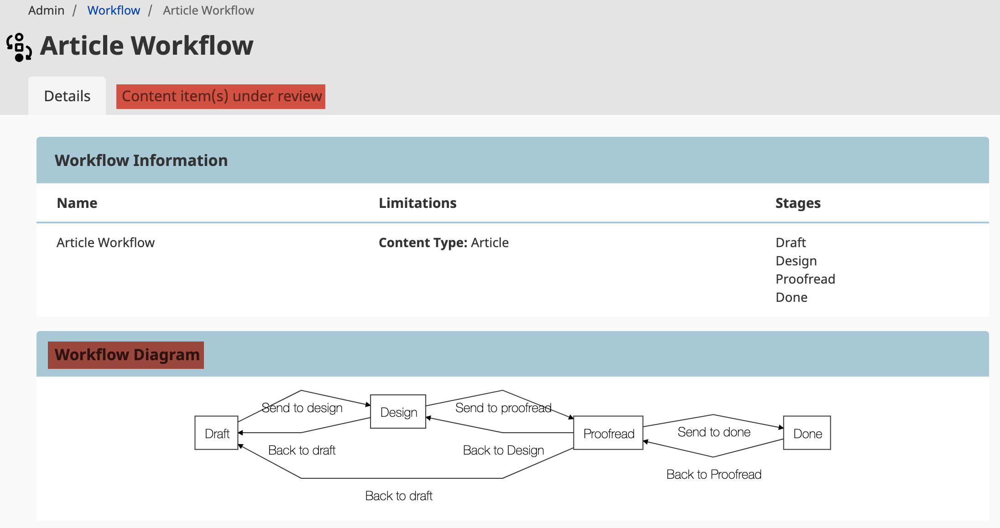

--

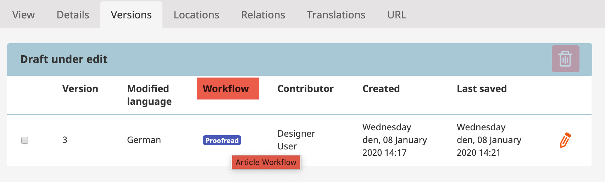

Note:Also it adds tooltips to stage badges with Workflow name for easier identification


&#9758; [More info](https://arfaram.github.io/slides/ezplatform_v2.5/#/2/1)

---

# Content Tree

--

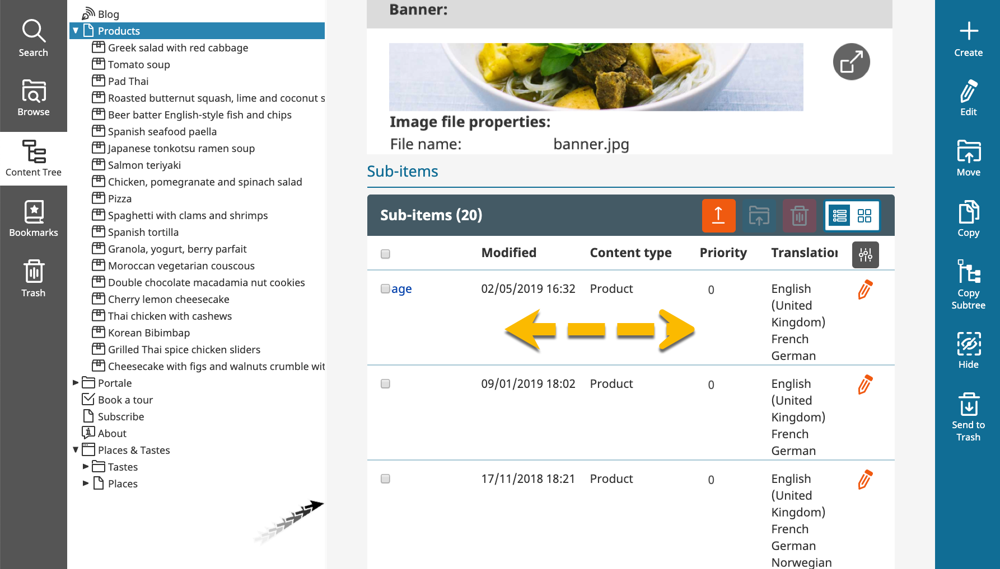

--

```yml
ezpublish:
    system:
        # any SiteAccess or SiteAccess group
        admin_group:
            content_tree_module:
                # defines how many children will be shown after expanding parent
                load_more_limit: 15
                # users won't be able to load more children than that
                children_load_max_limit: 200
                # maximum depth of expanded tree
                tree_max_depth: 10
                # Content Types to display in Content Tree, value of '*' allows all CTs to be displayed
                allowed_content_types: '*'
                # Content Tree won't display these Content Types, can be used only when 'allowed_content_types' is set to '*'
                ignored_content_types:
                   - post
                   - article
                # ID of Location to use as tree root. If omitted - content.tree_root.location_id setting is used.
                tree_root_location_id: 2
                # list of Location IDs for which Content Tree's root Location will be changed
                contextual_tree_root_location_ids:
                   - 2 # Home (Content structure)
                   - 5 # Users
                   - 43 # Media
```

--

```yml
contextual_tree_root_location_ids:
   - 54 # Product
```


--

## REST API: Load location subitems

```
Request:
GET /api/ezp/v2/location/tree/load-subitems/<LocationId>/<limit>/<offset>
Accept: application/vnd.ez.api.ContentTreeRoot+xml
```
```
Response:
{
    "ContentTreeNode": {
        "_media-type": "application/vnd.ez.api.ContentTreeNode+json",
        "locationId": 207,
        "contentId": 236,
        "name": "Places & Tastes",
        "contentTypeIdentifier": "landing_page",
        "isContainer": true,
        "isInvisible": false,
        "displayLimit": 30,
        "totalChildrenCount": 2,
        "children": [
            {
                "_media-type": "application/vnd.ez.api.ContentTreeNode+json",
                "locationId": 208,
                "contentId": 206,
                "name": "Tastes",
                "contentTypeIdentifier": "folder",
                "isContainer": true,
                "isInvisible": false,
                "displayLimit": 30,
                "totalChildrenCount": 7,
                "children": []
            },
            {
                "_media-type": "application/vnd.ez.api.ContentTreeNode+json",
                "locationId": 220,
                "contentId": 218,
                "name": "Places",
                "contentTypeIdentifier": "place_list",
                "isContainer": true,
                "isInvisible": false,
                "displayLimit": 30,
                "totalChildrenCount": 6,
                "children": []
            }
        ]
    }
}
```

--

## REST API: Load Subtree (e.g /2/207/220)

Request header:
```
POST /api/ezp/v2/location/tree/load-subtree
Accept: application/vnd.ez.api.ContentTreeRoot+json
Content-Type: application/vnd.ez.api.ContentTreeLoadSubtreeRequest+json
X-CSRF-Token: {{csrf_token}}
```
Request body:
```
{
  "LoadSubtreeRequest": {
    "_media-type": "application/vnd.ez.api.ContentTreeLoadSubtreeRequest",
    "nodes": [
      {
        "_media-type": "application/vnd.ez.api.ContentTreeLoadSubtreeRequestNode",
        "locationId": 2,
        "limit": 30,
        "offset": 0,
        "children": [
          {
            "_media-type": "application/vnd.ez.api.ContentTreeLoadSubtreeRequestNode",
            "locationId": 207,
            "limit": 30,
            "offset": 0,
            "children": [
              {
                "_media-type": "application/vnd.ez.api.ContentTreeLoadSubtreeRequestNode",
                "locationId": 220,
                "limit": 2,
                "offset": 0,
                "children": []
              }
            ]
          }
        ]
      }
    ]
  }
}
```

--

Response body:

```
{
    "ContentTreeRoot": {
        "_media-type": "application/vnd.ez.api.ContentTreeRoot+json",
        "ContentTreeNodeList": [
            {
                "_media-type": "application/vnd.ez.api.ContentTreeNode+json",
                "locationId": 2,
                "contentId": 235,
                "name": "Home",
                "contentTypeIdentifier": "landing_page",
                "isContainer": true,
                "isInvisible": false,
                "displayLimit": 30,
                "totalChildrenCount": 7,
                "children": [
                    {
                        "_media-type": "application/vnd.ez.api.ContentTreeNode+json",
                        "locationId": 306,
                        "contentId": 318,
                        "name": "Blog",
                        "contentTypeIdentifier": "blog",
                        "isContainer": true,
                        "isInvisible": false,
                        "displayLimit": 30,
                        "totalChildrenCount": 0,
                        "children": []
                    },
                    {
                        "_media-type": "application/vnd.ez.api.ContentTreeNode+json",
                        "locationId": 54,
                        "contentId": 52,
                        "name": "Products",
                        "contentTypeIdentifier": "product_list",
                        "isContainer": true,
                        "isInvisible": false,
                        "displayLimit": 30,
                        "totalChildrenCount": 20,
                        "children": []
                    },
                    {
                        "_media-type": "application/vnd.ez.api.ContentTreeNode+json",
                        "locationId": 345,
                        "contentId": 356,
                        "name": "Portale",
                        "contentTypeIdentifier": "folder",
                        "isContainer": true,
                        "isInvisible": false,
                        "displayLimit": 30,
                        "totalChildrenCount": 3,
                        "children": []
                    },
                    {
                        "_media-type": "application/vnd.ez.api.ContentTreeNode+json",
                        "locationId": 240,
                        "contentId": 238,
                        "name": "Book a tour",
                        "contentTypeIdentifier": "form",
                        "isContainer": false,
                        "isInvisible": false,
                        "displayLimit": 30,
                        "totalChildrenCount": 0,
                        "children": []
                    },
                    {
                        "_media-type": "application/vnd.ez.api.ContentTreeNode+json",
                        "locationId": 228,
                        "contentId": 226,
                        "name": "Subscribe",
                        "contentTypeIdentifier": "subscribe",
                        "isContainer": false,
                        "isInvisible": false,
                        "displayLimit": 30,
                        "totalChildrenCount": 0,
                        "children": []
                    },
                    {
                        "_media-type": "application/vnd.ez.api.ContentTreeNode+json",
                        "locationId": 227,
                        "contentId": 225,
                        "name": "About",
                        "contentTypeIdentifier": "about",
                        "isContainer": false,
                        "isInvisible": false,
                        "displayLimit": 30,
                        "totalChildrenCount": 0,
                        "children": []
                    },
                    {
                        "_media-type": "application/vnd.ez.api.ContentTreeNode+json",
                        "locationId": 207,
                        "contentId": 236,
                        "name": "Places & Tastes",
                        "contentTypeIdentifier": "landing_page",
                        "isContainer": true,
                        "isInvisible": false,
                        "displayLimit": 30,
                        "totalChildrenCount": 2,
                        "children": [
                            {
                                "_media-type": "application/vnd.ez.api.ContentTreeNode+json",
                                "locationId": 208,
                                "contentId": 206,
                                "name": "Tastes",
                                "contentTypeIdentifier": "folder",
                                "isContainer": true,
                                "isInvisible": false,
                                "displayLimit": 30,
                                "totalChildrenCount": 7,
                                "children": []
                            },
                            {
                                "_media-type": "application/vnd.ez.api.ContentTreeNode+json",
                                "locationId": 220,
                                "contentId": 218,
                                "name": "Places",
                                "contentTypeIdentifier": "place_list",
                                "isContainer": true,
                                "isInvisible": false,
                                "displayLimit": 2,
                                "totalChildrenCount": 6,
                                "children": [
                                    {
                                        "_media-type": "application/vnd.ez.api.ContentTreeNode+json",
                                        "locationId": 221,
                                        "contentId": 219,
                                        "name": "Valencia, Spain",
                                        "contentTypeIdentifier": "place",
                                        "isContainer": false,
                                        "isInvisible": false,
                                        "displayLimit": 30,
                                        "totalChildrenCount": 0,
                                        "children": []
                                    },
                                    {
                                        "_media-type": "application/vnd.ez.api.ContentTreeNode+json",
                                        "locationId": 222,
                                        "contentId": 220,
                                        "name": "Kochin, India",
                                        "contentTypeIdentifier": "place",
                                        "isContainer": false,
                                        "isInvisible": false,
                                        "displayLimit": 30,
                                        "totalChildrenCount": 0,
                                        "children": []
                                    }
                                ]
                            }
                        ]
                    }
                ]
            }
        ]
    }
}
```

---

# Webpack Encore

--

- eZ Platform uses Webpack Encore(more modern way) for asset management.
- Requirement: **node.js** and **yarn**

&#9940; Assetic is still in use, but it will be deprecated in a future version.

**Dump assets**

```
php bin/console assetic:dump -e prod
yarn install
yarn encore prod
```

```
yarn encore dev
yarn encore dev --config-name ezplatform
yarn encore dev --config-name <customConfigName>
yarn encore dev --config-name <customConfigName> --watch
```

Note: Pure JS library provided by Symfony. Is a simpler way to integrate Webpack into your application. It wraps Webpack and give us a clean & powerful API for bundling JavaScript modules, pre-processing CSS & JS and compiling and minifying assets.

--

**1. Structuring a bundle**

```        
`-- CustomBundle
    `-- Resources
        |-- encore
        |   `-- ez.config.js
        |   `-- ez.webpack.custom.config.js
        |   `-- ez.config.manager.js
        `-- public
            |-- css
            |-- scss
            `-- js

```

--

&#9745; `ez.config.js`: import assets from a bundle

```
const path = require('path');

module.exports = (Encore) => {
    Encore
        .addEntry('<entry-name-css>', [
            path.resolve(__dirname, '../public/scss/style.scss'),
            path.resolve(__dirname, '../public/css/style.css'),
        ])
				.addEntry('<entry-name-js>', [
            path.resolve(__dirname, '../public/js/script.js')
        ]);
};

```

pagelayout.html.twig

```
{{ encore_entry_link_tags('entry-name-css') }}
{{ encore_entry_script_tags('entry-name-js') }}
```

--

&#9745; `ez.webpack.custom.config.js` : To add new configuration under your own namespace and with its own dependencies

```
const Encore = require('@symfony/webpack-encore');

Encore.setOutputPath('<custom-path>')
		.setPublicPath('<custom-path>')
		.autoProvidejQuery()
		.enableSassLoader()
		// ...
		.addEntry('<entry-name>', ['<JS-path>']);

const customConfig = Encore.getWebpackConfig();

customConfig.name = 'customConfigName';

// Config or array of configs: [customConfig1, customConfig2];
module.exports = customConfig;
```
pagelayout.html.twig

```
{{ encore_entry_link_tags('<entry-name>', null, 'customConfigName') }}
{{ encore_entry_script_tags('<entry-name>', null, 'customConfigName') }}
```

--

compile assets

```
yarn encore dev --config-name <customConfigName>
```

or use package.json:
```
"scripts": {
    "dev-server": "encore dev-server",
    "dev": "encore dev",
    "configname": "encore dev --config-name customConfigName",
    "watch": "encore dev --watch",
    "build": "encore production"
  }

```

and then
```
yarn configname
npm run configname
```

--

&#9745; `ez.config.manager.js` : To edit existing configuration entries

```
const path = require('path');

module.exports = (eZConfig, eZConfigManager) => {
    eZConfigManager.add({
        eZConfig,
        entryName: 'ezplatform-admin-ui-security-base-css',
        newItems:[path.resolve(__dirname, '../public/scss/demo.admin.scss')],
    });
};
```

--

**2. Configuration from main project file**

Everything in Encore is configured via a `webpack.config.js`  file at the root of your project. It already holds the basic config you need:

```
Encore.addEntry('demo', [
    path.resolve(__dirname, './web/assets/scss/demo.scss'),
    path.resolve(__dirname, './web/assets/js/blocks/placesMapLoader.js'),
    path.resolve(__dirname, './web/assets/js/main.js'),
]);
```

---

# Various improvements

--

## Notification bars timeout

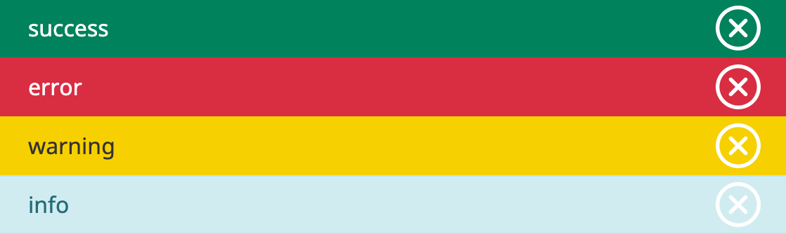

--


```
#ezplatform-admin-ui/src/bundle/Resources/config/ezplatform_default_settings.yml

ezsettings.default.notifications.error.timeout: 0
ezsettings.default.notifications.warning.timeout: 0
ezsettings.default.notifications.success.timeout: 5000
ezsettings.default.notifications.info.timeout: 0
```

```
ezpublish:
    system:
        admin:
            notifications:
                info:
                    timeout: 3000
```

```
//use EzSystems\EzPlatformAdminUi\Notification\NotificationHandlerInterface;
//use Symfony\Component\Translation\TranslatorInterface;

$this->notificationHandler->info(
    $this->translator->trans(
        'contenttype.update.success',
        ['%identifier%' => $data->getContentType()->identifier],
        'dashboard'
    )
);
```

--

## System Information - Bundle Version


```
composer show | grep -e kernel -e user
composer show | egrep 'kernel|user'
composer show -i
composer show -i -t
composer show -- ezsystems/ezplatform-user
less composer.lock | grep kernel !  üò± üò¨
```

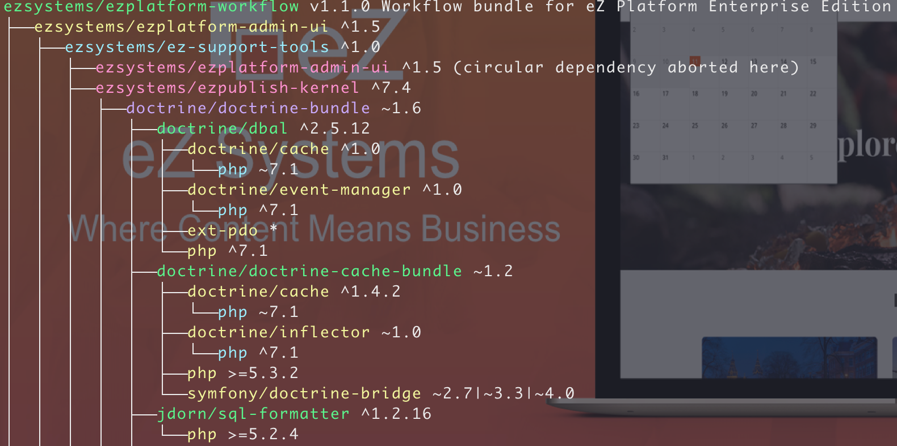

--


--

## Icons for Content Types

`ezplatform-admin-ui`/src/bundle/Resources/config/default_parameters.yml

&#xE3C9; **Standard Icons**
```
ezsettings.default.content_type.article:
	thumbnail: '/bundles/ezplatformadminui/img/ez-icons.svg#article'
ezsettings.default.content_type.blog_post:
	thumbnail: '/bundles/ezplatformadminui/img/ez-icons.svg#blog_post'
ezsettings.default.content_type.user:
	thumbnail: '/bundles/ezplatformadminui/img/ez-icons.svg#user'
```

&#xE3C9; **default icon**
```
ezsettings.default.content_type.default-config:
	thumbnail: '/bundles/ezplatformadminui/img/ez-icons.svg#file'
```

--

&#xE3C9; **custom default icon**

```
ezpublish:
    system:
       default:
           content_type:
              default-config:
                 thumbnail: '/assets/images/mydefaulticon.svg'
```

&#xE3C9; **custom contentType icon**

```
ezpublish:
    system:
       admin_group:
           content_type:
              article:
                 thumbnail: '/assets/images/customicon.svg'
```

&#9998; All icons should be in SVG format so they can display properly in Back Office.

--

&#xE3C9; Custom icons in Twig templates

```
<svg class="ez-icon ez-icon-{{ contentType.identifier }}">
    <use xlink:href="{{ ez_content_type_icon(contentType.identifier) }}"></use>
</svg>
```

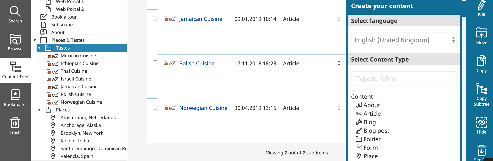

--

# RTE enhancements

--

## Inline custom tags

- Insert the “custom tag” within a line of rich text
- Embed different type of content in a paragraph without breaking the flow of the sentence.

**Configuration**

```
ezpublish:
    system:
        admin_group:
            fieldtypes:
                ezrichtext:
                    custom_tags: [abbreviation]

ezrichtext:
    custom_tags:
        abbreviation:
            template: '@ezdesign/fields/ezrichtext/custom_tags/abbreviation.html.twig'
            icon: '/bundles/ezplatformadminui/img/ez-icons.svg#about'
            is_inline: true
            attributes:
                style:
                    type: 'string'
```

--

**Edit**


--

**Storage**

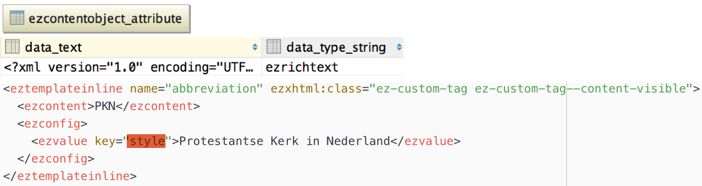

--

**Rendering**

```
{{content|raw}}
```

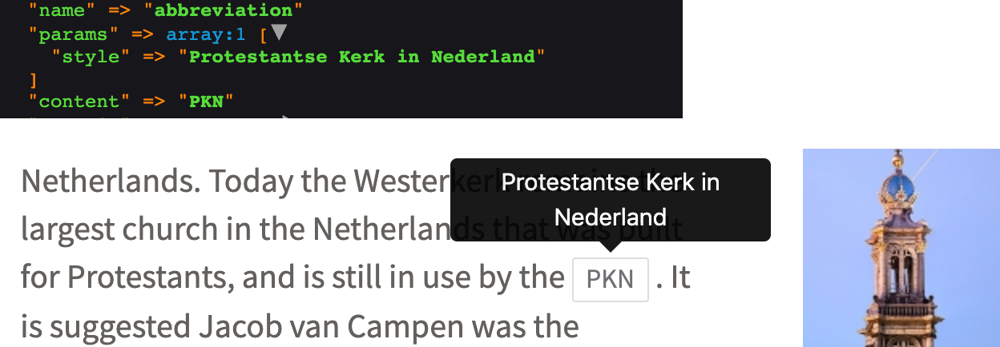

--

## Custom CSS classes and attributes

The available elements are:

- `embedinline`, `embed`, `formatted`, `heading`, `embedimage`, `ul`, `ol`, `li`, `paragraph`, `table`, `tr`, `td`

&#9758; [More infos](https://doc.ezplatform.com/en/latest/guide/extending/extending_online_editor/#custom-data-attributes-and-classes)

--

## Configuration

```
ezpublish:
    system:
        admin_group:
            fieldtypes:
                ezrichtext:
                    #custom classes
                    classes:
                        paragraph:
                            choices: ['none', 'box']
                            default_value: 'none'
                            #required: false
                            multiple: false

```


--

```
ezpublish:
    system:
        admin_group:
            fieldtypes:
                ezrichtext:
                    #custom attributes
                    attributes:
                        paragraph:
                            border:
                                type: boolean
                                default_value: false
                            border_radius:
                                type: number
                                default_value: 0
                            box_padding:
                                type: number
                                default_value: 0
                            border_style:
                                type: choice
                                choices: ['none', 'dotted','dashed', 'solid', 'double']
                                default_value: 'none'
                                #required: false
                                multiple: false
                            background:
                                type: choice
                                choices: ['none', 'light', 'dark', 'yellow']
                                default_value: 'none'
                            box_blink:
                                type: boolean
                                default_value: false
```
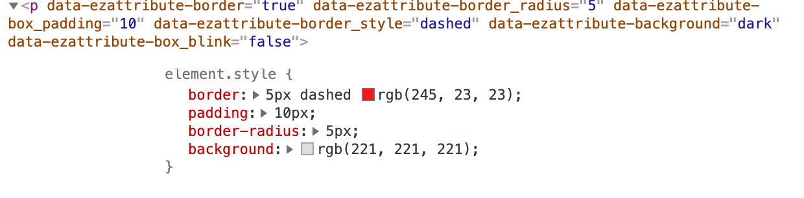

--

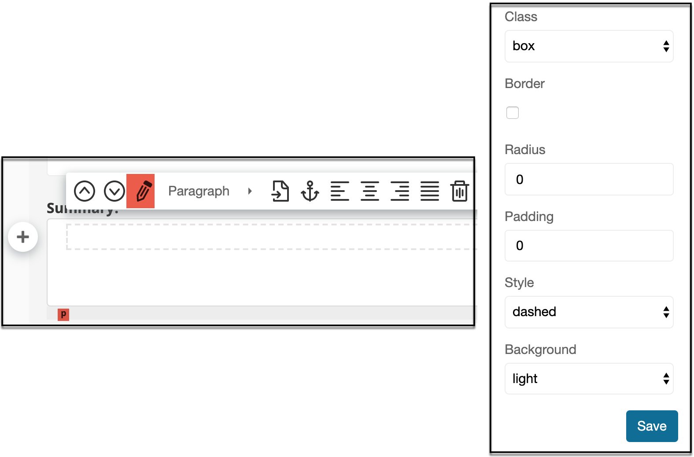

--

**Storage**

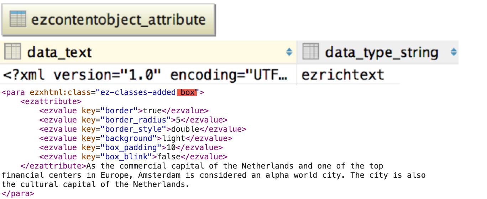

--

**Rendering**

- Overriding embed templates for  `embedinline`, `embed` or `embedimage`. The data attributes and classes will not be rendered automatically. Instead, you can make use of the data_attributes and class properties in your templates. The `ez_data_attributes_serialize` helper enables you to serialize the data attribute array.

--

```
ezpublish:
	system:
	    site_group:
	        content_view:
	            embed:
	                embed_image:
	                    template: "@ezdesign/fields/ezrichtext/custom_attributes/image.html.twig"
	                    match:
	                        Identifier\ContentType: [image]
```

```
array:17 [▼
  "data_attributes" => array:2 [▼
    "caption" => "true"
    "fade-duration" => "2"
  ]
```

```
data_attributes|ez_data_attributes_serialize
```

><div data-caption="true" data-fade-duration="2" ...


&#9758; [To follow](https://jira.ez.no/browse/EZP-31284)

--

# Recap RTE Custom-X

--

- [custom tags - v2.1](https://arfaram.github.io/slides/ezplatform_v2/#/6/7)

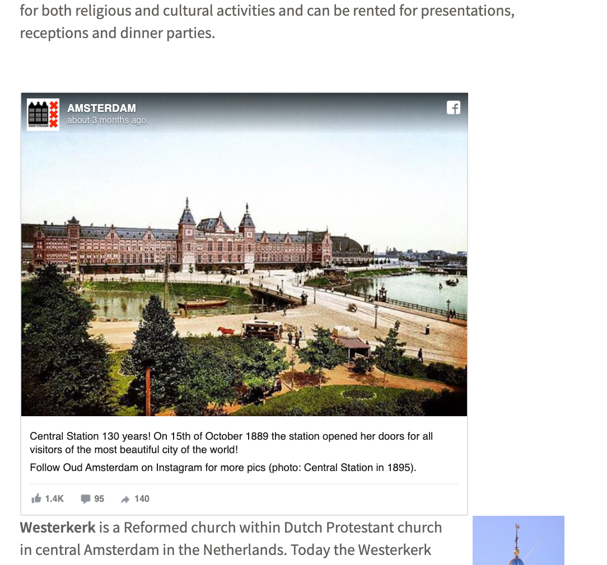

--

- [custom styles - v2.3](https://arfaram.github.io/slides/ezplatform_v2.3/#/2/5)


--

- [Unformatted text - v2.4](https://arfaram.github.io/slides/ezplatform_v2.4/#/2/29)


--

- [inline custom tags - v2.5](https://arfaram.github.io/slides/ezplatform_v2.5/#/7/9)

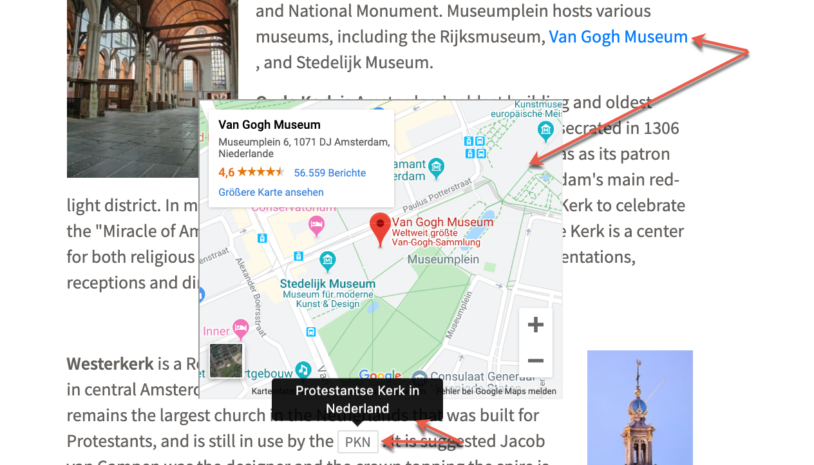

--

- [Custom CSS class and attributes - v2.5.2]


--

## Anchor link

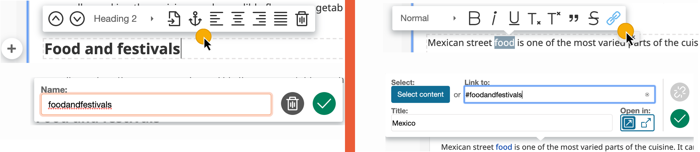

--

## Floating Toolbar


<video class="center scale60" controls>
    <source data-src="videos/floating_toolbar.mov" type="video/mp4" />
</video>

---

# miscellaneous Features

but useful !

--

- Filtering sub-items menu (Extensibility - Detail to follow)
- Collapse sections (fields preview) in the content view
- Define a new main language for the content and then be able to delete unnecessary languages under the translation tab
- Object state table includes fewer fields and make it easier to read
- Password requirements: 10 characters long, and must include upper and lower case letters, and digits. Existing passwords are not changed.
- Dashboard a label that indicates the eZ version and license type that is being used

---

# Database Updates

--

- 7.4.0-to-7.5.0

```
CREATE TABLE `ezcontentclass_attribute_ml`
ALTER TABLE ezcontentobject_trash add  trashed int(11) NOT NULL DEFAULT '0';
ALTER TABLE `ezcontentobject` ADD COLUMN `is_hidden` tinyint(1) NOT NULL DEFAULT '0';
```

- 7.5.2-to-7.5.3, [Enterprise PageBuilder Updates](https://doc.ezplatform.com/en/latest/updating/4_update_2.5/#page-builder)
- 7.5.4-to-7.5.5

```
ALTER TABLE ezuser ADD COLUMN password_updated_at INT(11) NULL;
```

&#9758; [Update folder](https://github.com/ezsystems/ezpublish-kernel/tree/master/data/update)


--

#### ezcontentclass_attribute_ml for ContentType MultilingualData

[As an Administrator I want to translate ezselection Field Definition options](https://github.com/ezsystems/ezpublish-kernel/pull/2532)

```
contentclass_attribute_id: 313
                  version: 0
              language_id: 2
                     name: Salutation
              description: NULL
                data_text: <?xml version="1.0" encoding="utf-8"?>
<ezselection><options><option id="0" name="Mr"/><option id="1" name="Mrs."/></options></ezselection>

                data_json: NULL
*************************** 40. row ***************************
contentclass_attribute_id: 313
                  version: 0
              language_id: 8
                     name: Anrede
              description: NULL
                data_text: <?xml version="1.0" encoding="utf-8"?>
<ezselection><options><option id="0" name="Herr"/><option id="1" name="Frau"/></options></ezselection>
				data_json: NULL
```

&#9758; More infos in `SelectionConverter.php`

--

Using the Public API to set `ezselection` fieldSettings.

```
$selectionFieldCreate =
$contentTypeService->newFieldDefinitionCreateStruct('selection', 'ezselection');
$selectionFieldCreate->isRequired = true;
//...
$selectionFieldUpdate->fieldSettings = [
		'multilingualOptions' => [
				'eng-US' => [
						0 => 'Seattle',
						1 => 'San Francisco',
				],
				'ger-DE' => [
						0 => 'Berlin',
						1 => 'Cologne',
						2 => 'Bonn',
				],
				'eng-GB' => [
						0 => 'London',
						1 => 'Liverpool',
				],
		],
);
```

Also used everytime you translate FieldType name:

```
'name' => [
    'eng-US' => 'description',
    'ger-DE' => '√úberschrift',
],
```

--

#### ezcontentobject_trash : trashed column

- `TrashItem->trashed` timestamp covers when a Content item was placed in Trash
	- API: `TrashService`:  used within `trash()` and `loadTrashItem()` methods

--

#### ezcontentobject: is_hidden column

- `is_hidden`: Hiding and revealing **Content** by making all the Locations appear hidden/visible.
	- (Legacy)**Visibility/Location** `ezcontentobject_tree` : `is_hidden` & `is_invisible` columns
	- (<span class="orange_text">New</span>)**Hidden/Content** `ezcontentobject`: `is_hidden` column, (`ezcontentobject_tree.is_invisible` = 1 if content is hidden)
		- API: `ContentService`: `hideContent()` and `revealContent()` methods

--

## Content vs Location hide

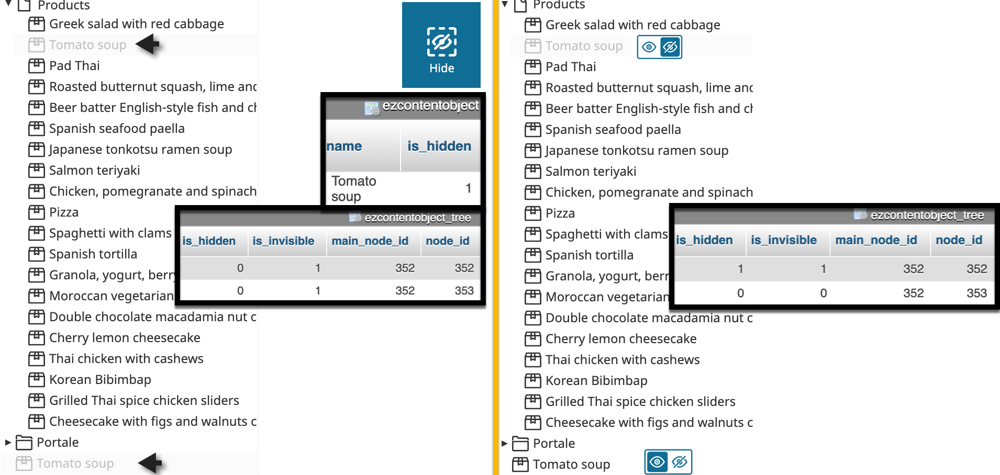

---

# Using PostgreSQL

--

- The introduction of [support for PostgreSQL](https://doc.ezplatform.com/en/latest/guide/databases/#using-postgresql) includes a change in the way database schema is generated.

- It is now created based on [YAML configuration](https://github.com/ezsystems/ezpublish-kernel/blob/master/eZ/Bundle/EzPublishCoreBundle/Resources/config/storage/legacy/schema.yaml), using the new [DoctrineSchemaBundle](https://github.com/ezsystems/doctrine-dbal-schema).

Requirements:

&#9745; `pdo_pgsql` PHP extension

&#9745; `ezsystems/doctrine-dbal-schema` Bundle provides cross-DBMS schema import

&#9745; `ez_doctrine_schema` settings in config.yml

--

## Doctrine Schema Bundle

- **SchemaBuilder**
	- Is an extensibility point to be used by Symfony-based projects.
	- Provided by APIs defined on the `SchemaBuilder` interface
	- Is event-driven
- **Schema Exporter**
	- Provided by APIs defined on the `SchemaExporter` interface
	- Exports given `\Doctrine\DBAL\Schema` object to the custom Yaml format.

- `CoreInstaller`: New variant of CleanInstaller, which uses SchemaBuilder.
- You can extend the `DbBasedInstaller`(only for eZPlatform Installtion) to import data `runQueriesFromFile()`

---

# ezmatrix fieldType

--

Content field definitions

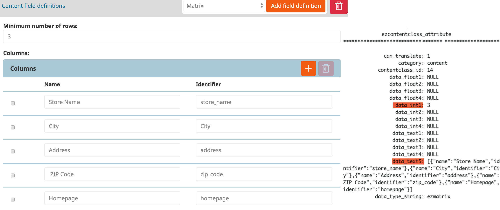

--

Content field view/edit

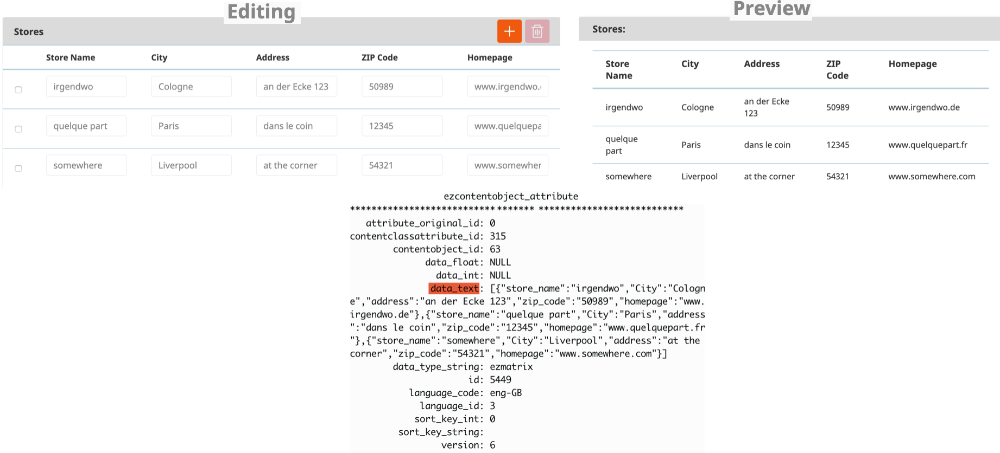

--

Content field Converter

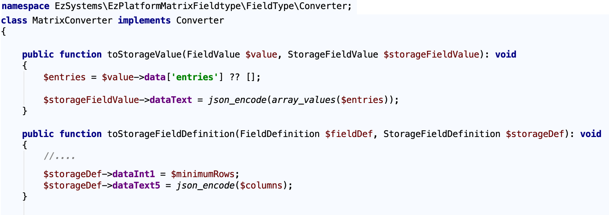

&#9758; [MatrixConverter.php](https://github.com/ezsystems/ezplatform-matrix-fieldtype/blob/master/src/lib/FieldType/Converter/MatrixConverter.php)

--

Content field Value - Rendering

```
<div class="ezmatrix">
    {{ ez_render_field(content, 'fieldtype-identifier') }}
</div>
```

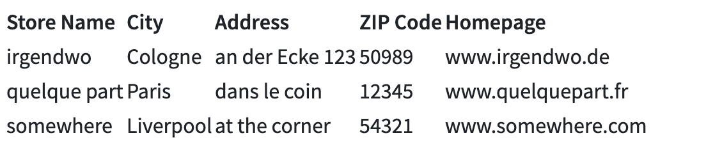

--

Content field - Template override
```
ezpublish:
	system:
	    site_group:
	        field_templates:
	            #- { template: '@ezdesign/fields/ezmatrix/content_fields.html.twig', priority: 10 }
	            - { template: '@EzSystemsDemo/fields/ezmatrix/content_fields.twig', priority: 10 }
```

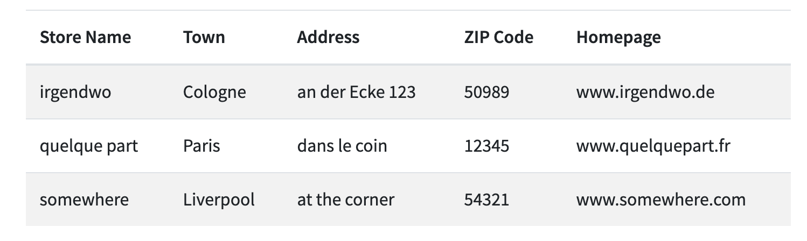

--

Content field Value - REST

```
Accept: application/vnd.ez.api.ContentInfo+xml
Accept: application/vnd.ez.api.ContentInfo+json
```

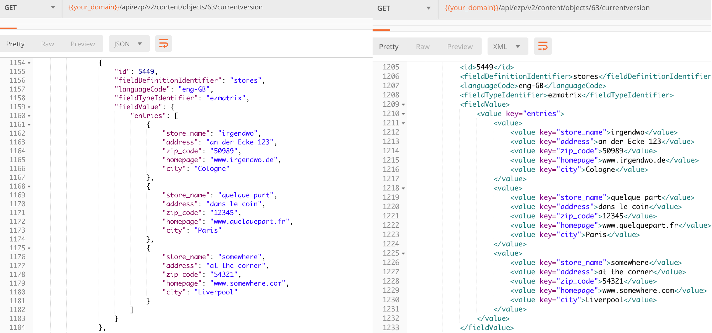

--

Content field Value - Public API

```
use EzSystems\EzPlatformMatrixFieldtype\FieldType\Value;

$contentUpdateStruct->setField(
	'stores',
	new Value\Row(
			[
				'store_name' => 'Alnatura',
				'city' => 'Cologne',
				'address' => 'Hansaring 12',
				'zip_code' => 12345,
				'homepage' => 'www.al.de'
			]
	)
);

```

--

Content field Value - GraphQL

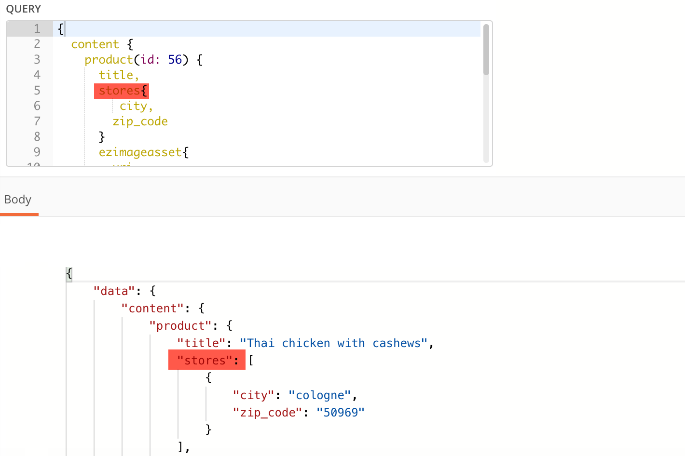

&#9758; [Query/Mutation Examples](https://github.com/ezsystems/ezplatform-matrix-fieldtype/pull/20)


--

## Changes to Matrix Field Type - Migration

To migrate your content from legacy XML format to a new ezmatrix value use the following command:

```
bin/console ezplatform:migrate:legacy_matrix
```

&#9758; [MigrateLegacyMatrixCommand.php](https://github.com/ezsystems/ezplatform-matrix-fieldtype/blob/master/src/bundle/Command/MigrateLegacyMatrixCommand.php)

---

# API Improvements

--

## Use sudo()

- To skip permission checks. It allows API execution to be performed with full access, sand-boxed.

```
$repository->sudo(function ($repository) use ($location) {
    return $repository->getLocationService()->hideLocation($location);
});
```

- This option is recommended instead of setting the admin user as the current user.

--

## loadContentInfoList()

- Especially useful for cases where you have content id's just need content info
- Available from the Content Service
- It Provides same content Information like `loadContentInfo()`

```
array:2 [▼
  60 => ContentInfo {#3117 ‚ñ∂}
  224 => ContentInfo {#3182 ▼
    #id: 224
    #contentTypeId: 19
    #name: "Amsterdam, Netherlands"
    #sectionId: 1
    #currentVersionNo: 15
    #published: true
    #ownerId: 14
    #modificationDate: DateTime @1559482610 {#3190 ‚ñ∂}
    #publishedDate: DateTime @1542479004 {#3189 ‚ñ∂}
    #alwaysAvailable: 1
    #remoteId: "4dda92e6e80cd29a2caf839234840477"
    #mainLanguageCode: "eng-GB"
    #mainLocationId: 226
    #status: 1
    #isHidden: false
  }
]
```

Note: Bulk-load ContentInfo items by id's.Can be used in combination with RelationList or SignalSlots

--


```
$relatedContentInfos = array_map(
	function($relatedContentId){
	    return $this->contentService->loadContentInfo($relatedContentId);
	}
	,$field->value->destinationContentIds
);
```
OR

```
$relatedContentInfos = $this->contentService->loadContentInfoList($field->value->destinationContentIds);
```

--

## Possibility to load several languages at once

- Mostly an internal improvement but 2 new API's endpoints exposed on loading several languages at once (by id and locale):
	- `loadLanguageListByCode(array $languageCodes)`
```
array:2 [▼
	"eng-GB" => Language {#4620 ▼
		  #id: 2
		  #languageCode: "eng-GB"
		  #name: "English (United Kingdom)"
	  	#enabled: true
	}
	"ger-DE" => Language {#292 ‚ñ∂}
]
```
	- `loadLanguageListById(array $languageIds)`
```
array:2 [▼
  2 => Language {#4627 ▼
	    #id: 2
	    #languageCode: "eng-GB"
	    #name: "English (United Kingdom)"
	    #enabled: true
  }
  8 => Language {#4634 ‚ñ∂}
]
```

&#9758; `$this->languageService->loadLanguages()`

--

## loadVersions by status

- Listing versions and specify the particular status of the content
- It improves `CleanupVersionsCommand` performance

```
$versions = $contentService->loadVersions($content->contentInfo, VersionInfo::STATUS_DRAFT);//0
$versions = $contentService->loadVersions($content->contentInfo, VersionInfo::STATUS_ARCHIVED);//3
$versions = $contentService->loadVersions($content->contentInfo, VersionInfo::STATUS_PUBLISHED); //1
```

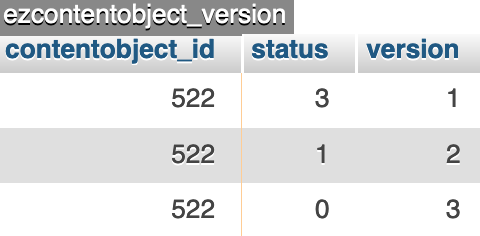

<p class="fragment" data-fragment-index="0">&#128161; ContentInfo::STATUS_TRASHED; // 2</p>

--

## limit Content management to specific Translations

Use case: Editor should only be able to translate content and publish it for given language.

- re-implement Language Limitation for translation
- It will also make migration from eZ Publish much easier
- `content/translate` policy still remains not used for now

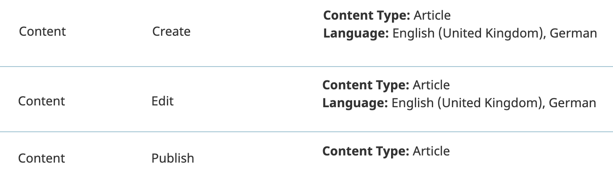


Note: Migration no further steps will be required

--

Admin UI check edit permission for current user

```
/content/{contentId}/check-edit-permission/{languageCode}
```

Response:

```
{
	"canEdit":true,
	"editLanguagesLimitationValues":["eng-GB","ger-DE"]
}
```

--

- We introduced a new `LookupLimitationsTransformer` to access Limitation Values.
	- `getFlattenedLimitationsValues` get all Limitation Values
	- `getGroupedLimitationValues` get specific/group of Limitation values (group by)

```
$lookupLimitations = $permissionResolver->lookupLimitations('content', 'edit', $content);
$this->lookupLimitationsTransformer->getFlattenedLimitationsValues($lookupLimitations);
```

```
array:4 [▼
  0 => "16"
  1 => "eng-GB"
  2 => "ger-DE"
  3 => "article_workflow:draft"
]
```
```
$permissionResolver->lookupLimitations('content', 'edit', $content);
$this->lookupLimitationsTransformer->getGroupedLimitationValues($lookupLimitations, [Limitation::LANGUAGE]);
```
```
array:1 [▼
  "Language" => array:2 [▼
    0 => "eng-GB"
    1 => "ger-DE"
  ]
]
```

```
$this->lookupLimitationsTransformer->getGroupedLimitationValues($lookupLimitations, ['WorkflowStage']);
```

```

array:1 [▼
  "WorkflowStage" => array:1 [▼
    0 => "article_workflow:draft"
  ]
]
```

--

## URL Wildcards


enable in Configuration

```
ezpublish:
    url_wildcards:
        enabled: true
```

--

`URLWildcardService` or `Repository` you are able to:
- `create($sourceUrl, $destinationUrl, $forward = false)`
	- exec/* -> /Teams/Executive/accounts/{1} <!-- .element: class="fragment" data-fragment-index="0" -->
- `load($id)`
- `remove(URLWildcard $urlWildcard)`
- `loadAll($offset = 0, $limit = -1)`
- `translate($sourceUrl)`

&#9758; 'content', 'urltranslator' permission to create and remove url wildcards <!-- .element: class="fragment" data-fragment-index="1" -->

--

## ezplatform extension

<ul>
	<li>It's rather a [workaround](https://github.com/ezsystems/ezplatform-core/pull/11) to simplify migration</li>
	<li class="fragment" data-fragment-index="1">You can now use `ezplatform` as well as `ezpublish` as the main configuration key</li>
	<li class="fragment" data-fragment-index="2">In v2.5:
		<ul>
			<li>`AppKernel.php`: <i>`new EzSystems\EzPlatformCoreBundle\EzPlatformCoreBundle(),`</i> </li>
		</ul>
	</li>
	<li class="fragment" data-fragment-index="3"> Detail to follow in 3.x:
		<ul>
			<li>`EzPlatformCoreBundle` <s>EzPublishCoreBundle</s></li>
			<li>`ezplatform` <s>ezpublish</s> extension</li>
		</ul>
	</li>
</ul>

--

## Signals

- (<span class="orange_text">New</span>) `AssignSectionToSubtreeSignal`: returns locationId and sectionId
- (<span class="orange_text">New</span>) `HideContentSignal` and `RevealContentSignal` : `contentId` Property

- `PublishVersionSignal` contains new parameter : `affectedTranslations`

```
PublishVersionSignal ( [contentId] => 532 [versionNo] => 1  [affectedTranslations] => Array ( [0] => eng-GB ) )
```

- `CreateContentDraftSignal` contains new parameters: `newVersionNo`, `languageCode`  

```
CreateContentDraftSignal ([contentId] => 59 [versionNo] => 10 [userId] =>  [newVersionNo] => 11 [languageCode] => eng-GB )
```

Note: Assign a content item and its sub-items to a certain section from the content view

--

## ContentService

<ul>
	<li class="fragment" data-fragment-index="1">`countContentDrafts()` returns the number of all drafts for the provided user</li>
	<li class="fragment" data-fragment-index="2">`loadContentDraftList()` returns a list of all drafts for the provided user, `loadContentDrafts()` is marked as deprecated</li>
	<li class="fragment" data-fragment-index="3">`countReverseRelations()` returns the number of all reverse relations for a Content item</li>
	<li class="fragment" data-fragment-index="4">`loadReverseRelationList()` returns a list of all reverse relations for a Content item</li>
</ul>

--

## User FieldType - Password

<ul>
	<li class="fragment" data-fragment-index="1">Password restriction [2.4](https://arfaram.github.io/slides/ezplatform_v2.4/#/2/42)</li>

	<li class="fragment" data-fragment-index="2">[Password expiration](https://jira.ez.no/browse/EZP-30797)
		<p>
			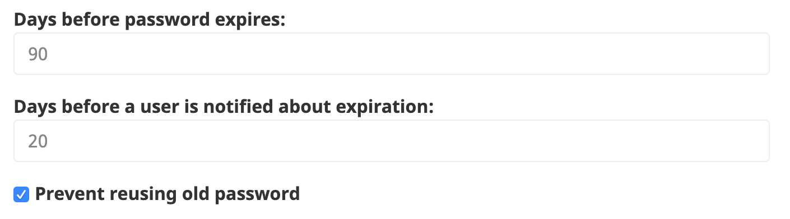
		</p>
		<p class="fragment" data-fragment-index="3">Storage: [UserConverter](https://github.com/ezsystems/ezpublish-kernel/blob/v7.5.6/eZ/Publish/Core/Persistence/Legacy/Content/FieldValue/Converter/UserConverter.php#L77), `ezcontentclass_attribute table`</p>
		<p class="fragment" data-fragment-index="4">&#9758; [dbupdate-7.5.4-to-7.5.5.sql](https://github.com/ezsystems/ezpublish-kernel/blob/master/data/update/mysql/dbupdate-7.5.4-to-7.5.5.sql) - `password_updated_at` column</p>
	</li>
</ul>


--


- [CredentialsExpiredListener.php](https://github.com/ezsystems/ezplatform-admin-ui/blob/master/src/lib/EventListener/CredentialsExpiredListener.php)

--

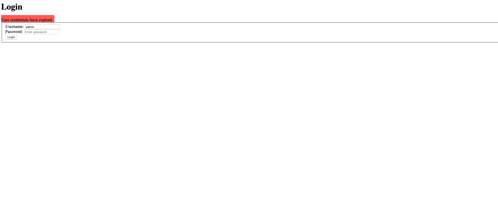

--


[CredentialsExpirationWarningListener.php](https://github.com/ezsystems/ezplatform-admin-ui/blob/master/src/lib/EventListener/CredentialsExpirationWarningListener.php)


--

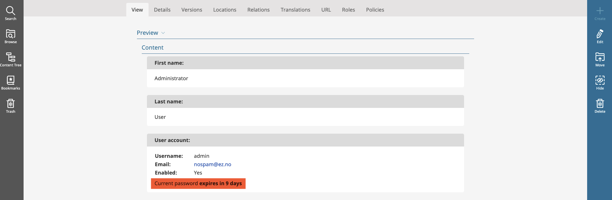

--

- `UserService`
	- (<span class="orange_text">New</span>) `getPasswordInfo(User $user): PasswordInfo`
		- `isPasswordExpired():bool`, `hasExpirationDate():bool`, `getExpirationDate():DateTimeImmutable`, `hasExpirationWarningDate():bool`, `getExpirationWarningDate():DateTimeImmutable`  

```
$isPasswordExpired = $this->repository->getUserService()->getPasswordInfo($apiUser)->isPasswordExpired();
```

```
$passwordExpiresIn = $passwordInfo->getExpirationDate()->diff(new DateTime());
```

<p class="fragment" data-fragment-index="1">&#9758; Not exposed yet in REST API</p>


---

# User Preferences

--

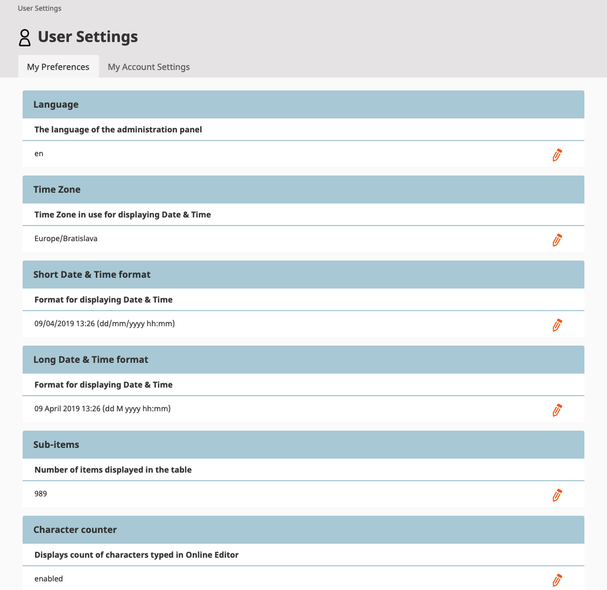


--

```
mysql> select * from ezpreferences;
+----+-----------------------+---------+------------------------------------------------------+
| id | name                  | user_id | value (longtext!)                                    |
+----+-----------------------+---------+------------------------------------------------------+
|  1 | subitems_limit        |      14 | 989                                                  |
|  2 | character_counter     |      14 | disabled                                             |
|  3 | language              |      14 | fr                                                   |
|  4 | timezone              |      14 | Europe/Bratislava                                    |
|  5 | short_datetime_format |      14 | {"date_format":"dd\/MM\/yyyy","time_format":"HH:mm"} |
|  6 | full_datetime_format  |      14 | {"date_format":"dd LLLL yyyy","time_format":"HH:mm"} |
+----+-----------------------+---------+------------------------------------------------------+
```

- Value storage as string, XML or JSON depends on your needs

--

## Default settings

- Some default values are stored in `ezplatform-user` or `ezplatform-admin-ui` bundles
  - Sub-items
```
ezsettings.default.subitems_module.limit: 10
```
  - Long/ Short Date & Time format (defaults)
```
ezsettings.default.user_preferences.short_datetime_format:
		date_format: 'dd/MM/yyyy'
		time_format: 'HH:mm'
ezsettings.default.user_preferences.full_datetime_format:
		date_format: 'LLLL dd, yyyy'
		time_format: 'HH:mm'
```
    - Whereas the latter can be extended using
```
ezsettings.default.user_preferences.allowed_short_date_formats:
ezsettings.default.user_preferences.allowed_short_time_formats:
ezsettings.default.user_preferences.allowed_full_time_formats:
ezsettings.default.user_preferences.allowed_full_date_formats:
		'German short format': 'dd.MM.yyyy'
		'German long format': "cccc 'den', dd MMMM Y"
```

--

- RichText character counter can be enabled or disabled and it's using a JavaScript function for words and characters counting

```

				<span class="ez-character-counter__word-count">0</span>
				<span class="ez-character-counter__character-count">0</span>

} //ezrichtext.html.twig

```

```
const wordWrapper = counterWrapper.querySelector('.ez-character-counter__word-count');
const charactersWrapper = counterWrapper.querySelector('.ez-character-counter__character-count');
//... base-rich-text.js
```

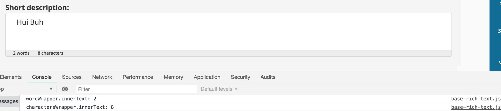

--

- Language (The language of the administration panel)
  - If you want to install a new language in your project, install the corresponding package.
```
composer require ezplatform-i18n/ezplatform-i18n-fr_fr
```
  - Alternatively, You can manually add the necessary xliff files. Add the language to an array under  ` ezpublish.system.<siteaccess>.user_preferences.additional_translations: []`


[Back Office languages doc](https://doc.ezplatform.com/en/latest/guide/internationalization/#installing-new-ui-translations)

--

Back Office languages Fallback:
1. Installation package or manually added xliff files
```
$additionalTranslations = $this->configResolver->getParameter('user_preferences.additional_translations');
array_unique(array_merge($this->availableTranslations, $additionalTranslations)); //TranslationCollectorPass.php
```
```
$availableTranslation: All installed ezplatform translation files in ezsystems/ezplatform-i18n-* package //GlobCollector.php
```
2. Browser language
```
Return a list of user's browser preferred locales directly from Accept-Language header.
$preferableLocales = $this->requestStack->getCurrentRequest()->getLanguages(); //UserLanguagePreferenceProvider.php
```

```
if(\in_array($preferableLocale, $this->availableTranslations, true) //RequestLocaleListener.php
```

3. `parameters.locale_fallback` in `default_parameters.yml`

--

- Time Zone
  - Default: `date_default_timezone_get()` will return a default timezone of UTC if not set (e.g date.timezone)
  - Using Symfony `TimezoneType` FormType to get the list of Time zones
  - In the Template we can use some Twig filter to get the right Date/Time format
    - `|ez_short_datetime`
    - `|ez_full_datetime`
    - ... other filters in `DateTimeExtension.php`

--

## Extend user settings

1.Create a setting class implementing two interfaces:
- `ValueDefinitionInterface`: Interface for displaying User Preferences in the Admin UI
	- `getName()`: Returns name of a User Preference displayed in UI
	- `getDescription()`: Returns description of a User Preference displayed in UI
	- `getDisplayValue(string $storageValue)`: Returns formatted value to be displayed in UI.
		- $storageValue: String, XML or JSON from value column.
	- `getDefaultValue()`: Returns default value for User Preference.
```
ezsettings.default.....: String, []
```

--

- `FormMapperInterface`:
	- `mapFieldForm(FormBuilderInterface $formBuilder, ValueDefinitionInterface $value)`: Creates 'value' form type representing editing control for setting user preference value.

```
class CharacterCounter
//...
return $formBuilder->create(
    'value',
    ChoiceType::class,
    [
        'multiple' => false,
        'required' => true,
        'label' => $this->getTranslatedDescription(),
        'choices' => $choices, //enabled,disabled
    ]
);
```

--

2.Register the class as a service

```
services:
    #...
    EzSystems\EzPlatformUser\UserSetting\Setting\CharacterCounter:
        tags:
            - { name: ezplatform.admin_ui.user_setting.value, identifier: character_counter, priority: 10 }
            - { name: ezplatform.admin_ui.user_setting.form_mapper, identifier: character_counter }
```

You can order the settings in the User menu by setting their `priority`.

--

## Behind the scenes

- Any Class with the tag `ezplatform.admin_ui.user_setting.value` will be collected from the `ValueDefinitionPass.php` and calls the `addValueDefinition()` of the `ValueDefinitionRegistry.php` after service initialization.

```
class ValueDefinitionPass
//...
$registryDefinition->addMethodCall('addValueDefinition', [
    $tag['identifier'],
    new Reference($taggedServiceId),
    $tag['priority'] ?? 0,
]);
```

Note: Compiler passes give you an opportunity to manipulate other service definitions that have been registered with the service container

--

Same for `ezplatform.admin_ui.user_setting.form_mapper` tag. The `FormMapperPass.php` returns all services ids for a given tag and calls the `addFormMapper()` of the `FormMapperRegistry.php` after service initialization

```
$registryDefinition->addMethodCall(
    'addFormMapper',
    [$tag['identifier'],
		new Reference($taggedServiceId)]
);
```


--

- The `UserSettingService` uses the `ValueDefinitionRegistry.php` to __loadUserSettings__ (list in UI)  __setUserSetting__ (Store user setting)

```
if ($form->isSubmitted()) {
	//...
	$result = $this->submitHandler->handle($form, function (UserSettingUpdateData $data) {
		$this->userSettingService->setUserSetting($data->getIdentifier(), $data->getValue());
		//...
	}
}
```

- The `UserSettingUpdateType` build the edit form using both registry classes

```
public function buildForm(FormBuilderInterface $builder, array $options)
{
	$formMapper = $this->formMapperRegistry->getFormMapper($options['user_setting_identifier']);
	$valueDefinition = $this->valueDefinitionRegistry->getValueDefinition($options['user_setting_identifier']);
	$builder
			->add('identifier', HiddenType::class, [])
			->add($formMapper->mapFieldForm($builder, $valueDefinition))
			->add('update', SubmitType::class, []);

}
```

--

&#9758; [Undestanding better the Integration in UI](https://github.com/ezsystems/ezplatform-admin-ui/pulls?utf8=%E2%9C%93&q=is%3Apr+preferences+in%3Atitle)(Github PRs)

---

## Read about the features

- https://ez.no/Blog/Spring-Release-Discover-eZ-Platform-v2.5

- https://ez.no/Blog/Sneak-Peek-Two-great-small-features-making-it-to-v2.5

- https://ez.no/Blog/Sneak-Peek-eZ-Platform-2.5-tech-highlights

- [Release note ezplatform 2.5](https://doc.ezplatform.com/en/latest/releases/ez_platform_v2.5/)

- [Webinar youtube] [Discover eZ Platform v2.5](https://www.youtube.com/watch?v=3u_lFRGwWpA&feature=youtu.be&utm_campaign=%5BWebinar+Recording%5D+-++Discover+eZ+Platform+v2.5&utm_medium=email&utm_source=%5BWebinar+Recording%5D+-++Discover+eZ+Platform+v2.5&utm_content=Webinar+Recording%3A+Discover+eZ+Platform+v2.5)

- [Webinar slideshare] [Discover eZ Platform v2.5](https://www.slideshare.net/eZ_Enterprise/webinar-discover-ez-platform-v25?utm_campaign=%5BWebinar%20Recording%5D%20-%20%20Discover%20eZ%20Platform%20v2.5&utm_medium=email&utm_source=%5BWebinar%20Recording%5D%20-%20%20Discover%20eZ%20Platform%20v2.5&utm_content=Webinar%20Recording%3A%20Discover%20eZ%20Platform%20v2.5)

---

### Thank you

|                   |                                                                             |
|-------------------|:----------------------------------------------------------------------------|
| We                |**http://ez.no**                                                             |
| Installation      |**https://ezplatform.com<br> https://github.com/ezsystems**                  |
| Documentation     |**http://doc.ezplatform.com**                   |
| Product Roadmap   |**[Product Roadmap](https://portal.productboard.com/vsjzmdg4emeihrpkxcfz6nrz)**                   |
| Tech. Contact     |**[Slack](https://ez-community-on-slack.herokuapp.com/)<br> https://discuss.ezplatform.com**   |

---

### Download Slides

<center>
<h3>http://bit.ly/367fs3q</h3>
</center>

<!--

---
# eZ Global Partner Conference 2020 <br> January 23-24</h1>


<center>
<h3 style="padding-top:30px;"class="orange_text">Annual Update Certification</h3>
</center>

-->
