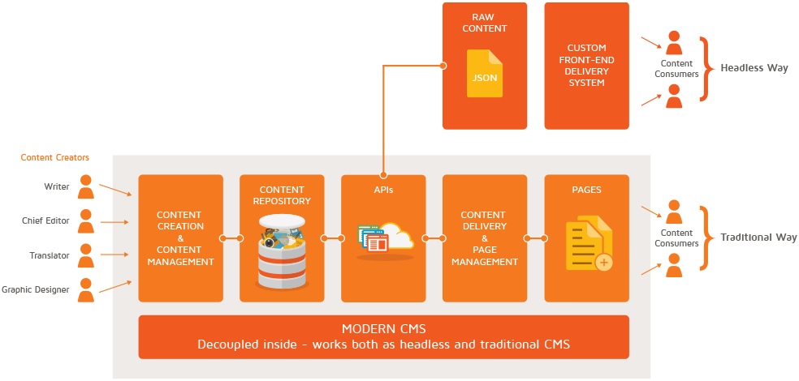

# eZ Platform <br> Extending the REST API

<center><small>M.Sc. Ramzi Arfaoui</small></center>

<center><small>Ez Systems Cologne 2017/11/30</small></center>


---

## Ramzi Arfaoui

- Professional Services @ ez Systems
- ramzi.arfaoui@ez.no
- Twitter <a target="blank" href="https://twitter.com/ramzi_ar">@ramzi_ar</a>
- GitHub <a target="blank" href="https://github.com/ramzi-arfaoui/">ramzi-arfaoui</a>
- Gist <a target="blank" href="https://gist.github.com/ramzi-arfaoui/">ramzi-arfaoui</a>

---

## Agenda

- Recap (Teil 1)
- Extending The REST API
- Demo

---

## Recap (Teil 1)

- [Going Headless with eZ Platform](https://ramzi-arfaoui.github.io/slides/sensiolab_meetup20170830/)
  - Rest API to interact with the repository (Level 3: I URI , II HTTP verbs, III HATEOAS)
  - Request/Response Formats: XML and JSON
```
    Accept: application/vnd.ez.api.ContentInfo+xml
    Accept: application/vnd.ez.api.ContentInfo+json
```
  - Authentication (POST, DELETE, PATCH but also GET e.g user content)
  ```
  <ErrorMessage media-type="application/vnd.ez.api.ErrorMessage+xml">
    <errorCode>401</errorCode>
    <errorMessage>Unauthorized</errorMessage>
  ```

--

##  AGAIN - Progressive Decoupling

<center></center>

---

# Extending The REST API

--

## Extending The REST API

From where to start
- REST::doc
  - https://doc.ezplatform.com/en/1.12/api/extending_the_rest_api/
  - Follow the latest   version ;)

- REST::specification
  - https://github.com/ezsystems/ezpublish-kernel/blob/master/doc/specifications/rest/REST-API-V2.rst

- REST::implementation
    - https://github.com/ezsystems/ezpublish-kernel/tree/master/eZ/Publish/Core/REST

--

### So let's dig a little deeper into this


Note: Sorry, try me in Chrome ;)

--

## Requirement

<ul>
  <li>Route using `/api/ezp/v2`</li>
  <li>Controller action to handle request</li>
  <li>(optional) `ValueObjectVisitor` to serialize REST controller value</li>
  <li>(optional) `InputParser` to handle payload body of a HTTP Request</li>
  <li class="fragment" data-fragment-index="2">(~~optional~~) Cache the Response</li>
</ul>
  <p class="fragment" data-fragment-index="1">Anything else ?</p>

--

## Route - General overview

- Route using `/api/ezp/v2` (HTTPS)
  - Get root resource with :  http://example.com/api/ezp/v2/

```
<?xml version="1.0" encoding="UTF-8"?>
<Root media-type="application/vnd.ez.api.Root+xml">
    <content media-type="" href="/api/ezp/v2/content/objects"/>
    <contentByRemoteId media-type="" href="/api/ezp/v2/content/objects{?remoteId}"/>
    <contentTypes media-type="application/vnd.ez.api.ContentTypeInfoList+xml" href="/api/ezp/v2/content/types"/>
    <contentTypeByIdentifier media-type="" href="/api/ezp/v2/content/types{?identifier}"/>
    <contentTypeGroups media-type="application/vnd.ez.api.ContentTypeGroupList+xml" href="/api/ezp/v2/content/typegroups"/>
    <contentTypeGroupByIdentifier media-type="" href="/api/ezp/v2/content/typegroups{?identifier}"/>
    <users media-type="application/vnd.ez.api.UserRefList+xml" href="/api/ezp/v2/user/users"/>
    <usersByRoleId media-type="application/vnd.ez.api.UserRefList+xml" href="/api/ezp/v2/user/users{?roleId}"/>
    <usersByRemoteId media-type="application/vnd.ez.api.UserRefList+xml" href="/api/ezp/v2/user/users{?remoteId}"/>
    <usersByEmail media-type="application/vnd.ez.api.UserRefList+xml" href="/api/ezp/v2/user/users{?email}"/>
    <usersByLogin media-type="application/vnd.ez.api.UserRefList+xml" href="/api/ezp/v2/user/users{?login}"/>
    <roles media-type="application/vnd.ez.api.RoleList+xml" href="/api/ezp/v2/user/roles"/>
    <rootLocation media-type="application/vnd.ez.api.Location+xml" href="/api/ezp/v2/content/locations/1/2"/>
    <rootUserGroup media-type="application/vnd.ez.api.UserGroup+xml" href="/api/ezp/v2/user/groups/1/5"/>
    <rootMediaFolder media-type="application/vnd.ez.api.Location+xml" href="/api/ezp/v2/content/locations/1/43"/>
    <locationByRemoteId media-type="" href="/api/ezp/v2/content/locations{?remoteId}"/>
    <locationByPath media-type="" href="/api/ezp/v2/content/locations{?locationPath}"/>
    <trash media-type="application/vnd.ez.api.Trash+xml" href="/api/ezp/v2/content/trash"/>
    <sections media-type="application/vnd.ez.api.SectionList+xml" href="/api/ezp/v2/content/sections"/>
    <views media-type="application/vnd.ez.api.RefList+xml" href="/api/ezp/v2/views"/>
    <objectStateGroups media-type="application/vnd.ez.api.ObjectStateGroupList+xml" href="/api/ezp/v2/content/objectstategroups"/>
    <objectStates media-type="application/vnd.ez.api.ObjectStateList+xml" href="/api/ezp/v2/content/objectstategroups/{objectStateGroupId}/objectstates"/>
    <globalUrlAliases media-type="application/vnd.ez.api.UrlAliasRefList+xml" href="/api/ezp/v2/content/urlaliases"/>
    <urlWildcards media-type="application/vnd.ez.api.UrlWildcardList+xml" href="/api/ezp/v2/content/urlwildcards"/>
    <createSession media-type="application/vnd.ez.api.UserSession+xml" href="/api/ezp/v2/user/sessions"/>
    <refreshSession media-type="application/vnd.ez.api.UserSession+xml" href="/api/ezp/v2/user/sessions/{sessionId}/refresh"/>
</Root>
```

<small>`media-type` and `href` attributes gives you some information about your custom REST API Route</small>

--

## Custom REST API route

- routing.yml
```
ez_rest_routes:
    resource: "@EzRestBundle/Resources/config/routing_rest.yml"
    prefix: '%ezpublish_rest.path_prefix%'
```

- routing_rest.yml
```
ez_rest_get:
    path: /ez_rest/contentTypeContent/{contentTypeId}
    defaults:
        _controller: ez_rest.controller.content:getContentTypeContent
    methods: [GET]
```

--

## Request Example

`/api/ezp/v2/ez_rest/contentTypeContent/48?&limit=1&subtree=99&fields=title,summary,description,main_image&sort=DESC
`
- Request Parameters
  - contentTypeID
  - limit
  - subtree
  - fields
  - sort

--

## Register the Controller

- services.yml

```
parameters:
      ez_rest.controller.content.class: Ez\RestBundle\Rest\Controller\ContentTypeContentListController

services:
    ez_rest.controller.content:
        class: '%ez_rest.controller.content.class%'
        parent: ezpublish_rest.controller.base
        arguments:
            - '@whatever_services'
            - '%whatever_params%'
```

```
app/console debug:container | grep ezpublish_rest.controller.base

eZ\Publish\Core\REST\Server\Controller
```

--

## The REST Controller

- Extend `eZ\Publish\Core\REST\Server\Controller` class


```
use eZ\Publish\Core\REST\Server\Controller as BaseController;
use Symfony\Component\HttpFoundation\Request;
use Symfony\Component\HttpFoundation\JsonResponse;

class ContentTypeContentListController extends BaseController
{
  public function getContentTypeContent($contentTypeId, Request $request)
  {
    // Get Request Parameters
    $requestParams = $request->get('fields');
    // ... Business Logic ...

    return new JsonResponse(array('response' => $data));
  }
}  
```

--

<div style="text-align:center;">
  
</div>

--

## But wait!

what about?

- POST, PATCH requests
- XML Response body format
```
$domtree = new DOMDocument('1.0', 'UTF-8');
$xmlRoot = $domtree->createElement("xml");
$xmlRoot = $domtree->appendChild($xmlRoot);
//...
```
- Caching
```
<?xml version="1.0" encoding="UTF-8"?>
<ErrorMessage media-type="application/vnd.ez.api.ErrorMessage+xml">
    <errorCode>500</errorCode>
    <errorMessage>Internal Server Error</errorMessage>
    <errorDescription>No visitor found for Symfony\Component\HttpFoundation\JsonResponse, Symfony\Component\HttpFoundation\Response!</errorDescription>
</ErrorMessage>
```

--


--

## ValueObjectVisitor

> A `ValueObjectVisitor` will take a **Value** returned by a REST controller


```
use Ez\RestBundle\Rest\Values\ContentData as ContentDataValue;
//...
public function getContentTypeContent($contentTypeId, Request $request)
{
  //...
  //return new JsonResponse(array('name' => $data));


  return new ContentDataValue($data);
}

```

- Outputting this object in the Response requires that we create a ValueObjectVisitor

--

## ValueObjectVisitor as a Service

```
parameters:
    ez_rest.value_object_visitor.content.class: Ez\RestBundle\Rest\ValueObjectVisitor\ContentData
services:
    ez_rest.value_object_visitor.content:
        parent: ezpublish_rest.output.value_object_visitor.base
        class: '%ez_rest.value_object_visitor.content.class%'
        tags:
            - { name: ezpublish_rest.output.value_object_visitor, type: Ez\RestBundle\Rest\Values\ContentData }
```

--

## ValueObjectVisitor Class

<small> `$visitor`: The output visitor. Can be used to set custom response headers</small>
<small> `$generator`: The actual Response generator. It provides you with a DOM like API.</small>
<small> `$data`: the visited data, the exact object you returned from the controller</small>

```
class ContentData extends ValueObjectVisitor
{
    public function visit(Visitor $visitor, Generator $generator, $data)
    {
        $visitor->setHeader('Content-Type', $generator->getMediaType('ContentTypeContentList'));
        $visitor->setStatus(204);  //default: 200
        //..

        $contenItems = $data->content ;

        $generator->startObjectElement('contentList');
        $generator->startList('contents');

        foreach ($contenItems as $content)
        {
            $generator->startObjectElement('content');

            $generator->startValueElement('contentId', $content['contentId']);
            $generator->endValueElement('contentId');

            $generator->startObjectElement('locations');
            $generator->startAttribute('href', $content['locations']['href']);
            $generator->endAttribute('href');
            $generator->endObjectElement('locations');

            foreach ($content['fields'] as $identifier => $field) {
                $generator->startValueElement($identifier, $field);
                $generator->endValueElement($identifier);
            }            

            //...
            $generator->endObjectElement('content');
        }
        $generator->endList('contents');
        $generator->endObjectElement('contentList');

```

--

## Example
`accept: application/xml`

```
<?xml version="1.0" encoding="UTF-8"?>
<contentList media-type="application/vnd.ez.api.contentList+xml">
    <content media-type="application/vnd.ez.api.content+xml">
        <contentId>101</contentId>
        <contentTypeId>48</contentTypeId>
        <identifier>blog_post</identifier>
        <language>ger-DE</language>
        <publishedDate>2017-07-09T22:15:13+02:00</publishedDate>
        <uri>/blog/Article-title</uri>
        <categoryPath>/1/2/94/95/99/101/</categoryPath>
        <mainLocation media-type="application/vnd.ez.api.mainLocation+xml" href="/api/ezp/v2/content/locations/1/2/94/95/99/101/"/>
        <locations media-type="application/vnd.ez.api.locations+xml" href="/api/ezp/v2/content/objects/101/locations"/>
        <title>Article title</title>
        <summary>&lt;![CDATA[&lt;section xmlns=&quot;http://ez.no/namespaces/ezpublish5/xhtml5&quot;&gt;&lt;p&gt;The summary.&lt;/p&gt;&lt;/section&gt;
]]&gt;</summary>
        <main_image>http://www.domain.com/var/site/storage/images/7/7/4/0/477-1-ger-DE/image.jpg</main_image>
    </content>
</contentList>
```

--

## InputParser

- Providing controller with parameters, either in JSON or XML
- Converting the payload to an actual ValueObject
- Each payload is dispatched to its Input Parser based on the request's Content-Type header

<small>`content-type: application/vnd.custom.ContentTypeContentList+xml `</small>

```
<?xml version="1.0" encoding="utf-8"?>
<ContentTypeContentList>
    <contentTypeId>50</contentTypeId>
    <limit>2</limit>
    <subtree>109</subtree>
    <sort>DESC</sort>
    <fields>
    	<field>
    		<fieldDefinitionIdentifier>title</fieldDefinitionIdentifier>
    	</field>
     	<field>
    		<fieldDefinitionIdentifier>summary</fieldDefinitionIdentifier>
    	</field>
     	<field>
    		<fieldDefinitionIdentifier>description</fieldDefinitionIdentifier>
    	</field>
    	<field>
    		<fieldDefinitionIdentifier>main_image</fieldDefinitionIdentifier>
    	</field>
    </fields>
</ContentTypeContentList>
```

--

## InputParser as a Service

```
ez_rest.input_parser.contenttypecontentlist:
    parent: ezpublish_rest.input.parser
    class: Ez\RestBundle\Rest\Input\Parser\ContentTypeContentList
    tags:
        - { name: ezpublish_rest.input.parser, mediaType: application/vnd.custom.ContentTypeContentList }
```

--

## InputParser class

```
namespace Ez\RestBundle\Rest\Input\Parser;

use eZ\Publish\Core\REST\Common\Input\BaseParser;
use eZ\Publish\Core\REST\Common\Input\ParsingDispatcher;
use Ez\RestBundle\Rest\Values\ContentData;
use eZ\Publish\Core\REST\Common\Exceptions;

class ContentTypeContentList extends BaseParser
{

    public function parse(array $data, ParsingDispatcher $parsingDispatcher)
    {

        if ( !isset( $data['contentTypeId'] ) )
            throw new Exceptions\Parser( "Missing or invalid 'contentTypeId' element for ContentTypeContentList." );

        //go further with other checks

        return new ContentData( $data );
    }


}
```
Data life cycle:
`XML/JSON` -> `Array` -> `ValueObject`

More Infos: `/REST/Common/Input/Dispatcher.php`

--

## POST- Controller action

- `$request->getContent()`  contains the XML or JSON and will be passer to the input parser

```
public function getContentTypeContentPost(Request $request)
{
    $options = $this->inputDispatcher->parse(
        new Message(
            array('Content-Type' => $request->headers->get('Content-Type')),
            $request->getContent()
        )
    );
    //...
}
```

--

## Caching

- Return an instance of CachedValue, with your Value Object as the argument.
- It the `eZ\Publish\Core\REST\Common\Output\ValueObjectVisitor` abstract class, and implement the `visit()` method
- Response overview `REST/Server/Output/ValueObjectVisitor/CachedValue.php`

--

## Caching

```

//return new ContentDataValue($data, $options);

return new CachedValue(
    new ContentDataValue($data, $options)
    ,
    array('locationId' => $options['subtreeId'])
);
```

--

## Debug

```
Without caching
  Cache-Control →private
  Content-Type →application/vnd.ez.api.ContentList+xml


http_cache filesystem
  Age →3
  Cache-Control →public, s-maxage=60
  x-content-digest →ezlocation/99/ene7eba198a7365c6c16a87e18d824e58b4d237b088267d7061eda049920382a96
  x-location-id →99


Using Varnish
  Age →2
  Cache-Control →public, s-maxage=60
  Via →1.1 varnish-v4
  X-Cache →HIT
  X-Cache-Hits →1
  X-Location-Id →99
  X-Varnish →32811 32810
```

- eZPlatform v1.12 support for Varnish Cache 4.1 with xkey VMOD

---

### Thank you :-)

|                   |                                                                             |
|-------------------|:----------------------------------------------------------------------------|
| We                |**http://ez.no**                                                             |
| Installation      |**https://ezplatform.com<br> https://github.com/ezsystems**                  |
| Documentation     |**http://doc.ezplatform.com (NEW)<br> https://doc.ez.no**                    |
| Contact us        |**https://ezcommunity.slack.com<br> https://discuss.ezplatform.com (NEW)**    |


---

without cache
  Cache-Control →private
  Content-Type →application/vnd.ez.api.ContentList+xml


http cache filesystem
  Age →3
  Cache-Control →public, s-maxage=60
  x-content-digest →ezlocation/99/ene7eba198a7365c6c16a87e18d824e58b4d237b088267d7061eda049920382a96
  x-location-id →99


Varnish
  Age →2
  Cache-Control →public, s-maxage=60
  Via →1.1 varnish-v4
  X-Cache →HIT
  X-Cache-Hits →1
  X-Location-Id →99
  X-Varnish →32811 32810

  -   ReqMethod      BAN
  -   ReqHeader      X-Debug: Ban done for content connected to LocationId ^(100|99)$
