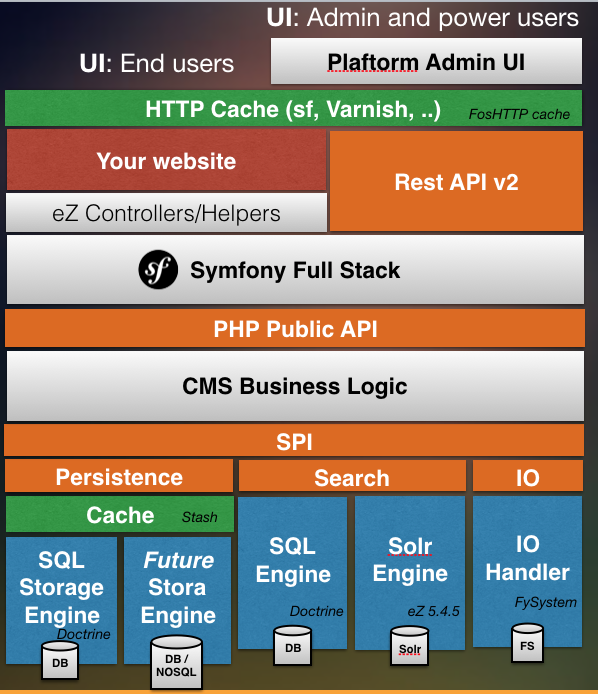
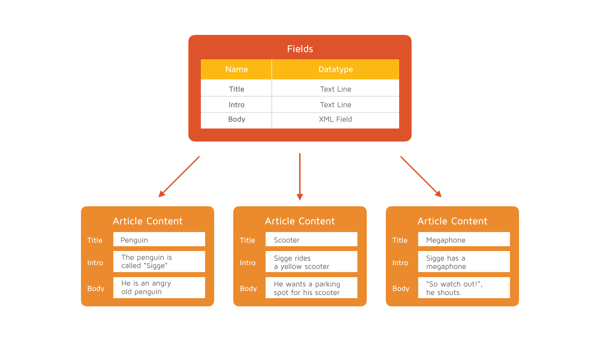
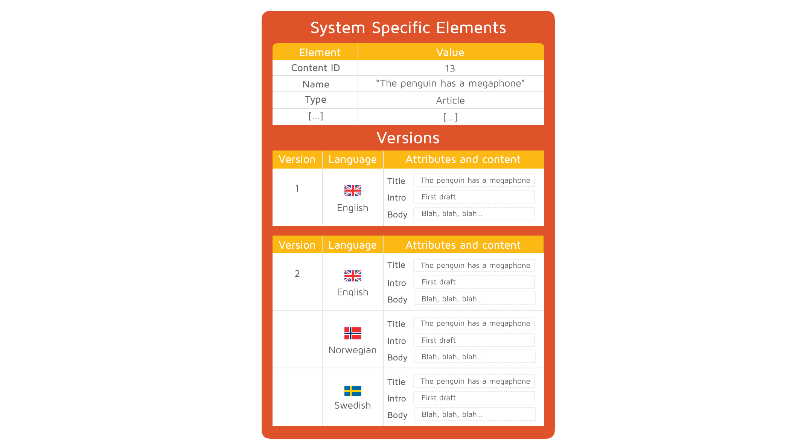
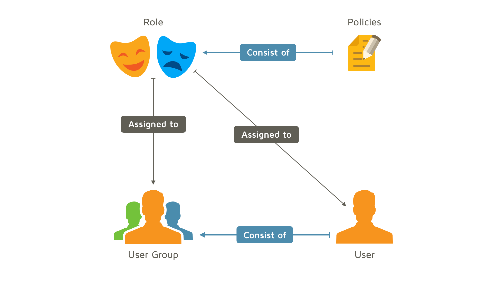
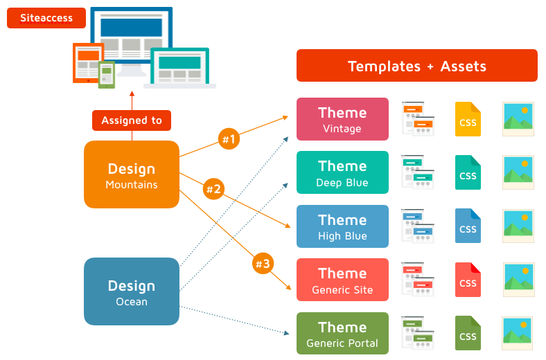
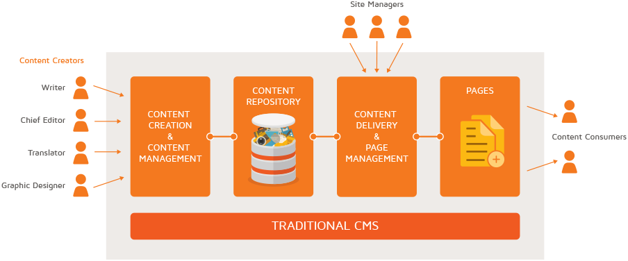
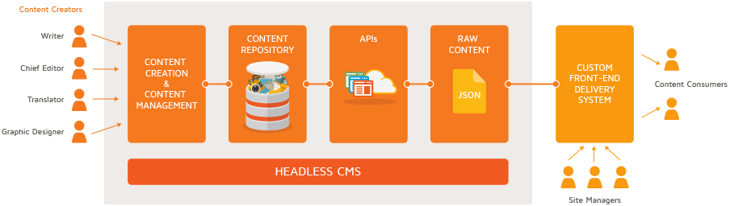
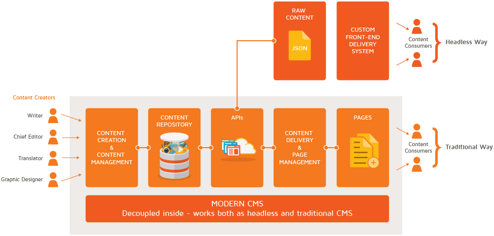

# Going Headless<br />with eZ Platform

<center><small>M.Sc. Ramzi Arfaoui</small></center>

<center><small>SensioLabs Cologne 2017/08/30</small></center>

---

## Ramzi Arfaoui

- Professional Services @ ez Systems
- ramzi.arfaoui@ez.no
- Twitter <a target="_blank" href="https://twitter.com/ramzi_ar" >@ramzi_ar</a>
- GitHub <a target="_blank" href="https://github.com/ramzi-arfaoui/" >ramzi-arfaoui</a>
- Gist <a target="_blank" href="https://gist.github.com/ramzi-arfaoui/" >ramzi-arfaoui</a>

---

## Agenda

- What eZ Platform adds to Symfony
- Learning the core concepts
- Going Headless with eZPlatform
- eZ REST API
- API consumer examples

---

# Installation
```
$ cd /var/www/html
$ composer create-project --no-dev ezsystems/ezplatform ezplatform-meetup
$ cd ezplatform-meetup
$ app/console doctrine:database:create
$ app/console ezplatform:install --env=prod clean
$ app/console assetic:dump
$ composer update
$ composer dump-autoload --optimize
```


Check eZ Launchpad https://ezsystems.github.io/launchpad/

---

# What eZ Platform adds to Symfony

--

## A Content Repository

- A flexible storage for content
- Fully integrated search engine for high performance with millions of content items
- Sends API signals (on all operations like delete, move, remove subtree, indexing...) for workflows and integrations

--

## A comprehensive REST API

- A public interface to interact with the repository
- The admin interface uses it - a first class citizen!
- For content syndication or straight with front end technologies like Angular, React or Vue.js.
- Extensible, you can aggregate data from any Symfony data models like Doctrine ORM

--

## Dynamic routing

- Uses the ChainRouter from Symfony CMF
- Matches dynamic URLs from the repository:
 - http://example.com/products/bicycles/kids
- Works with the static routes you’ve made:
 - http://example.com/polls/123


--

## Siteaccess concept

- Matching a URL to a set of configurations
- Typical use cases are multisites and language versions
 - http://example.de/
 - http://example.com/de/
 - http://de.example.com/
- Powerful multisite and multilanguage configurations

--

## eZ Platform Architecture

--

<center></center>

---

# eZ Platform Core Concepts

- Content Types
- Content Objects
- Locations
- Access control
- Themes & Designs

--

## Content Types

--

<center></center>

--

## Content Objects

--

<center></center>


--

## Locations


--

<center></center>

--

##  Permissions

--

<center></center>

--

##  Themes & Designs

--

<center></center>


---

# Going Headless with eZPlatform

--

## What is it good for?

- A decoupled cms separates the content creation process from the delivery process, allowing businesses to define the presentation in the cms or use the cms solely for content creation, storage and delivery.

- Provide your developers and designers with an open, extensible technical platform for building content-rich websites and apps.

- Deliver content accross channels - from brand sides, e-commerce, intranets, apps, wearables, IOT, and any other places where it gets delivered

- Feed content to other platforms


--

## Traditional/Monolithic/Coupled CMS

<center></center>

--

##  headless CMS

<center></center>

--

##  Progressive Decoupling

<center></center>


<small>combination of the two depending on the project. More importantly, these systems adapt to the organization’s business needs</small>

---

# eZ REST API

--

## Methods

- **GET** /content/objects - list
- **POST** /content/objects - create
- **DELETE** /content/objects/< ID > - delete
- **PATCH** /content/objects/< ID > - update
 - *or POST with header: X-HTTP-Method-Override:PATCH*
- **COPY**  /content/objects/< ID > - copy
- **PUBLISH** /content/objects/< ID >/versions/< versionNo > - publish content
 - *or POST with header X-HTTP-Method-Override:PUBLISH*
- API exceptions are converted to HTTP errors: 404 (Not found), 401 (Unauth), 500 (Runtime)

<small>https://github.com/ezsystems/ezpublish-kernel/blob/master/doc/specifications/rest/REST-API-V2.rst</small>

--

## Headers


- The type of output is specified in the Accept header
 - application/vnd.ez.api.Content+xml
 - application/vnd.ez.api.Content+json
   - application/json works too!
- The type of input (if any) is specified in the Content-Type header
 - application/vnd.ez.api.ContentCreate+json
 - application/vnd.ez.api.ContentCreate+xml

- Authentication ; get different results based on the user, roles and policies
 - Authorization
 - X-CSRF-Token

--

## HATEOAS

- Never build URIs client side
- Follow links provided by a previous response
- Need to request to root first

---

# API consumer examples

--

## Session Auth

- Authentication done with a POST on /user/sessions
    - 201 Created in case of success
    - Returns the CSRF Token
    - X-CSRF-Token header required for non safe methods
        - POST
        - PUT
        - DELETE
        - custom HTTP verb

--

## GET: Location, Content, ObjectStates

- Load Location children
	- /api/ezp/v2/content/locations/< PATH|PARENT-LOCATION-ID >/children 
- Load Location Information
	- /ezp/v2/content/locations/< PATH >
- Load Content Information
	- /ezp/v2/content/objects/< CONTENT-ID >
- Load content Current Version
	- /ezp/v2/content/objects/< CONTENT-ID >/currentversion
- Load ObjectStates
	- /api/ezp/v2/content/objects/< CONTENT-ID >/objectstates

--

## PATCH: Set Content ObjectStates

```
HOST:   www.domain.com/api/ezp/v2/content/objects/140/objectstates
METHOD: PATCH
HEADER: ACCEPT: application/vnd.ez.api.ContentObjectStates+xml
		CONTENT-TYPE: application/vnd.ez.api.ContentObjectStates+xml
		X-CSRF-Token: XXXXXXXXXXXXX

BODY:
<?xml version="1.0" encoding="UTF-8"?>
<ContentObjectStates>
    <ObjectState href="/api/ezp/v2/content/objectstategroups/2/objectstates/1"/>
    <ObjectState href="/api/ezp/v2/content/objectstategroups/12/objectstates/5"/>
</ContentObjectStates>

```

- Check User Policies (content-edit + State)
- Edit Content again

--

## POST: Create ObjectState

```
HOST:   www.domain.com/api/ezp/v2/content/objectstategroups/12/objectstates
METHOD: POST
HEADER: ACCEPT: application/vnd.ez.api.ObjectState+xml
		CONTENT-TYPE: application/vnd.ez.api.ObjectStateCreate+xml
		X-CSRF-Token: XXXXXXXXXXXXX

BODY:
<?xml version="1.0" encoding="UTF-8"?>
<ObjectStateCreate>
  <identifier>worker</identifier>
  <priority>1</priority>
  <defaultLanguageCode>eng-GB</defaultLanguageCode>
  <names>
    <value languageCode="eng-GB">Worker</value>
    <value languageCode="ger-DE">Mitarbeiter</value>
  </names>
  <descriptions>
    <value languageCode="eng-GB">Company worker</value>
    <value languageCode="ger-DE">Firma Mitarbeiter</value>
  </descriptions>
</ObjectStateCreate>

```


--

## POST Create Content with image

What we need:

- ContentType ID
- ParentLocation Path
- Section ID
- Language


Example: Image Base64 using openssl encrypt tools: 

```
openssl enc -base64 -in black_story.jpeg > black_story.b64
```

--

## POST Create Content with image

```
HOST:   www.domain.com/api/ezp/v2/content/objects
METHOD: POST
HEADER: ACCEPT: application/vnd.ez.api.Content+xml
		CONTENT-TYPE: application/vnd.ez.api.ContentCreate+xml
		X-CSRF-Token: XXXXXXXXXXXXX

BODY:
<?xml version="1.0" encoding="UTF-8"?>  
<ContentCreate xmlns:xsi="http://www.w3.org/2001/XMLSchema-instance">
  <ContentType href="/api/ezp/v2/content/types/48"/>
  <mainLanguageCode>ger-DE</mainLanguageCode>
  <LocationCreate>
    <ParentLocation href="/api/ezp/v2/content/locations/1/2/94/95/99" />
    <priority>0</priority>
    <hidden>false</hidden>
    <sortField>PATH</sortField>
    <sortOrder>ASC</sortOrder>
  </LocationCreate>
  <Section href="/api/ezp/v2/content/sections/1"/>
  <alwaysAvailable>true</alwaysAvailable>
  <remoteId></remoteId>
  <fields>
    <field>
      <fieldDefinitionIdentifier>title</fieldDefinitionIdentifier>
      <languageCode>ger-DE</languageCode>
      <fieldValue>black stories - Köln Edition</fieldValue>
    </field>
    <field>
      <fieldDefinitionIdentifier>summary</fieldDefinitionIdentifier>
      <languageCode>ger-DE</languageCode>
      <fieldValue>
		<value key="xml"><![CDATA[<section xmlns="http://ez.no/namespaces/ezpublish5/xhtml5/edit"><p>Warum wurde in Köln-Deutz ein Mann von einem Hai angegriffen und so stark verletzt, dass er im Krankenhaus versorgt werden musste? Und weshalb sackte der Karnevalsprinz Paul II. am Rosenmontag um 11 Uhr 11 auf seinem Wagen plötzlich zusammen und starb? </p></section>]]></value>
	 </fieldValue>
    </field>
    <field>
      <fieldDefinitionIdentifier>description</fieldDefinitionIdentifier>
      <languageCode>ger-DE</languageCode>
      <fieldValue>
		<value key="xml"><![CDATA[<section xmlns="http://ez.no/namespaces/ezpublish5/xhtml5/edit"><p>Die kniffligen Rätsel von „black stories“ gibt es jetzt in der Köln Edition. Von Nippes bis zur Südstadt gilt es, den Tathergang Stück für Stück durch Fragen, Raten und Tüfteln zu rekonstruieren. Immer wieder greifen die 50 rabenschwarzen Geschichten „typisch Kölsches“ auf, und gelegentlich fließen tatsächliche Geschehnisse und Fakten aus der Geschichte Kölns ein. So erfährt die Rategemeinde zu jeder Story auch noch etwas über Köln und lernt nebenbei die schöne Domstadt näher kennen.
</p><h3>Fazit der Redaktion von Koeln-Magazin.info:</h3><p>Die Köln Edition der beliebten „black stories“ ist ideal für Köln-Begeisterte und die, die es noch werden wollen. Das Spiel eignet sich außerdem gut als Andenken an eine schöne Städtereise. Ein gruseliger Rate-Spaß für Teenager und Erwachsene, der auf keiner Party fehlen darf. Bei den mysteriösen und morbiden Rätselgeschichten rund um Köln ist Gänsehaut garantiert. </p></section>]]></value>
	 </fieldValue>
    </field>
       <!-- The image's content is provided as base64 -->
        <field>
            <fieldDefinitionIdentifier>main_image</fieldDefinitionIdentifier>
            <languageCode>ger-DE</languageCode>
            <fieldValue>
                <value key="fileName">rest-rocks.jpg</value>
                <value key="fileSize">17589</value>
                <value key="alternativeText">HTTP</value>
                <value key="data"><![CDATA[/9j/4AAQSkZJRgABAQAAAQABAAD/2wBDAAoHBwgHBgoICAgLCgoLDhgQDg0NDh0V
FhEYIx8lJCIfIiEmKzcvJik0KSEiMEExNDk7Pj4+JS5ESUM8SDc9Pjv/2wBDAQoL
Cw4NDhwQEBw7KCIoOzs7Ozs7Ozs7Ozs7Ozs7Ozs7Ozs7Ozs7Ozs7Ozs7Ozs7Ozs7
Ozs7Ozs7Ozs7Ozs7Ozv/wAARCAEsANQDASIAAhEBAxEB/8QAHwAAAQUBAQEBAQEA
AAAAAAAAAAECAwQFBgcICQoL/8QAtRAAAgEDAwIEAwUFBAQAAAF9AQIDAAQRBRIh
MUEGE1FhByJxFDKBkaEII0KxwRVS0fAkM2JyggkKFhcYGRolJicoKSo0NTY3ODk6
Q0RFRkdISUpTVFVWV1hZWmNkZWZnaGlqc3R1dnd4eXqDhIWGh4iJipKTlJWWl5iZ
mqKjpKWmp6ipqrKztLW2t7i5usLDxMXGx8jJytLT1NXW19jZ2uHi4+Tl5ufo6erx
8vP09fb3+Pn6/8QAHwEAAwEBAQEBAQEBAQAAAAAAAAECAwQFBgcICQoL/8QAtREA
AgECBAQDBAcFBAQAAQJ3AAECAxEEBSExBhJBUQdhcRMiMoEIFEKRobHBCSMzUvAV
YnLRChYkNOEl8RcYGRomJygpKjU2Nzg5OkNERUZHSElKU1RVVldYWVpjZGVmZ2hp
anN0dXZ3eHl6goOEhYaHiImKkpOUlZaXmJmaoqOkpaanqKmqsrO0tba3uLm6wsPE
xcbHyMnK0tPU1dbX2Nna4uPk5ebn6Onq8vP09fb3+Pn6/9oADAMBAAIRAxEAPwD1
rUtW07R7X7Tqd7BZw/35pAoJ9BnqfYV5t4h+O2k2gaHQLOTUJcECaYGKIehx95vp
hfrXmPjmSW78fa2bmaSbyruRE3sW2qGOFGegHpWKFUdEX8qpRJcjqrj4x+N5rmSV
NSigRzkQx20ZVPYbgT+ZNR/8Lg8c/wDQYX/wFi/+JrmsD+6v5UYH91fyo5Q5jpf+
Fv8Ajn/oML/4Cxf/ABNO/wCFw+Of+gsn/gLF/wDE1zGF/uL+VHH91fyo5Q5jpx8Y
vHAIP9qxn2+yxc/+O0//AIXL42/6CEP/AICx/wCFcrx/dX8qOP7q/lRyhzHVp8Z/
Gqtk31u4x0NsmP0FP/4XV4z/AOfm1/8AAZa5Hj+4v5UYX+4v5Ucocx2CfGzxkucy
2b5/vW44/I07/hd3jH+9Y/8AgP8A/XrjcL/cX8qML/dX8qOUOY7MfHDxgP8AnwP1
tz/8VS/8Lw8Yelh/4Dn/AOKri8L/AM81/Kjj+4v5Ucocx24+Ofi4DHk6afcwN/8A
FUf8L08W/wDPDTP+/D//ABdcR8v9xfyo+X+4v5UcouY7v/hfHiv/AJ8dJ/78yf8A
xyl/4X14q/58NI/78y//AByuD+X/AJ5r+VGF/wCea/lRyj5jvP8AhfXir/oH6R/3
5l/+OUf8L68Vf9A/SP8AvzL/APHK4Mbf+eaflS/L/wA8k/KjlDmO8/4X14p/6B+k
f9+Zf/jlP/4X34k/6Bml/wDfEn/xdcBlf+eSflR8n/PJPyo5Q5j0Ffj54gA+bStN
J9QJB/7NT0+Putgnfo9gR2wXH9a86xH/AM8U/KkKRn/lktHKHMekD4/axnnRbLH+
+9a/h346x3V+ya9py2VmVwLm3DSbG/2h1wRnpz7enkqeRHYXTG2QygLsc87fm547
8Vny3Es2A7ZVfuqOAPoKTVhp3PsWGVJ4UmiO5JFDKcYyCMjrRVTRG36Dp7etrGf/
AB0UUhnzT4zGPHuvD/p+l/8AQjTPC/h6fxZryaNbXKW0jxtIJHBI+UZxgVL44G34
g66P+ntz+ta/whOPiXae8Eo/8cNX0J6mrcfA3W7a3lnOtWTLEhcjY/OBn0rzdH8x
dwGPavrXUVd9NukjQyO0LhUHVjg4FeP6P8BZZNOSTVtaa2unGTDBGHWM+hYnk+uO
Pc9aSY2jywnaMntXZeHvhVrvinQrbWrG/sYbe53bI5mcMNrFTnCkdVNZfjXwXqHg
i+jtruZLm2uVY21yg278YyCvYjI9RyOa9r+EX/JMNI/7bf8Ao6Sm32EkeM+LfAWr
eCbe2uNTurS4S6cxoLdmJBAzzlRXOV7J8fB/xJtHP/T03/oNeYeHPC+r+Lr9rLR4
FbywDNPIdscIPTJ9TzwMng8cGhPQGjKor1aL4BTtCDP4mVZSOQlnuUfiXGfyFcz4
q+Fmv+FLR78SRalYR8ySwgq8Y9WQ9voT74o5kKzOPopC6hN2RjHWu08N/CbxJ4jt
I76VotLtJRmM3AJkdf7wQdB9SPbjmncLHGUE4Ga9I1D4Fa7bwGTT9XtbyRRny5EM
Rb2B5GfrivPL+yu9MvZ9P1C2e2u4DtkicYI/xHcEcEc0J3Cx0eh/DXxL4l0eHV9M
+yfZZywQSy7W+UlTkY9Qaq+JPA+u+ELaC51gW4iuJPLTyZNx3YzzxXsvwbOfhtYD
0kmH/kRqx/jlbTXuk6Ja26b5p78Rxr/eYqQB+ZqblWR4pRXe/wDCkvGAbH2nSyPX
znx/6BXBErvdQwfaxXcvRsdx7VSdyWrBRWnonhjX/ErSDRNMku0iOHk3KiA+m5iB
nnpnNTeIPB+veFIYJtbto4UuWKx7JVc5HJzg0XCzMaitjQfB/iLxQrSaNpzTQI21
rh2CRg+gLEZx7ZrSvvhb430+Fp20lblEGWFtMrt+C5yT9AaLoLM5WigEEcfQj0op
iHP/AMeFx/wH+dZtaLH/AEG44/u/zrOqJFRPrbwpJ53g/RZf7+nwN+ca0VH4M/5E
fQf+wbb/APotaKko+e/H6lPiNrgP/Pxn8wDWj8JDj4m2HvFN/wCi2ql8Rhj4la2P
+mq/+gLVv4TnHxP0z3SYf+Qmq/sk9T6LncxQSSAAlEJAPsK434T6/qXiPwcbvVbg
3FxHdSReYQAWAAIzj/erspxm3kHqh/lXnPwJOfAtx7ahJ/6BHUFFX4+KD4Y01sci
9xn/AIA3+Fb3wfbPwz0sejTD/wAivWJ8ex/xSWnn0vx/6Letj4OHPw10/wBpJv8A
0Y1AGD8fR/xT2lN6XZ/9ANbnwbsYbT4dWc8agSXkkssrepDlR+iisf49jPhnTCf+
f7H/AI41cr8Prj4jataLp3hrUks9Js2KedPBGY4yfmKglCzHnOO2RnGRT6CPRfFP
irUtH+InhvSLd1Flf7luIyoJck7Qc9Rjrx+NdrJFHNE0UqK8bqVZGGQwPUEelcra
eEorfULPWvFOsnV9TtSI7WaWNLeONmOAFRcZYk45J5xgA11tIZ8weE9FhufidZ6L
Ookgh1BwyOMhxGScEHqDtx+NfT9fO3hX5fjvx0/tO6H/AKMr6JpsDjPhx4sv/FVr
q0moLGGtb5449i4ATqAfUjnmuV+PekxHTtM1tFAmjmNq7AcsrAsAT7FWx/vGvPLT
xn4h8LX+pW2jaitpFLeSO6mGN8sDjOWU9qZrXjnxH4nsBYazqKXVuriUIIY0O4Ag
HKgHuaaTE2j2j4MnPw4s/aaX/wBDNbmvaM2ra/oEzRh7ewuJLmQnsQhCfjuIP4Vg
/Bc5+HNt7Ty/+hV3lSM5z4hax/YfgXVbxX2ymAwxENgh3+QEe43Z/CvmEgpAFUfM
3Fe7fHaG5k8H2ksbH7PFeqZkA65Vgp+gPH4ivDHfyzHKBnYwbHrg1SJZ9U6Hpll4
V8M2mnh44YLOECSViFUt/ExJ6ZOT+NcD8TYbTxzd+HtG0XUrW6kmun8xreZZPKTa
NzkA9AM/XpXfavpWm+MPDb2NyzvZX0aOHiba2MhlIP4A1meEPh5ofguaefTvtE1x
OuxprlwzBc52jAAAyAfwFSUb2l6ZaaNplvpthCsNtbIEjQDt6n1JPJPckmltdT0+
/kkjs762uXj++sMquU+oB4rhvi94nOlaNbaJbTFLrV5PLcofmSDOHPsTkAe270rX
8K/DjQfB+pS6hphujPLEYT50oYBSQTwAO6igDyT4waRBpPj9pbZAiajAty6qMASE
srfnt3H3Y1xVegfG68juPHVrbRsGNrZKJMfwszMcfkVP415/Wi2Ie4rf8eNxz/d/
nWdWk3/HlcZ9Fx+dZtTLcpH1X4BkMvgHQ2PayjX8lx/SioPhqwb4d6KQc/6Pj8iR
RUjPD/iUMfEzWv8AfT/0WtTfCs7fifpPuJh/5CemfE8Y+J+sfWL/ANFJVbwDqVno
/jzTdS1CcW9pAZPMlIJC5jYDpz1Iq/sk9T6dIyCPWvNPgMc+B7v21KT/ANFx1vv8
UvBaxO6a7A7IpIXa4LY7DIqLwt498G32kLLbXen6OxJaazmdICjnljzgN/vDr3we
Kgowvj0P+KOsT/1EF/8ARb1p/Bht3w5tR/dmlH/jxP8AWuE+MHjXT/Ej2ujaPMtz
b2khlnuE5RnxgBT3wC3PTkYrpPhN4o0HSPAsNpqOsWVpcLPITFNMqMATkHBp9BC/
Hsf8Unpx/wCn8f8Aot62vg4iL8NdPKqAWeYsfU+Ywz+QH5VzHxn17Rdb8K2UOl6t
Z3sqXys0dvOrsF2OCSAc4yR+dSfBvxnpltoX/CO6neRWlzBKzW5mYIsqMc4BPG4M
Tx7jGecHQC/8R7mb/hYXgi0Lt5H20SFAeC+9ACR6j9Mn1r0yuX8Uav4SsLnTb3WX
s5ryGdRZAupdGcgFuvCjgljwMDvitNfFPh1/u6/pjfS8jP8AWkM8J0GRYPjwxY4H
9sXKfiWcD+dfRdfK+tXktr4/1PVLCRWeDVpbi3kHzKxEpZT7jpX0N4U8b6N4tsIp
rO5jjuiP3tm8g82Nu4x1I9COD+lNiueb/C3QdJ1vxB4rj1bTLe88m5Xy/PjDbMvJ
nGemcD8qufGDwxoGheD4bnS9KtbO4e9SPzIk2sQVckZ/CvSLPR9E8OPqGoW8MFj9
sk867mZ8Kx55JJwByT2HJrxX4teN7bxTqEGmaVL5un2DF3mH3Zpeny+oUZAPfJ7Y
JFuB6D8FDn4eQ+1zL/Ouq1PUnsdZ0e248u+mkhbPqI2cf+gY/GuR+CkiL8PkDOo/
0qXqfpU3xU1FdJs/Duq+ZtS11qFnIP8ABtfd+gNIZv8AjnSTrfgnVtPVS7yWzNGq
9WdPnUf99KK+XYiJIQD0xg19gV8p+KNM/wCEe8V6tphTYlvcN5S/9Mz8yf8AjpFV
ETOu8F/Fu88K6dHpOpWZ1Cyh4gkR9ssS9dvPDAdumPpgDqbj4+aKsDG10bUJZv4U
lKIp+rAnH5VU8HfBvTNR0C21PX57iS4vIxKsMLhFiRhlQeMk4wT0647ZO+fgl4OI
4jvR9Lj/AOtS0DU8U1vX77xF4hbXNSkVpi6lY1PyxovRF9B/Uk969Gvfj+fszCy8
PbJyDsee4yin1ICgn6ZH1roj8D/CB6NqA+lwP/ia1vDfwz8O+F7i4mtY5rn7QoVl
uykiqAc8fKKNA1PnW6vrnVL2fUb2dri6uXLyyN3P07DtjoKjr3fxb8KPDl++pa6X
u7efyDIIbdkSIFEwMLt77Rnn1rwWJzIm44z7VadyWiUj/Qrj/dH86za0j/x5XH0H
86zamW44n078KW3/AA00c+iSD8pHoqL4QkH4Z6VjsZh/5FeipKPIvisMfE/VPdYT
/wCQkrB0PTU1vX7HSJJxbpeSiNpSM7B64roPiz/yU7Uv+ucP/ota5a3mht7mOe5t
lu4EbMlu7FRIPTKkEfUVa2Ie51CeALL+1JrW6vL/AE6GOaC1U3VmvmvcTFgnyq5H
lgKSW3fQViWvhPV9T1HULC2tI5J9MZheMZlRYwpKlssRxkGtiH4jypcq0miWkthb
JALKxMjgWzQkmJ9+dzYLNnPXNYUevTfZ9bgnxPLrQU3Ex4KMsokJAHXJBH40tRux
qeH/AATe6vf6dBcstvY6jvWO4t5EmKOIzIqMFb5WIA4bB/I1V/4QrxHLqJsf7KDX
IiWbPnx+WUY7VIk3bTluAAck5FdTP8Q9SttO0e/k8Oww2Ukpkt1FyfKkMcRhdY0/
5ZJ8+cY655OeM61+JCWNr/ZtppL22jiBUjhjuA08biQyeYJHQg5ZmGCvTpjFF2Fk
YUfhPXhpcurrpEy2UKsZJGwCoVtr/KTu+VgQeOMc09/B/iN76HTm0eU3k8XmpDuX
cqdy3PydR97HUetaJ+IEkxg82zMkkdtewGRp/mf7SzHceOq7vx9q0pPFn9qiC0k8
OaldW+oWbWstyJA15ebWVtwkWMB9mwDkHjOaLsLIxNQ8C6rp+n2N/a20t9bXkEbP
JHFhYZXYp5ROTkhgBn1I9qyf7B1I4xpV0d1ybQfum5nHWP8A3vb2rppPEF1LboLb
Qr5beXRxo9o+SdzNMWjfcFAJOwjA6lTjpgaFx8Tnju7iN9Ia1uBbsojztMGoner3
GO2RIwx14FF2Oxx76LrEVvazvpV2ILwhLV/JbExPQL6kjp60XHhnXYonuZ9C1CKK
IbpZTbOFjGA2WOOOCDzXV6d470TS7OygttHmiMM1pNOqJGF3Q53ENjc5bJOWPGcD
A60bTxTpsGg6lBI2pf2xqU5lnuMLIk6DJWFiWBVCcbsDJxjkcU7sVkcve2N9ZpA+
p215Ckyb4PPRlEi+q56jkdK3r7wNq+l2Qu5biwlhXyftCwT7ntPNx5ZkXGQDkdAa
teNfF9t4ps0gsY5IRLdG7nilgVfLkKhSBICS/fnC8BeK0bzx9pOqQpaX9vffY7aW
ylt1gCxO5iULKrsDkgjJU5yCOo7LUNDmLnwdq4v57SKD7ZcW0DXE4gDDyo1JGSHC
nJA3AAZII+lZaWdwqxOLW4K3J2wExnExzj5fX8K9Ff4gaO13FDDc38MDadc2Mt3H
CUMZkbdE4TzGZgvI5bPJPei18d6JDPpkt3NcXd3FZyWkt2sDxJaq0YVSIxJkuCDl
oyhKn1ouwscINHvV0J9aMhjtorsWbozkSCXaW6emB69apXBYwkuxY/3mOTXY+KfF
NlrWkX1nHMJrmXUIJ0ljgeNJY0hKFiHZm3Z4yxyeDXJYGOQPxpoTPp1NZtPD/gW1
1W+LrbW1lCz7FyeVUAAfUiuZX44+EW6pqC/W3H9Gry3wz4O8W+Mrd10+4lXTQdjS
3VwwhJH8IXktj2GBjtXSj4Da1tydbsg3oI2xU6FHYr8bPBx6y3o+tuf8a3fDHjzQ
vF1zPb6TLM7wIHfzIioAJx3ry4/AfXh93WdPP1V/8KztR+FPjjw/E91YOt0ADv8A
7OnZZCvX7pALfQZNGganqXiz4h+GdKOpaFfXskV6tuyFPIdhl48qMgY6MK+dIVZI
wrDBqR5nupDPPM88rfeklYs5x6k80lUlYlu44/8AHlcnHYfzrNrRb/jyuPov86u+
FfCtz4nvREkn2e2Vtks+3dsPlu4G3IJz5ZHtSkNbHunwafd8N7Ef3ZZh/wCPk/1o
pvwbZG8CARx+Wi3kwVC27aM9M9/rRUlHlvxbGPibqHvFD/6LWsTwvd2eneLdLvtQ
IWzt5w0zFSwC+uBkmt74vjHxLuz6wRH/AMdFccRkYrRbEPc7zTfEWiahFbX+uahb
w3tm975kLWp/0kSxBYtu1doC4xz0x75qePxN4YnhW21QW01jZnTpLeFbUAllUC5J
wuW9wc5A4zXnZUHkjNG0elLlHc7Dx7q0GoaXoMC6nZapd2ct01y1jDsjCu6FONqj
O0Y4HbnPU9D5/gmLVhdtc6Jc293qn2lIvJGIrc20gCuCvA8zblfXBry5VVc7Rj1p
PLTngc0corncaxqOiah4WuI1h0lL59Ktp90FvHFL9r87bIo2gYPlgZUcck461d0f
VrGT4cafoUeqW1jq80F2kVxJKq+QPMDmFyf9WJR0bIzjFed7QDnHOc0FFbOR160c
o7no1nP4fh0/TmWbS4bK3FnLaSLPi8F2JAZfNBOdozITkbQCpXrUl9/wi9wZ4pY9
KuJ9Q/tSWe984GVHSVmgKkNhc8Y4+YY7V5p5aZJwMmjy19PT9KOULhEWKAv196dR
RVEhRiiigAwPSjAoooAMVHcMREcd6kqO4UmI47c0AfVei2Vn4b8L2dpuit7eztlD
uxCKMDLMT0GTkk+ppqeLPDcgyniHS2/3b2M/1qO1XTPGfg63+1Qrc2OoW6NJGWI9
DjIOQQw7dCKwm+Dvgc9NKkH0upf/AIqsjQ6ZfEWhv93WbBvpdIf61atr+yvCRa3c
E5Xr5UgbH5VxTfBfwU3SyuF+ly9aXhv4b+HfCupnUdMinFwUMYMkxYAHrx+HegDy
f4x6JDo/jdbq2jEcWpw+c4AwPNBIY/jwT7k1w1ejfHO+jn8WadYoQzWtqXfB6F2P
B/BQfxFec1otiHuK3/HncfQfzrsvh/JbQeE9Zubu5MNvb3EPmBW2l92QPm6jAD9O
u4iuOb/jzuP90fzro/h/4e03VLXU9R1hWe0szFEqFyqGSQlQWxzx2x3I7ZqZDWx6
38HBt8DkbSv+mS8FNhHI/h7fSij4O4/4Ql9shkUX0wV2OSwyMHoKKko81+Mgx8R5
D/etYj/OuJruvjSMfERfeyj/AJtXC1otiHuFNkYohIGf6U6mujylYowWeRgqgdya
YjuvFvgbSNA8DaTr2n6uLqS4IV38tgLvf8y7R/BtUHr1x2PB4ccivU/Gu278P+IP
DMTBo/CyWMloo6kBNsh/ANzXlaHKA1MRyNzwZ4fg8U+JE0y5neKERPK6xECaUKCd
seQRuzjrjjNZ2rac+jazd6VJcRXElpIY2lhztJHUc9weD7g10fw6uG0mTxD4kUIX
0vTiId4yBK7AL/Ij8arfEmwTTviNqqRLiK4ZbhfcuoZj/wB9E0J6j6HN0UUVRIUU
UUAFFFFABRRRQAUUU2VikZZeooA67wX8SdT8FI1mIVv9NZi32Z32tEx6lGwcA9xg
j6ZNegQ/Hrw6yjztL1ONu4VI2A/HcKXQ/hF4T1Tw9pt/PFdCa6tIpZClwQCzICeP
qatN8DvCLdH1FfpcD/4ms3YsjHx18KHra6oPrAn/AMXVLVfjxpS2jLoul3c90RhT
dBY419zhiT9OPrVxvgT4VPS81Vf+26f/ABFRN8BvDZ+7qWqj/tpH/wDEUaBqeM31
9d6rqNxqV/MZ7u5ffK59fQegA4A9BUFdN8Q/Cln4L8Q2+mWE888U1qs7NOQWDFmX
AwBx8ormatbEsU/8edx9B/Ouq8Aa7o2jaNq0upuv2uHElhGULM7srL8o6dQnJ6dR
XKt/x5z/AEH867nwA3h7w94Zm8TaqI1vBI8dqzkNISAP9UnrkjLdvUVEho9D+DCl
PAmCUP8ApcnKHI6L0opfgyHHgY71Kk3chwRgjhe3FFIo88+NYx8Qovewj/8AQnrh
K7743DHxAtz66fGf/H3rga0WxD3CtvwNYf2p4/0S14IFyJmB6ERjeR+S1iV1fw5f
7HqOuazjB0zR55Im/uyHCr/M0PYFuaPg/UI/EHxK8R2rOTF4ht7yCMk9Acsv5Kte
fwZEeCMFeMVt+ALk2HjvQZx1a7SL/vv5P/ZqreJbQab4r1qzVdqQ3sqoP9nccfpi
ktGN6o3NIQWvwg8T3bY/06+trVD6lGEh/Q1Y+JGb2HwrruQxv9JRJGHeRPvfq+Pw
qDWQLH4P+HLIDa2pX094/uUyg/Qipbz/AIm/wU0+4Ee6bQtSeB27rHJ82fplkH4U
utx+Rx9FA5FFWQFFB4Brdbw6q/DZPFOJTcPqX2bH/LMQ7TzjHXeMZzSuNIwqKByK
KYgooooAKbIpdCox+NOooA9l0H4zeGdM0DTtOuLbUvNtLWKGQrChUsqgEj5+mRWm
vxw8IN1F+v1tx/Rq8CaZFJBU/lSefF/kVFkVdn0novxR8J67fxWFrqDR3M52xJPE
yb27DPTJ7DPNda7FULBS5AyFGMn2Ga+Qre8W2vILuJtslvIsi9uVORz+FetD9oNO
/hhv/A7/AO10mrDRznxa1m013xfbzWgmRra0EM8U8TRvE4dztIPsRyMiuLrofHPj
Cz8aalbapDph06eKMxTEy+Z5ozlew5HP6elc6rBxlelWtiXuObH2Wb6D+ddb8OPC
+m+JtM1VNSiIS2eKTz42AcKA5KZPCqeCW9q5I/8AHtN9B/Ouo+HehXPia01XTpdS
ntNIjRZrmOAANPJz5YJP8IOSc5HHTOCJkCPVfgyxfwOxIA/0uTgdBwtFHwZdpPBD
u7bmN7KWbcWyflycnrzRUlnBfHLjx7Zf9g1P/RklefV6D8cx/wAV5Yn/AKhqf+jJ
K8+q47EPcbI/loWxnFeh6t4d/wCEL+FE9x9o86fxL9jVgV2mHhpWUc8jjFefxW5v
by2s1zm4mSMY9yBXWfFO9kuPiFqNoJG+y2vlrHDn5FPlLkheg9KHuNbHJRTtZXFt
dR8PbyLIuPUHNep/EL4c3useK11PTb233a3crDHC4KiLEG7czDPXy3OMen4eWYBG
CM16v8Kr55vA/iFpWeS6053uYZmcl1Y25RcH2VSB6ZofcEcz8SopNNk8M6DKoWTT
tIj85AQQsrE7+R7rR8PU/tTS/FfhnaXkv9P+0W656yxHKgD1JYflXK3+q32u38mq
apcG4vJsB5CoXIAAHAAHQDtUui63d+Gtat9a08Rm4ts4WQEowIKkEAjsfWi2gX1I
LuwvNKvJNP1G3e3u4ceZE/VcgMP0IqKuy+KJ+16roWuELu1XSIZZWUY3Pjn9Co/C
uNprYT3GynEbH2r1ueKNPgYNBUE3S6Ympn/caff/ACzXkjxvMUhiQvJIwVVUZLE8
ACvYLkI/j7VfC8JOIPCh06NcZBYIrg/k1TIcTx+M5QH2p1RwHMQ9qkqyQooooAKZ
N/qmp9Iyh1KnoaAPp7wUqS+BdCLxqf8AiXw9Rn+AVrtY2b/etIG+sYNeBaZ8YvEm
i6Va6bBY6Y8FnEsMbSRybiqjAzhwM49quL8e/EI+9pWmH6CQf+zVnZl3Pa20TSX+
/pdm31t0P9Khbwz4ff7+h6a31tIz/SvIE+Purj7+iWTf7srD/GrEfx/u/wCPw3E3
+7dkf+ymizGdFc+HtD/4XDa2B0XTzaPorSG3+yp5ZfzSN23GM44zXn/xd0+x0vxz
HbadZwWcBskYxW8YjUtubnA4zwKuP8Wml8aQeJ20Er5NkbM2wusk5Ytu3bPfGMVz
3jbxSvjPX49XWyNkEt1hMTSbycFjnOB/e/SmlqS2jD620/8Auj+ddr8NTpv/AAjm
tTarPstLCSK6khMm1J2AbYrjq4DAEL0LYzmuK/5dbj/dH867H4b+FNMv9PufE+qz
kQ6XPlY921CVXdlz6ZK4APOCKJAj0v4NO0ngdncgs13ISQcjkL7min/B+b7R4LaY
DAe7kIG7dgYXjPfHT/DpRUlHAfHP/kebD/sHL/6Mkrz2vRPjoMeNNOPrYAf+RHrz
urWxD3NPwrH5vjfQY9u4HUICQfQOCas+O5hcfEPXZF6C6ZP++fl/pVv4Y2wu/iZp
CNysbSSH/gMbEfqBWFq919u8RapeA5E95LID9XJ/rR1DoVa7r4aXrW3h7xvBztOl
tKD2BCOP/Zv0rha7DwKAPCPjmQ9tPRfz30PYFucXAP3S06UZjb6URf6pfpSsNyke
tUI7HxmfP+Hvga8P8ME8JP8AusoH8jXHb1/vCuv0/wAaaGnhTTvDmv8Ahh9Ui093
aOZLxo/vMzdFA/vYxntU6a58KmyJfBepR+6Xbtj85BUq6KepzHh5gPFminPTUIP/
AEYtd3oTs/7Qt+SxJ865XJPpGwH8qzrbVfhTbX9tewaZ4gt5baZJUAKMpKkEA5c8
cVS0fxZp1n8ULjxXdR3CWM0s7qiKGkw6sFyM4HX1NJ6jWhx9t/q/xqWutjsvhVIP
+Qt4itye8kaHH/fKmpovCHgbUZ1j034hCIuQFS7smXJ7DcSop3FY4yirmr6VeaDr
NzpGoIFubZ9pI+647MPYjBH1qnVEhQxCgk9BRUc/+qNAHrHwx+GNhrGlR+IfEMTT
pOSbW0JKptBxvbHJyQcDpjnnPHpv/CFeFdu3/hG9Kx/15x/4UzTJZNN8A2UunWhv
JLfTY2ht0baZSIxgA+9cI3xX8YW6O9z8P7xVQEsxSVQoHUnKVmaHdN4E8JN18N6Z
+Fso/kKydW+Eng/VIWEenGwmP3ZrRyhX/gJyv6Vq6R4lm1bwMniOLT2aZ7WSdLON
yxdl3YQHHU4x071keGPHmta9rUdhf+CdS0qJ1Y/apdxRSBnnci9enXqRSA8N8SeH
73wrr0+j35DvGN0UwGBNGejD+R9CCO1Zlep/Hy2iTUNCuwAJZEmjY9yqlCP1Zvzr
yytFsQxR/wAe0/8Auj+ddV4AsG1qxktNWu2Xw3a3gmurcHZvkaJ9rbxyOY1GM965
Uf8AHvN/u/1rqfA2uaXofhrV7m+kVrmKaBra23DM2W+bCng4C9T0z6mpkCPV/g+s
sfgt4ptvmR3kittTaMgL2wP5UU34NEt4FDlCm+6kYKeoHGPrxznvnNFSWcR8dhjx
ZpbdzZkf+PtXm9emfHlceIdHb1tnH/j3/wBevM6uOxD3O8+E0slkPFWqwnZPZ6U7
RvgHacFh190H5V5/B/q89zyTXd/D4lPBfjyXt9gRM/VZBXCw/wCqWhbg9h9dP4U1
KxsfB/jCzubhY7q8toRbxNwZcMwO31I3DjrjJ7HHMUFQSCe3Sm1cE7DYwRGAeuKd
RRTEFGKKKADA9KMUUUAJtHoKa8SupG0Z7Gn0UAdrfMfHPgFdUBL694ajEd3nJa4t
ecP7leSeezE9RXO69oFz4dbTRcyrL/aVlHeIVXGzdn5D6kY6+9L4Z1+Xwvr0WqJG
JoSpiu4G6TQt95T/ADHuBXb/ABOgk8TaBofinSrF49NgtH8wHA8lPMVFHHfnoOmD
UbMrdHmlI671K+tKCCMjoaKsk95+EvjO11jw/baHczLHqenxiIRscGWNfusvrhcA
/TPeu21oE6Hfgdfs0n/oJr5Vs7C/1O9W30uzubq7Qb1W2QsygH73HTBxzXS6hJ8T
NC00zare6vbWTHyy81wWHI6ckmoaLTPZfhYc/DbRv+ub/wDoxq6yvmLQ/E3jWNYt
J8O3t9KkSny7a2i8zYuc9MHjJ/WrOvv8S7mzk/tyPXGs9uZR5bLHj/aCjGPrSsFy
58V/FFv4n8VxxafMs1jpsZiWVTlZJCcuynuOFHvtyODXGUiFSg2YxS1aViG7ij/U
Tf7v9a0/A+kaXrviaPT9XleOCSNynluFZnHIUZ65xjFZg/495v8Ad/rXQ/D7XdP8
Ozapd3Vubq7e3CWcCod0jbsn5sfKAByfSpkNHt/w/mln03VJJoPsznVZx5HH7oDa
AvHHAx0oqD4ZNfPoF++pxrFfNqlx9pjX7qSbhkDBPA+p+tFSWcL8ex/xN9DPfyZf
5rXl9epfHz/kKaEf+mU381ry3tVx2Ie52/g4iD4V+NbnnMgiiz26kf8As1cNFxGv
0ru9BAj+BPieQfee/jQ/QNF/ia4VPuD6UIGLRRRVCAkAZPSkV1fO05xW74MsrC/8
QSpqUS3EdvZT3MVs5ISeRELKrEc44J/4DVrxxNbpcWekrbWy6hZKXvbm2tUt43Mg
VljVUHzKg43NyeelK+th20OZooopiCiijIHegAp3ly+UZ/Jk+zh/LM207N+M7d3T
OO1R5aWRYIFaWaQhURBksTwAAOpr1TxLZW2h/CjUPDYiRp9Na0NxKBnNzId74PfC
lQD6cUm7DSPLGGVI9RXs/wANdV0fX/A9t4JuWeS4aC4+0oMjYnmZHPuJBjHoa8YX
7orc8D3t5YeOdINjOYXubqKCUgA7o2ddy8+oFEkCZnatarp+v6np8YIjtLuWFAey
q5A/lVORtiE+lbPjLb/wnuvbBgfbpfz3HP61izjMTULYOp9GfCrw/BofgeylWMfa
tRQXU8mOW3cqPoFI49cnvVD4yo194HjtrUefNPfwxxohyWY5wB71u+GktvEHw106
28xhBdaYlu7RNhl+TY2D2IIP5Vi+E/hFpHhbXF1b7ZPezQg+QsqhVjJ43cdTjI/H
1xjMs3fBHhK08H+H4bGJFN06h7ucDmWTvz6DOAPT3Jroq5n4geKR4R8KXGoRkfa5
P3NqD/z0YHB/AAt74x3rB8F/D660zVbTxNP4nvrySeDzJoXBAlLp/EdxyBnI46gU
AcH8Y/DlvoXim3v7KJYbfVI2Z0UYAlUjcQO2Qyn65rg69Y+P08Zk0G2BBkBmcjuB
8gH54P5V5PVx2Ie4v/LvN/u/1rZ8AWk974guILRFe7ewnjgDttUM6+WWJ/2Vdmx1
OMd6xv8AlhN9P61p+Bv7Y/4S22i0CaOC/lSRBLIMrGpQ7mP0GSPcDrSkCPffh8X/
ALM1NJZzcSx6rPHLNtC+a6kBn2jgZIJx2zRUfw1s007QL2xSaScW2pXERmk+9IQ2
Cx9yc0VJZwvx9H/Ew0E/7E/80ryw9DXq/wAfl/0jw+3tOP8A0XXlHarjsRI7jQl3
/AnxOP7t/G3/AI9FXDIcoK7rQP8AkhPij/r+j/8AQoa4VPuD6UIbFpGbaCeuPSrW
nabf6zqMWnaZbPc3Ux+VF7D1J7AeprrLrwf4P8M5TxT4plu75R89hpKBijA8qXOR
+DbTTbsJIPD+lRaH4XuPEQnXUr3VoX0yzs7ICVoJZV4385DYDfKAevvVH4jQWcXi
Y31rdGW51DLz2BVTJZEYARirMCeDxnIxyK6SC40KfRtBg8PC40yyj1A3dxJLIWlR
ldV3kjuUVuBxzWJeeLfEnh/Vr+70yG1sIb68mljuBaRPJIGdmALkE8A8A1kppyt1
OqeGqQpqo17rV7/OxgWnhrxJqChrPw/qMqN0cWzhfzxitqH4W+MZE8y7tLXTYcZM
t3dIqj64JI/KqV74/wDGeo/6/wARXaf9e5EP/oAFYNw897L5t5czXMn9+Zy5/M1p
qcuh3Np8NtHlidrv4haQksALXMduRIqKP7rFhu/Kqvk/CrTWUtea5rjqOViQRRMf
xCsPzri2jiUcgDFauh+G9b8SymPRNLlugvDS8JGvsXOBn2zmi3djv2Oig+JKaLke
FfCWl6UNpXzpg083PfeSD+ByKal1PcfB/Wb+9laWe/1xAZG6yNtDE/zpLzwVonhp
S3i/xLG1wvXTNKHmTE4HBZuE69xz2NZvijxhN4nSytUtxp+lafEsdtYpJvC4GNzN
gZOOPb8TlWvsP1MIfdFanhOQReN9Bc9BqEP/AKGKyPNUuEQF2PACjOa7PwV4B8Ta
l4j029k0uexs7a5jmee5Ty+FIbhTy2cYGBjmqbJSJPid4O1Dw9rM+uTyxT2uq3kr
Ax5zCxYsqtnrlfT0PsTxfUV6h401KLxB4G8TXsT7orfxEvksDuVgsSR5B9Dyfxry
4H5QTSiEjuPAPxNuPBkB0y9tXvdLZy6CNv3kBPXbngg9cccnOa7/AP4Xl4S8rf5W
pbv+ef2dd3/oWP1rxq38P6heWkd1B5JjkGVDPg9celO/4RjVSflhhb6Sioc6d7XO
uOExLSapuz8i7488YXnjnVVuWi+zWVuCtrbk5IB6sx/vHA+mAO2T6TYfGzwzY6Pb
W5s9TeaCBIyoiTBYKB13dK8fttNvbySZLaHzGtztlG4DaeR369DUh0LVR1sWJ9ip
/rTbhtczjQrSXMoNr0ZY8UeJLzxd4gl1i9RYiVEcMCnIhjGcLnuckkn1J6dBlVJc
WtzaOI7qFoXYblVhyR61HVq1tDGSknaSsxf+WMv0FdB8Nd48TXJilWGRbGVhK38C
jaXI9Ds3gHsTntXP/wDLGX6VvfD7wy/ibWp0N5Ja2ttEWuTE+2SWNvlKA9ACMgk8
AZ61MhLc9w+HAtl8P3Qsn8y1Go3Cwybt/mIHwG3fxZxnPfNFSfDz7H/wjcn9nLGt
kL65FsIuV8sSsFwe4wOtFSWcP8fh8mgN33zj9I68k7V678fv9ToP/XSf+SV5ESAC
T0q47ESO58Pn/ixfioHoL2P/ANCirl/D3hzVfE0jx6dEqQQKWuLy4OyCBQMku/bj
t1/Wuu0DXW8C/DN5Z7WC4vNcujLZWlym5fLXAMrL6ZHA4zwRkZpwnuPHHgoQQiy0
x5tR+x21lCzQWkZCiRflXrJI2QGfK8HGCc0rlWIhp+oeBvAuvzW5824vbi3gTUrf
JQ2rqWDxtjoT8p9yOcgVxen6NeX6brSANGpw0rnC5+vf8K29F8eeIfDlnHogWKWw
tZJFnsbmIHzFY/PE2egyGx7sc5HFQafNNLrdwvh3zY9L3+YLe7bIiQ9j15zkAjk4
5qZuUU2jfDQp1KsYTvZ9tzTtNMfSdNuEtJzNdOoYBh8m4dgPccVR1hVvtNspbydb
S8KMVVwRE+Mbh3IPTHY5rZvppre1eWztzcTD7iZ4H+0fYVxl7f3GqTCe6dXZV2rt
XAUVzUIynLnZ72ZzpYan7CN9Vtrbff1IMYJGQcdx0NB6cdaQkKMk4pplQfxV3Hy5
1fhTVPAmkIlx4i0jUdT1BSTgKjW688AKWG7jruz9K6i7+K2g36G22+ItMsVQLHba
cbeNfpkAMoPs34V5Z5sf94UokQnG4VPKO51yaj8L4Zy48Oa3cRg8LLcBQR3ztbP6
1JPq/wALRJ5tt4U1Z8dIXuiiH6neTXGebH/eFLGWmcRwRPM5/hjUsfyFFkO7O1/4
Wjf6fC9t4W0LTdCt2GAyR+ZN9Sx4b8Qa5/UvF3ifU2klv/EF828bWRJTGhHpsXC/
pWlpvw28ZapGsyaQbSA8+beOsW0epUnd+lbGjaD4P8JX63/ivxFp+rSxK2zTrJDc
IW7bj09eGAHTmjRBqVI4WsfgPI8vy/2lrAaEf3lVQP5xt+VcZj5fwrb8R+L9Z8WN
CupmGK1tj/o9pbxhI4uMcdzwO5PtisUjINNIUjft31i40C1h023kh8ok/aBKB5gy
eAD2yf0q1catqVneJfXOmyw2CLteJHVgWOcNnt2/Km6Ze2f9jWsEurG2ljDBlDqC
OTgHIPb+dWmksbu0ls5daSSOfGWMkYZQDnjiuFv3rOP5n1VKLdJOFV81l1ja6Wit
v6/iZWgSK1zqN0b37HCzhyG2jdksQMt6e1ao17SjJ5Iv8N083adufrjH9KydAsLW
W61AvCLz7KQsKHB3DJG7njsPzrXGn2VyfJk0Pyg/G8BBt98q2aKvJzaiwLxKw8eS
2t+7vr5aIw/Eyyi/tzLcpchocxuigALuPHBIPNZNXdSs4LJYEginUkNvklHyykHG
U9qpV2U/gVj57FtuvJy3fnf8Rf8AljL9K3/h9b3Gp6vc6It41pp95AX1BkwHeGPL
bQx+6CSAfbrnocD/AJYS/Qfzrqfhpp9jdXWr32qXPkadZ2g+0qxwkilgQrEc4yo+
Ufe6d8USOeO57X8PVsk8KqumhRYrd3ItwjFl8vzn24J6jHeinfD+9TU/CceoRRtH
FdXNzLGrAAhTM+OBwOKKks4b4/D/AETQj6SzfyWvHZwTEcV7L8fV/wCJborelxIP
/HR/hXj1XHYl7nY/ES3a6tPDviS1+fSrnToraPbytvIgOY/bv+Kt6Vzel63e6Kbj
7G6tFdx+XPDJko+OUfgjDo2GVhyCPqDqeGfGD+H7S50nULCPVtDvOZrKQ42t/eQ9
jwD9QMYPNXJ5fhUWNzBa+JM5JFlujCH0BbJIH4k0baMPQoeGfCupeNr29uFvobeG
3Pm39/dv0LEkn3Jwx7DjkjiumttB8I6PDL/Z+rahe6iIyv2hoQsEjdlA6gEjrz9a
LHWfDkmgX2meFdOvbOK8lR703jhgoXkJHgnIz3PP6YiRAyApgr2wc1x16r+FH0eV
YCMoqvJ2fT/Mq6nPLa6NdTxBQ4THJ4APBP61xCMm0BWr0SGQQXMcrwxzxo2XglUM
kq91IPHNX5bT4eX26S48JXlq7HJa0uCQPoNwH6UsPUjFNM0zfCV69SMqaukjzaw1
E6bO06WtndORgLeQiVF9wp4z9Qa0Y/GF7CxYaVoBB6qdJgwfbhc12y6L8LljJOna
vIx/hLnI/wDHgKqSWngqzkRrHwVd35zkG61AxqpHTIBIP05rp9tTfU8X+z8Wlf2b
+4wY/iFZsu278D+GZcd4bPyifyJqwnjnwlOBHqHw90/YDu3Ws5jYY6dBz9M1o3Hx
G0mE+VN8NNHjOdmxlQEEf9s6rz+M9IikdG+GGmxzoNxDg4UepXZ0qro5eWS6Fy38
S2jiPUYvhDbtpwGTKLdnXHrv8vafyrp9Q8WTw+GxffDvT9MiiWN5Lq1+xtHKAOPM
jXChwvOSAccVwupfFbxVeyWx0+WHR4bVQscFpGNh7DIbIIA4A6U63+LHiOBpJ2sN
JlvpIzGb82u2Yg+pUgHtwRjiizJujmNU1zWPEDb9V1a6vV3bgkkh2KT6L0H4CqSx
ovRRQiBF2rnHvTqsi4UHpRQehpgb2mahbJpkUL6HNdeXkNMkAcMck9fxqd7nS5YW
k/4R+VEjdC7G0UYG4Z/TNO0uXWF0O0Gn21sYxvy8rnLfMe3GPzNWTfa9FE5l0yF5
CQsZSUBRk45GfeuCXxP/ADPqaSfsY819v5L9O5jaNarfajeT2t81gEYmEoByhJ+X
Geg44rZbTtUdGVPEJwwxkW65/MGsTRLK2M93BqFlJcGLChUUt5bAkH7v0rVh0jQp
pljGnXEZY45Eqj8+lVVfvf8AATMsFByorRat/akuvZaGNrdjcaZLbWs921ygj3RZ
BHljOMAEn0rOp0o23EqAsVR2ChjyBnjrTa64pqKueBXlGVRuKsvW/wCIp/1Ev0H8
6riSVbeSJJXWKTBkRWIVyOmR3xk4qwf9TL/u1Wb/AFZ+lKRlc+lvhUNvw10cf9M3
P/kRqKl+GabPh1oo/wCmGfzYmipNDkfj4v8AxI9IbuLth/47/wDWrxqvaPj2P+Kd
0s/9Pv8A7Ia8X7VcdiZBSbN5CAHcxwAOpJ6UtGM1RJ041x9LijstR0qS0ljQbFhw
FYeuD9OeTWdJqumXF4Lh9Nnt3zzLbT7GPrkYx/L61lySyysGmlklYDAaRixUfj2q
xe2K2LhDeQ3BZQyGBt6kd8nsR9OawVKCfmz0547EVIWWsY90jpLbUYRC01oZ723G
AEbCtGQM7Ruxu454JP8AOsqOwuvEN+2qWpazj4xJKxJDDsmOSP5ViEHjBIIORg4w
fUe9dpYajBPbBLFpLsW0YLxvGI2x7HgZ/nWU4OlrHdnbhq8cbJQru0Y62XV+XXT5
mG2rax/aP2B9QiV/M8szELsHuTitc6TeW3zf8JC6zSD/AJaEbWb2BPSufvGW4S6v
2lVsyqFzCNzkjofQAcdMHHrUc2kzWhhjuY1BukDQlP3hIPoB1PtWjgna2nyOaGKl
Fyck5ro+Z6L5F2bVtStrieyvb2K5ROcNGsqOw5GOOPr2q/E+qXenzX8ItrRbhfml
juNuFHABU5GcZHY/Ssy0sorvSHJurO1eBixjm4lY46Z4OD2GDVIRQXMbNFHLHMGL
sgG6NIwOueuRT5YvYj29WOs22mtNdfv1226FiWxsPI8+w1JJIwwUxTqUlGe4UZ3D
6VBLBPte5e3EEe/btHy7T1wFJzip4TNeeRFptk7XdoxdZ4UAZ17bh659/apNXmu7
qS1bULjzLkxnEaxgBPQZH3if0PFUm07GE4U5Qc0rem34/kjOoq7b2Hly+XqllqEf
mjbB5UfJfsMHr9BVIrIjtHKhSRThlYYKn0Iq1JPY5p05QScgoPSig9OaozOh0m1u
f7Khlk1l7OKQnyYgRjAJz1981LfpqltZPdW2si6SEhnQouRgjByPQ44qLRrjUY9L
iT+yxe2uWML+YoI55GD75p2p3V2NMnij0RrRJFAlmypAXPtXC+Z1Om/kfTRdJYRN
cyfL/e3t91v0Me01a8sp57iBkMlyd0pdc5Oc8enJNXV8WaovPl2pPvGf8axxjHFF
dbpwb1R4VPGYimrQm0vUVmaSRpHbc7sWY+pPWkooqzm8xf8AljL/ALtVn+4fpVof
6mX/AHarP/qyfaokLqfT3w6GPh9on/XqtFS+AkKeAtDB72MR/NQaKk1OM+PQ/wCK
a0s/9P3/ALI1eLDpXtfx6H/FK6a3pfj/ANAevIdC09NY8QafpMkjRJezrE0ijJXJ
xkVcdiXuUqK9Ju/guYYL14PFNmZLOULIswCrFGQDmQ5+Vtp3YxjGOeazLr4U6rD4
yXw1a6hDOhtRePeuhQRxbivK5PO4EAA8+3ODmQrM4mkAAGBXUa18PNa0fXdP0mCS
HUBqv/HjcxNhJAME5HbAIPcYPBNJrvw817QNQsNPL2uoXGpOY7dbWTJ3jG4EMBgD
PXoO+Kd0Fmc4CI4/+WchlX0O6Ln+Z/Hg0LcTQwSQxTSRxSj94iEgP9RW94h8A+JP
DE9pFe2yXIvXEUD2rFw0p6JyAQ34c9s4NVte8H+IfC0EM+t2At4ZztR1lVxuxnad
pOD+lLRjvJarQo31q9u0M7JCkdwgaNYZfMHQZzkkg/X3qOONoIY72G5hMgfAizl4
z2JUjBH0zUAGMkd6XHei2mpTmuZtIkTzLm5LNE91KwJ2jJYnHXj0/pRAIz5jSxTS
qq8GE42N2LcHj2q7aLowsxLPeXtvfITkRDg/7px6epFU7a7ns7nzbSQoxOBkfeHb
cOhpXvdI0cFHllJp37Wf3li11NbbS7iyaOQNMwZZYX2E/wCy/qP1qxcXr6fbJYNB
ZzPH+8t7qCTe0XORz6iqshjtb6eK+sB5gXZIolOUfu4OeSeuOnNMtr2fTLiSTTLm
SJWBXeQAzL7jkVPKm72NVXlBcrl5eaXoy/fa/dX2kxwGSNJGbE+B8z45VhxhfwOa
zJ7ma7m865k8yUgAuQATj1x1PvUe0DoKKqMIx2RhWxFWs71JX/4AUHpRRVmJ0miz
QLpMKNrH2ZwWzCSny/McfeGeetWNSniGi3atq0dwXUBB8mc56DHrXJFQT0o2jOcV
zuheV7nqwzOUaPsuXpbd/kKOlFFFdB5QUUUUAOH+ql+lVpABGfpVlf8AVS/7tV5R
+6P0qZC6n1R4M48D6D/2Dbf/ANFrRR4N48EaD/2Dbf8A9FrRUGpxvx3XPgyyb+7q
Kf8AoD15D4VnitPGWi3VxIsUEN5E0kjnCou4ZJPYV7J8cIJbjwTbJBE8r/b0O1FL
HGx+wrwR5fLykqMjYwVYYNUtiWexa/rei3Fj4/jh1exkN4YGtgtwpM+Ikzs5+bkE
cZ6Vq3/iLRpPiJFaTalbPYaxoX2Q3EcysivvcgFs4GQxH1IrwYSw/Lxjb0pQ8Owr
ng9qOULns2p2174d0Pwh4VttWspPEtvqBkgYyHYsZ8z75PIUhlXGMnkLnFad9baT
ovxA8M6zfx2unaxqJlivIYZNyMzIQHzgYJbAzjnd3xmvBlEKqQCOeuacSr5LyGQs
MbnOTijlDmPbPEDarpGmrBY+GYLOeXX1lsUk1EzvcTbslwhX5UYA5+YYyeB1rI+K
+jS3el6Vrzx3NjqF7cCCXSZ7gSoshGCyc4H3FBIwCCpODnPmU19e3LxPc6jczvAM
QtJMzGL/AHcnjoOlSXmq6nqcsc2pandXskIxE88zOY/pk8dBRysakr6iXtlPp1yb
a6ULJtDfKcgg9wagp89xNdTGa5maaUgAu5ycCmVSvbUJ8vM+TbpcMe1FFFMgAMDF
FFFABRRRQAUUUUAFFFFABRRRQAUUUUAOX/Uy/wC7UD/6lvpU6/6qX/dqTTNMutb1
K10mxj8y5u3CID0Hqx9gAST6CpkLqfT3hBSvgvQ1PUadbj/yGtFX9Os107TLWxV9
620KRBiMZCqBn9KKg1LGAeo6UYz1paKAKsmmWEpzLY2zk92iU/0qjL4R8NTnMnh/
TWPr9kT/AArYooA5uT4eeD5DlvDtiP8Adj2/yqnL8KPBEpydCRT/ALE8i/yauwoo
A4KT4L+C5DlbO5j9luW/rmqUnwJ8KO2Vu9VjHos6Y/VDXpVFAHlsvwF0I/6nWNST
/fKN/wCyiqUvwBhLHyfEsyD0e1Df+zCvX6Kd2FjxWX4B36n9z4khcf7dqV/9mNVJ
fgT4iU/udY05x6vvX+SmvdaKLsVkfP8AL8EvGEZ+S40yUeqzOP5qKpz/AAj8cwnC
afb3HvHcoP8A0Iivoyii7CyPmp/hf47jXLaAx/3bmFv5PVSfwJ4yt/8AWeG70/8A
XNN//oOa+oKKfMwsj5Um8M+JrcZm8Oaog9TaP/hVSaw1O3GZ9LvYh6vAy/zFfW1F
HMwsj5AaUx/6yN0/3lxTftEfrX1+6JINrqGHoRmqs2k6bcpsn061lX0eFWH6ijmF
ynyZ58f96jzo/wC8K+pm8H+F35bw3pJ+tjH/APE1Wl+H/hCYEN4c08Z/uQhf5Ucw
cp8x+Yn94Uu9f7wr6Pb4VeCG66DF+E0g/wDZqgk+EHgeQ5Gjsn+7cy//ABVHMHKf
PKughmJP8Ne2fBvwYdL0w+I9Qixe36Yt1P8AyzgOCD9W6/THqa14/g74KjmSQabK
djA7WuHKtjsRnkV24AAAAwB0pN3BKwtFFFIo/9k=]]></value>
            </fieldValue>
</field>
  </fields>
</ContentCreate>

```

--

## Using Curl, httpie

- https://gist.github.com/ramzi-arfaoui/bdc5d9c4aa73e625cc440d1a776c020c
- https://gist.github.com/ramzi-arfaoui/d2914bf089f6fa4db1eb23cf23fe1844

--

## GET: URL ALIAS

REQUEST:
```
HOST:   www.domain.com/api/ezp/v2/content/locations/1/2/94/95/139/urlaliases
METHOD: GET
```

RESPONSE:

```
<?xml version="1.0" encoding="UTF-8"?>
<UrlAliasRefList media-type="application/vnd.ez.api.UrlAliasRefList+xml" href="/api/ezp/v2/content/locations/1/2/94/95/139/urlaliases">
    <UrlAlias media-type="application/vnd.ez.api.UrlAlias+xml" href="/api/ezp/v2/content/urlaliases/120-7c00267d1b79b226c06944b77958690b"/>
    <UrlAlias media-type="application/vnd.ez.api.UrlAlias+xml" href="/api/ezp/v2/content/urlaliases/120-aeef861848720be9a32ff65c98c6e118"/>
    <UrlAlias media-type="application/vnd.ez.api.UrlAlias+xml" href="/api/ezp/v2/content/urlaliases/120-d1103c23ba2c3beafed5037dacbfd141"/>
</UrlAliasRefList>

```

- custom
- forward

<small>More Public-API example: https://gist.github.com/ramzi-arfaoui/98d01be9e5f6b144074dae0915919a0d</small>

--

## GraphQL

- https://github.com/bdunogier/ezplatform-graphql-bundle

--

## GraphQL

- location Children

```
{locationChildren(id:99) {
  id,
  content {
    id,
    fields {
      fieldDefIdentifier,
      value {
        text
      }
    }
  }
 }
}
```

--

## GraphQL

- Location URL Alias 

```
{location(id:139) {
  urlAliases(custom:true) {
    path,
    forward,
    isCustom
  }
}}
```

--

## GraphQL

- Create Section

```
mutation {
  createSection(
    input: {
      clientMutationId: "test"
      identifier: "someidentifier"
      name: "Some name"
    }
  ) {
    id
    name
  }
}
```

--

## GraphQL

- Delete section

```
mutation {
  deleteSection(
    input: {
      clientMutationId: "test"
      identifier: "someidentifier"
      id: 7
    }
  ) {identifier}
}
```

--

## Pugpig  

## HTML Mobile Publishing 

- Newspaper
- Magasins
- Interactive books
- Product Brochures
- Education Tools
- ...

& eZ Partner ;)


---

## The end

### Thank you :-)

- https://ezplatform.com/
- http://ez.no

- http://doc.ezplatform.com (NEW)
- https://doc.ez.no

- https://github.com/ezsystems
- https://ezcommunity.slack.com/

